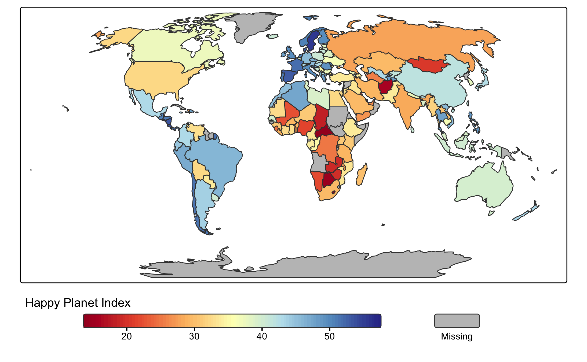

# tmap: thematic maps in R 

<!-- badges: start -->

[](https://github.com/r-tmap/tmap/actions/workflows/R-CMD-check.yaml)
[](https://app.codecov.io/gh/r-tmap/tmap?branch=master)
[](https://cran.r-project.org/package=tmap)
[](https://cran.r-project.org/web/checks/check_results_tmap.html)
[](https://www.r-pkg.org:443/pkg/tmap)
[](https://www.gnu.org/licenses/gpl-3.0.html)
[](https://r-tmap.r-universe.dev/tmap)
<!-- badges: end -->

**tmap** is an R package for drawing thematic maps. The API is based on
[*A Layered Grammar of
Graphics*](https://vita.had.co.nz/papers/layered-grammar.pdf) and
resembles the syntax of
[**ggplot2**](https://cran.r-project.org/package=ggplot2), a popular
R-library for drawing charts.

## Installation

Installation of **tmap** is straightforward:

``` r
install.packages("tmap")
```

In case it fails, please check the dependencies below.

### Development version

The development version can be installed from the GitHub repository
using one of the following functions:

``` r
# install.packages("remotes")
remotes::install_github("r-tmap/tmap")

# install.packages("pak")
pak::pak("r-tmap/tmap")

# Or from r-universe
install.packages("tmap", repos = c("https://r-tmap.r-universe.dev", "https://cloud.r-project.org"))
```

## Dependencies

tmap depend on other R packages, which will automatically be installed
along. However, two packages **sf** and **s2** have additional system
requirements: for Windows users, these are also installed along. For
Linux and MacOS users, these additional libraries may need to be
installed manually.

Instructions for the libraries GEOS, GDAL and PROJ (required by **sf**):
see the installation instructions of **terra** which requires the same
libraries:
[MacOS](https://rspatial.github.io/terra/index.html?q=installation#macos)
and
[Linux](https://rspatial.github.io/terra/index.html?q=installation#linux)

Instructions for the libraries Abseil and OpenSSL (required by **s2**):
see the [installation
instructions](https://r-spatial.github.io/s2/#installation).

## Getting started

Plot a World map of the happy planet index (HPI) per country. The object
`World` is an example spatial data (`sf`) object that is contained in
**tmap**:

``` r
tm_shape(World) +
    tm_polygons(fill = "HPI")
```


This map can be enhanced in several ways. For instance:

``` r
tm_shape(World, crs = "+proj=robin") +
    tm_polygons(fill = "HPI",
                fill.scale = tm_scale_continuous(values = "matplotlib.rd_yl_bu"),
                fill.legend = tm_legend(title = "Happy Planet Index",
                                        orientation = "landscape", 
                                        frame = FALSE)
                )
```



## Online tmap course

3-6 June, organized jointly by
[PRStats](https://www.prstats.org/course/visual-exploration-analysis-and-presentation-of-spatial-data-using-the-tmap-package-tmap01/)
and
[Instats](https://instats.org/seminar/spatial-data-analysis-and-visualization)

## Additional Resources for Learning **tmap**

For more in-depth learning on the **tmap** package, refer to the
following resources:

- **Book Chapter:** [Geocomputation with R](https://r.geocompx.org/)
  includes a chapter on [Making Maps with
  R](https://r.geocompx.org/adv-map), which covers **tmap**.  
- **Official Vignettes:** A collection of vignettes at
  [r-tmap.github.io](https://r-tmap.github.io/tmap/articles/) covers
  both basic and advanced topics with examples.  
- **Work-in-Progress Book:** *Elegant and Informative Maps with tmap* is
  an upcoming book available at
  [tmap.geocompx.org](https://tmap.geocompx.org/).

These resources provide a solid foundation for working with **tmap** in
R.
