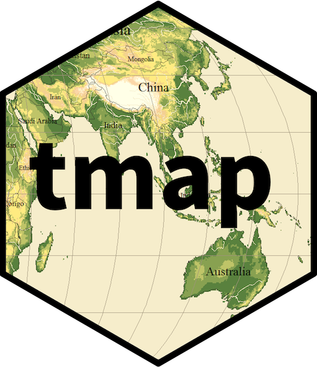
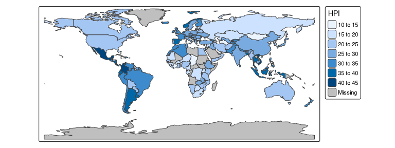
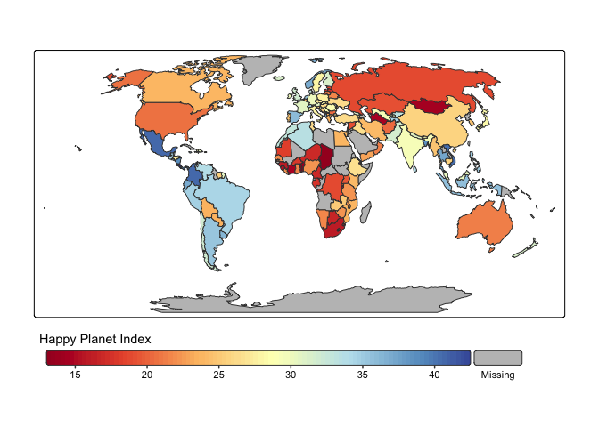

# tmap: thematic maps in R 

<!-- badges: start -->

[](https://github.com/r-tmap/tmap/actions/workflows/R-CMD-check.yaml)
[](https://app.codecov.io/gh/r-tmap/tmap?branch=master)
[](https://cran.r-project.org/package=tmap)
[](https://cran.r-project.org/web/checks/check_results_tmap.html)
[](https://www.r-pkg.org:443/pkg/tmap)
[](https://www.gnu.org/licenses/gpl-3.0.html)
[](https://r-tmap.r-universe.dev/tmap)
<!-- badges: end -->

**tmap** is an R package for drawing thematic maps. The API is based on
[*A Layered Grammar of
Graphics*](https://vita.had.co.nz/papers/layered-grammar.pdf) and
resembles the syntax of
[**ggplot2**](https://cran.r-project.org/package=ggplot2), a popular
R-library for drawing charts.

## Installation

Installation of **tmap** (version 4) is straightforward:

``` r
# install.packages("remotes")
remotes::install_github("r-tmap/tmap")

# On Linux, with pak
# install.packages("pak")
pak::pak("r-tmap/tmap")

# Or from r-universe
install.packages("tmap", repos = c("https://r-tmap.r-universe.dev", "https://cloud.r-project.org"))
```

The old version of **tmap** (version 3) is available on
[](https://cran.r-project.org/package=tmap),
but we recommend to use version 4, which will be on CRAN soon.

For Linux and macOS users who are new to working with spatial data in R,
this may fail since additional (non-R) libraries are required (which are
automatically installed for Windows users).

**Windows** No additional installation required.

**Linux (Ubuntu)** See
<https://geocompx.org/post/2020/installing-r-spatial-packages-linux/>.
Please address installation issues in this
[issue](https://github.com/r-tmap/tmap/issues/150).

**macOS** See <https://www.kyngchaos.com/>. Please address installation
issues in this [issue](https://github.com/r-tmap/tmap/issues/149).

# Getting started

Plot a World map of the happy planet index (HPI) per country. The object
`World` is an example spatial data (`sf`) object that is contained in
**tmap**:

``` r
tm_shape(World) +
    tm_polygons(fill = "HPI")
```



This map can be enhanced in several ways. For instance:

``` r
tm_shape(World, crs = "+proj=robin") +
    tm_polygons(fill = "HPI",
                fill.scale = tm_scale_continuous(values = "matplotlib.rd_yl_bu"),
                fill.legend = tm_legend(title = "Happy Planet Index",
                                        orientation = "landscape", 
                                        frame = FALSE)
                )
```



# Book chapter about tmap

The book [Geocomputation with R](https://r.geocompx.org/) provides a
chapter on [Making maps with R](https://r.geocompx.org/adv-map),
including a section on **tmap**.
