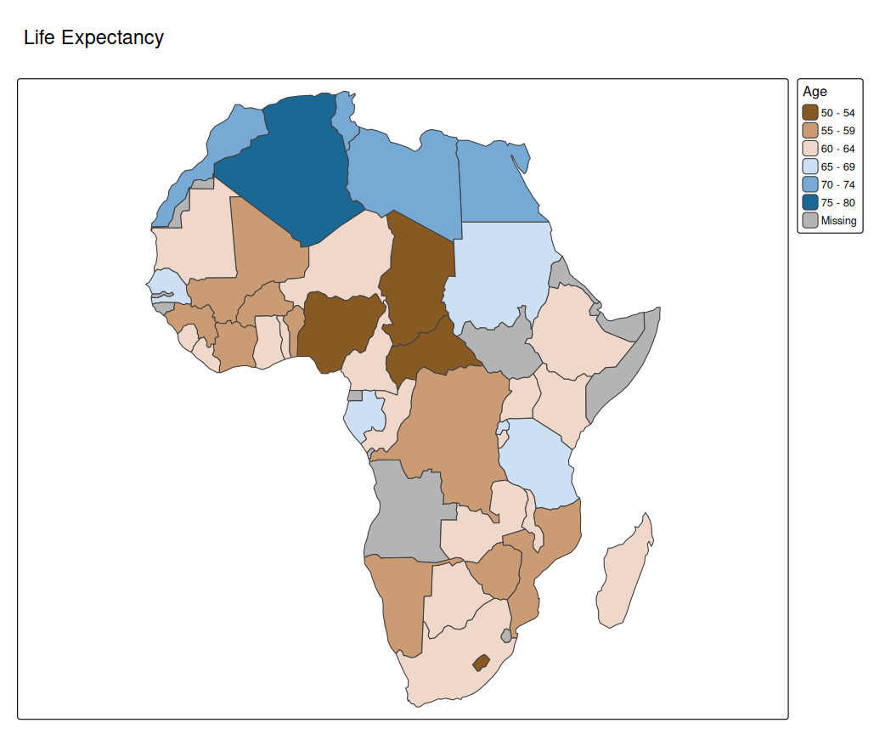

# tmap advanced: animations

Animations in tmap can be made in two ways:

1.  In the same way as creating facets
2.  Using a transition map variable

## In the same way as creating facets

[`tm_animate()`](https://r-tmap.github.io/tmap/reference/tm_animate.md)
is a function that belongs to the family of
[`tm_facets()`](https://r-tmap.github.io/tmap/reference/tm_facets.md).
It will specify a facetting dimension called `"frames"` (that will
define the frames) and in addition specify animation settings, such as
frames per second (`"fps"`).

Recall that
[facets](https://r-tmap.github.io/tmap/articles/basics_facets) can be
created by specifying multiple visual map variables or a group-by
variable.

### Multiple data variables for one map variable

In this example, we use bubble size a visual map variable. We specify 8
values: `"pop1960"`, `"pop1970"`, … `"pop2023"` that correspond to the
estimated population sizes of metropolitan areas.

``` r
tm_shape(World) +
    tm_fill("#dddddd") +
tm_shape(metro) +
    tm_bubbles(size = paste0("pop", seq(1960,2030, by = 10)),
               size.scale = tm_scale_continuous(values.scale = 2),
               size.legend = tm_legend("Population"),
               fill = "gold",
               size.free = FALSE) +
    tm_animate()
#> [tip] Consider a suitable map projection, e.g. by adding `+ tm_crs("auto")`.
#> This message is displayed once per session.
```


Without
[`tm_animate()`](https://r-tmap.github.io/tmap/reference/tm_animate.md)
it will create a facet wrap.

### Group by data variable

The `frames` argument of
[`tm_animate()`](https://r-tmap.github.io/tmap/reference/tm_animate.md)
can be used to specify a group-by argument. In the next example we show
all countries one by one (for this we need to cast `"name"` into a
factor).

``` r
World$name = as.factor(World$name)
tm_shape(World) +
    tm_polygons(fill = "continent") +
    tm_animate(frames = "name", fps = 3) +
    tm_options(facet.max = 177)
```


### Animated facets

Internally, the argument `frames` of
[`tm_animate()`](https://r-tmap.github.io/tmap/reference/tm_animate.md)
is passed on as `pages` to
[`tm_facets()`](https://r-tmap.github.io/tmap/reference/tm_facets.md).
The first two faceting dimensions of
[`tm_facets()`](https://r-tmap.github.io/tmap/reference/tm_facets.md)
are still available via
[`tm_animate()`](https://r-tmap.github.io/tmap/reference/tm_animate.md):

``` r
# keep Antarctica and Seven seas out (no data)
World5 = World[!World$continent %in% c("Antarctica", "Seven seas (open ocean)"), ]

tm_shape(World5) +
    tm_polygons(fill = c("well_being", "inequality", "gender", "press", "footprint", "life_exp"),
                fill.scale = list(tm_scale_intervals(values = "brewer.oranges"),
                                  tm_scale_intervals(values = "brewer.blues"),
                                  tm_scale_intervals(values = "brewer.purples"),
                                  tm_scale_intervals(values = "brewer.yl_or_br"),
                                  tm_scale_intervals(values = "brewer.greens"),
                                  tm_scale_intervals(values = "brewer.yl_or_rd"))) +
    tm_animate(by = "continent", free.coords = TRUE)
```


## Using a transition map variable

Most map variables are *visual*, e.g. polygon fill or symbol size.
However, tmap also facilitates *tansition* map variables. These
variables will alter spatial geometries in a data-driven way. The
difference is that a visual variable will only change the appearance of
a geometry (polygon fill color or symbol size), but a transition
variable will change the geometry itself.

Currently, the only implementation (and popular application) of
transition variables is the cartogram, via the extension package
[**tmap.cartogram**](https://r-tmap.github.io/tmap.cartogram/)

``` r
library(tmap.cartogram)
Africa = World[World$continent == "Africa", ]

tm_shape(Africa, crs = "+proj=robin") +
    tm_cartogram(size = "*pop_est", 
                 fill = "life_exp",
                 fill.scale = tm_scale_intervals(values = "-cols4all.bu_br_div"),
                 fill.legend = tm_legend("Age"),
                 options = opt_tm_cartogram(itermax = 15)) +
tm_title("Life Expectancy")
#> Cartogram in progress...
```



``` r
tm_shape(Africa, crs = "+proj=robin") +
tm_cartogram_ncont(size = "*pop_est", 
                   fill = "inequality",
                   fill.scale = tm_scale_continuous(values = "cols4all.pu_gn_div", values.range = c(0, 0.5)),
                   fill.legend = tm_legend(""),
                   options = opt_tm_cartogram_ncont()) +
tm_title("Income inequality (Gini coefficient)") +
tm_animate_fast(play = "pingpong")
#> Cartogram in progress...
```


