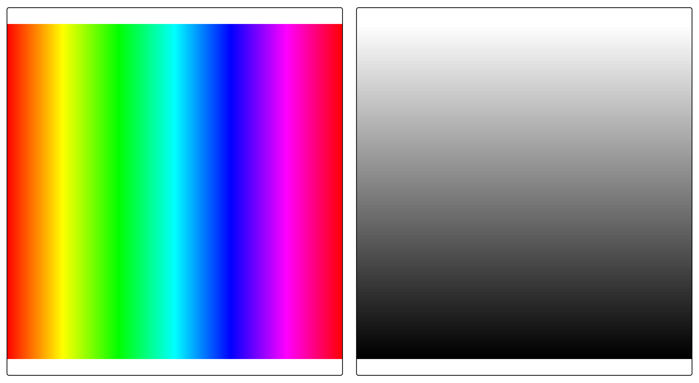
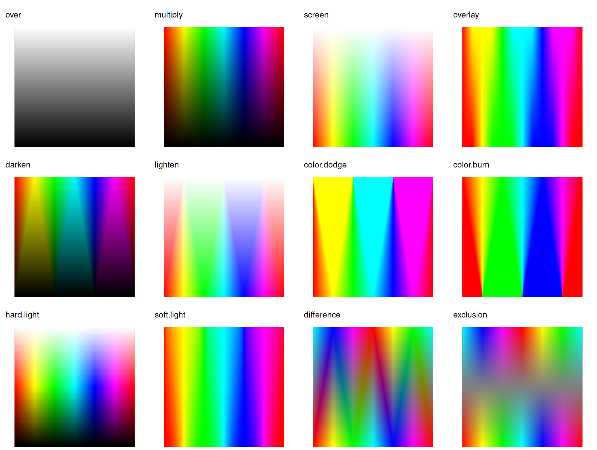
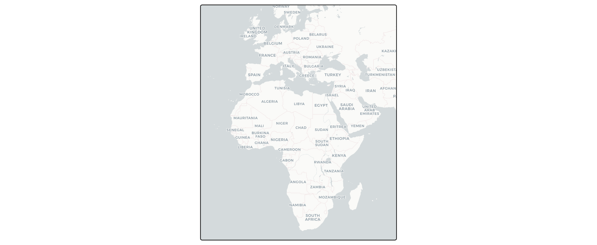
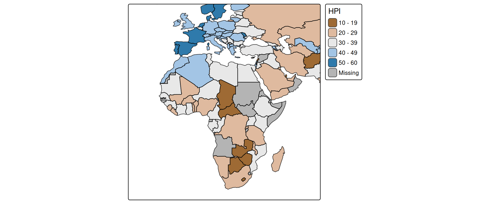
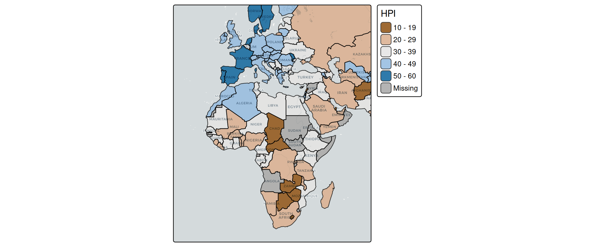
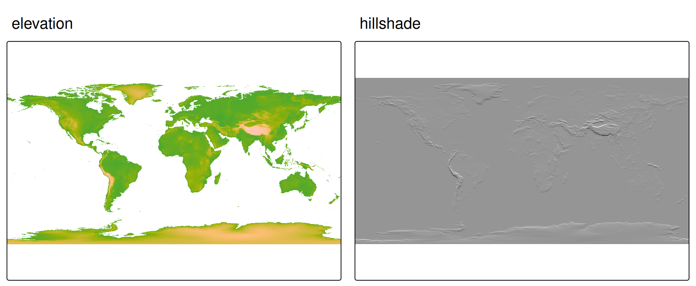
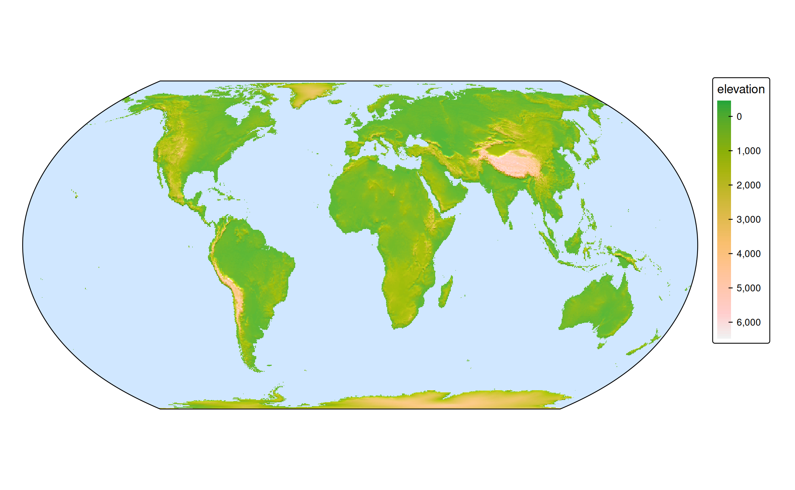

# tmap advanced: layer blending

## What is blending?

By default, when one map layer is drawn on top of another, the top layer
simply covers the layer below. Where the top layer is (partly)
transparent, the two are combined with *alpha compositing*: the result
is a weighted average based on the opacity.

**Blending** generalizes this. Instead of averaging, a blend mode
defines a *formula* that combines the color of each pixel in the top
layer with the color of the pixel beneath it, producing a single
combined image. This is the same idea as the “blend modes” in image
editors such as GIMP or Photoshop, and as the layer compositing in the
[ggblend](https://mjskay.github.io/ggblend/) package for ggplot2.

Blending is set with the `blend` argument, which is available on every
layer function
([`tm_polygons()`](https://r-tmap.github.io/tmap/reference/tm_polygons.md),
[`tm_raster()`](https://r-tmap.github.io/tmap/reference/tm_raster.md),
[`tm_rgb()`](https://r-tmap.github.io/tmap/reference/tm_rgb.md),
[`tm_symbols()`](https://r-tmap.github.io/tmap/reference/tm_symbols.md),
[`tm_lines()`](https://r-tmap.github.io/tmap/reference/tm_lines.md),
[`tm_text()`](https://r-tmap.github.io/tmap/reference/tm_text.md), etc.
[\#815](https://github.com/r-tmap/tmap/issues/815)).

## Blend modes

For each pixel, let \\S\\ be the source (the top layer) and \\D\\ the
destination (the layer below it), both as RGB values normalized to
\\\[0, 1\]\\. The result is one image; the “Result” column describes
what it looks like.

| `blend` | Formula | Result |
|----|----|----|
| `"over"` | \\S \cdot \alpha + D \cdot (1 - \alpha)\\ | The top layer simply covers the layer below (default; no blending). |
| `"multiply"` | \\S \cdot D\\ | Always darker. White in the top layer leaves the layer below unchanged; black turns it black. |
| `"screen"` | \\1 - (1 - S)(1 - D)\\ | Always lighter. The opposite of multiply. |
| `"overlay"` | multiply if \\D \< 0.5\\, screen otherwise | Raises contrast: dark areas get darker, light areas get lighter. |
| `"darken"` | \\\min(S, D)\\ | Keeps the darker color at each pixel. |
| `"lighten"` | \\\max(S, D)\\ | Keeps the lighter color at each pixel. |
| `"color.dodge"` | \\D / (1 - S)\\ | Strongly brightens the layer below. |
| `"color.burn"` | \\1 - (1 - D) / S\\ | Strongly darkens the layer below. |
| `"hard.light"` | overlay with \\S\\ and \\D\\ swapped | Strong contrast, driven by the top layer. |
| `"soft.light"` | gentle `hard.light` | Soft contrast; a subtle version of `hard.light`. |
| `"difference"` | \\\lvert S - D \rvert\\ | The absolute difference. Identical colors become black. |
| `"exclusion"` | \\S + D - 2 S D\\ | Like difference but with lower contrast (grays rather than black). |

The default `"over"` applies no blending, so existing maps are
unaffected.

The mode names above are the ones used in **plot mode**. In **view
mode** the compound names follow the CSS spelling with hyphens instead
of dots (`"color-dodge"`, `"color-burn"`, `"hard-light"`,
`"soft-light"`); the others are identical.

## A sandbox example

The clearest way to see what each mode does is to blend two rasters
where we know exactly what the pixels are. We use:

- a **color image** (the bottom layer): a vivid rainbow that runs
  through every hue from left to right, and
- a **white-to-black gradient** (the top layer): white at the top, black
  at the bottom.

Both are built with **terra** on the same grid, so they align pixel for
pixel:

``` r

library(terra)

n = 300

# bottom layer: a horizontal rainbow (hue varies with x, full saturation/brightness)
img = rast(nrows = n, ncols = n, xmin = 0, xmax = 1, ymin = 0, ymax = 1, nlyrs = 3)
xy = xyFromCell(img, 1:ncell(img))
cols = grDevices::hsv(h = xy[, 1], s = 1, v = 1)
values(img) = t(grDevices::col2rgb(cols))
names(img) = c("red", "green", "blue")

# top layer: a vertical white-to-black gradient
grad = rast(img, nlyrs = 1)
values(grad) = rep(seq(1, 0, length.out = nrow(grad)), each = ncol(grad))
names(grad) = "gradient"
```

We map the gradient with a continuous black-to-white scale, so a value
of `1` is white (top) and `0` is black (bottom). With the default
`"over"`, the gradient simply covers the rainbow:

``` r

tm_rainbow = tm_shape(img) +
    tm_rgb()    

tm_gradient = tm_shape(grad) +
  tm_raster("gradient",
    col.scale = tm_scale_continuous(values = c("black", "white")),
    col.legend = tm_legend_hide())

tmap_arrange(tm_rainbow, tm_gradient)
```



Here are all twelve modes side by side. A small helper keeps the code
compact:

``` r

blend_map = function(mode) {
  tm_shape(img) +
    tm_rgb() +
  tm_shape(grad) +
    tm_raster("gradient",
      col.scale = tm_scale_continuous(values = c("black", "white")),
      col.legend = tm_legend_hide(),
      blend = mode) +
  tm_title(mode, size = 0.8) +
  tm_layout(frame = FALSE)
}

modes = c("over", "multiply", "screen", "overlay",
          "darken", "lighten", "color.dodge", "color.burn",
          "hard.light", "soft.light", "difference", "exclusion")

tmap_arrange(lapply(modes, blend_map), ncol = 4)
```



Because the gradient is white at the top and black at the bottom, each
panel reads top-to-bottom:

- **`multiply`** keeps the rainbow at the top (multiplying by white = 1)
  and fades it to black at the bottom (multiplying by black = 0).
- **`screen`** does the reverse: untouched at the bottom, washed out to
  white at the top.
- **`overlay`** and **`hard.light`** push contrast, darkening the lower
  half and brightening the upper half.
- **`darken`** and **`lighten`** keep, at each pixel, whichever of the
  two layers is darker or lighter.
- **`color.dodge`** and **`color.burn`** are the strong versions of
  brightening and darkening.
- **`difference`** and **`exclusion`** subtract the two layers, so the
  colors invert where the gradient is bright.

## Example 1: basemap labels

``` r

# basemap
tm_basemap("CartoDB.Positron", zoom = 3) +
    tm_crs(bbox = "Africa", ext =2 )
```



``` r

# thematic map
tm_shape(World, bbox = "Africa", ext =2 ) + 
    tm_polygons(fill = "HPI", 
                fill.scale = tm_scale_intervals(values = "-bu_br_div"),
                blend = "multiply")
#> [tip] Consider a suitable map projection, e.g. by adding `+ tm_crs("auto")`.
#> This message is displayed once per session.
```



``` r

# multiply overlay
tm_basemap("CartoDB.Positron", zoom = 3) +
    tm_shape(World, bbox = "Africa", ext =2 ) + 
    tm_polygons(fill = "HPI", 
                fill.scale = tm_scale_intervals(values = "-bu_br_div"),
                blend = "multiply")
```



## Example 2: shaded relief

A common reason to reach for `blend` is to combine a colored map with a
*hillshade*: a grayscale layer that simulates light and shadow on
terrain, making slopes visible. On its own the hillshade is just gray;
blended onto a colored elevation map it adds a sense of relief without
changing the colors.

We compute the hillshade from the elevation raster in the `land`
dataset:

``` r

elev = rast(land)["elevation"]
elev[is.na(elev)] = 0

hs = shade(
  slope  = terrain(elev, "slope",  unit = "radians"),
  aspect = terrain(elev, "aspect", unit = "radians"))
names(hs) = "hillshade"
```

First, the two layers on their own. The colored elevation map (left) and
the grayscale hillshade (right):

``` r

m_elev = tm_shape(land) +
  tm_raster("elevation",
    col.scale = tm_scale_continuous(values = "hcl.terrain"),
    col.legend = tm_legend_hide()) +
  tm_title("elevation")

m_hs = tm_shape(hs) +
  tm_raster("hillshade",
    col.scale = tm_scale_continuous(values = c("black", "white")),
    col.legend = tm_legend_hide()) +
  tm_title("hillshade")

tmap_arrange(m_elev, m_hs, ncol = 2)
```



Now we draw the elevation map and blend the hillshade on top with
`"overlay"`, which darkens the shaded slopes and lightens the lit ones
while keeping the terrain colors:

``` r

tm_shape(land) +
  tm_raster("elevation",
    col.scale = tm_scale_continuous(values = "hcl.terrain"),
    col.legend = tm_legend()) +
tm_shape(hs) +
  tm_raster("hillshade",
    col.scale = tm_scale_continuous(values = c("black", "white")),
    col.legend = tm_legend_hide(),
    blend = "overlay") +
tm_crs("+proj=eqearth") +
tm_layout(
  earth_boundary = TRUE,
  bg.color = "slategray1",
  frame = FALSE,
  earth_boundary.lwd = 1, 
  inner.margins = 0.01)
#> Linking to GEOS 3.12.1, GDAL 3.8.4, PROJ 9.4.0; sf_use_s2() is FALSE
```



## Requirements and notes

Blending in plot mode relies on graphics-device *compositing*, which has
a few requirements:

- **R \>= 4.2** is needed. On older versions `blend` is ignored (with a
  warning) and the layer is drawn normally.
- A **compatible graphics device** is required, for example
  `png(type = "cairo")` or
  [`svg()`](https://rdrr.io/r/grDevices/cairo.html). If the active
  device does not support the requested operator, tmap falls back to no
  blending and warns. The default RStudio graphics device may not
  support compositing; if a blended map looks unblended, re-plot to a
  Cairo or SVG device. The simpler operators (`"multiply"`, `"screen"`,
  …) are the most widely supported; the compound ones (`"color.dodge"`,
  `"soft.light"`, …) require a fuller compositing implementation.
- Blending acts on the *rendered pixels*, so it is most predictable when
  the layers involved are opaque. Combining `blend` with partial
  transparency (`fill_alpha`, `col_alpha`) is possible but harder to
  reason about.

Internally, plot mode uses
\[[`grid::groupGrob()`](https://rdrr.io/r/grid/grid.group.html)\]\[grid::groupGrob\],
which also supports the Porter-Duff operators (`"clear"`, `"source"`,
`"in"`, `"out"`, `"atop"`, `"xor"`, …) beyond the blend modes listed
above.

### View mode

In interactive (`"view"`) mode, blending is applied through the CSS
`mix-blend-mode` property on the Leaflet pane of the layer. The simple
mode names are identical to plot mode; the compound ones use the CSS
hyphen spelling (`"color-dodge"`, `"hard-light"`, …). As in plot mode,
`"over"` means no blending.

``` r

tmap_mode("view")

tm_shape(land) +
  tm_raster("elevation",
    col.scale = tm_scale_continuous(values = "hcl.terrain")) +
tm_shape(hs) +
  tm_raster("hillshade",
    col.scale = tm_scale_continuous(values = c("black", "white")),
    col.legend = tm_legend_hide(),
    blend = "overlay")
```
