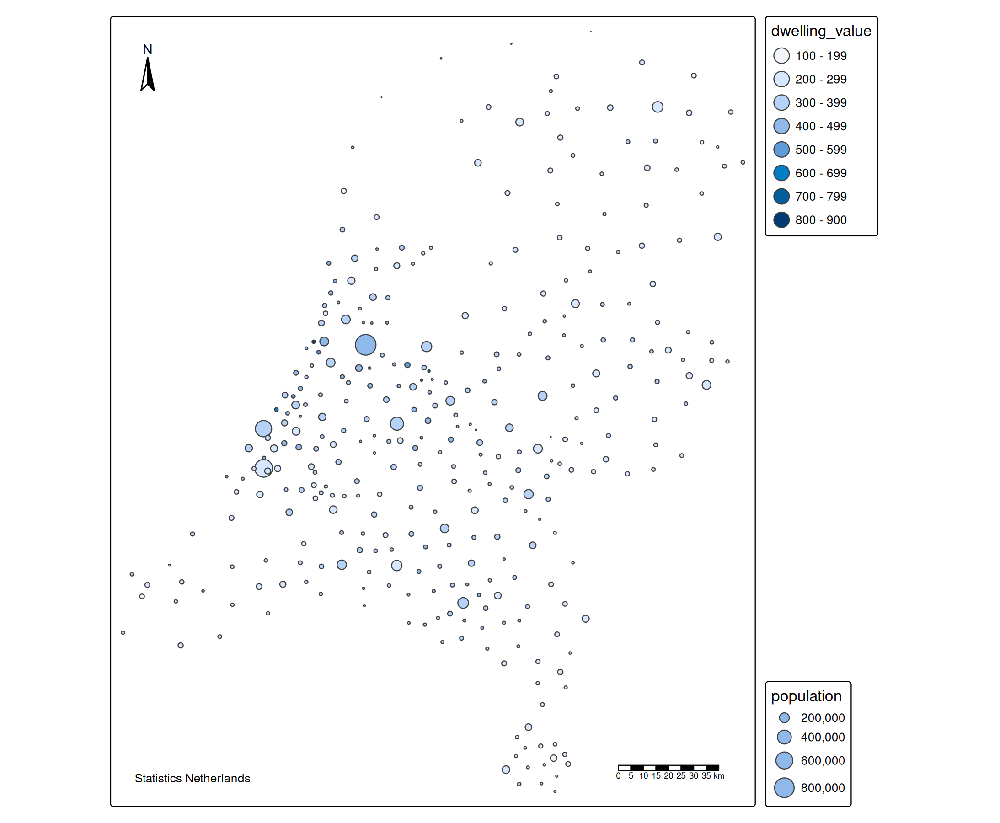
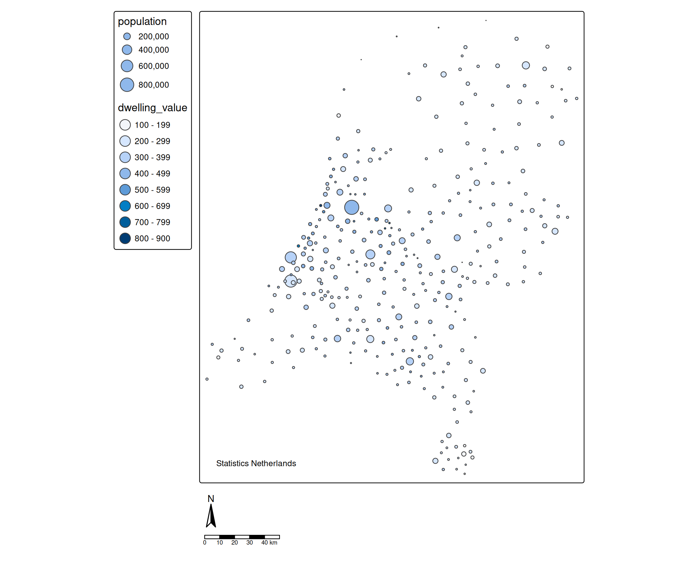
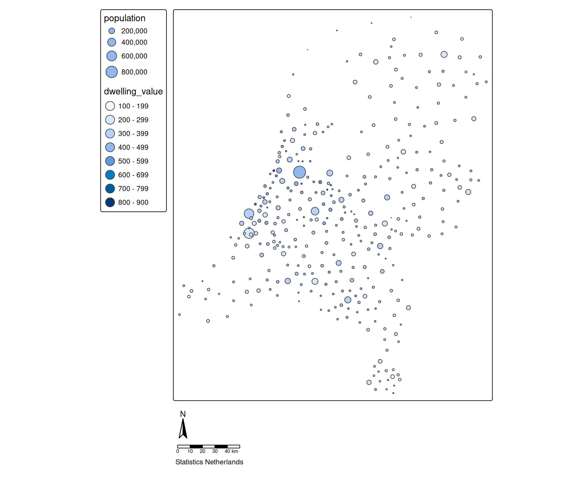
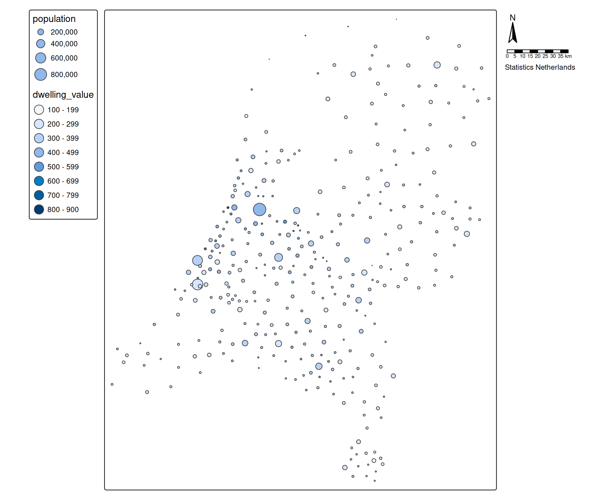
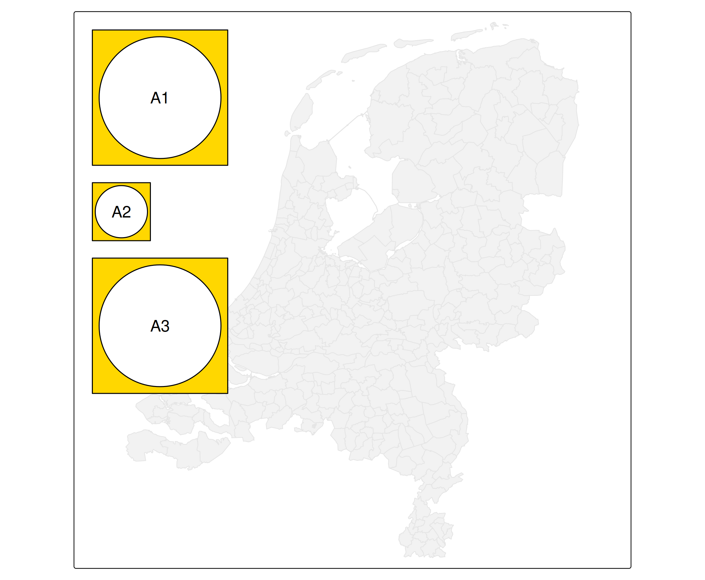
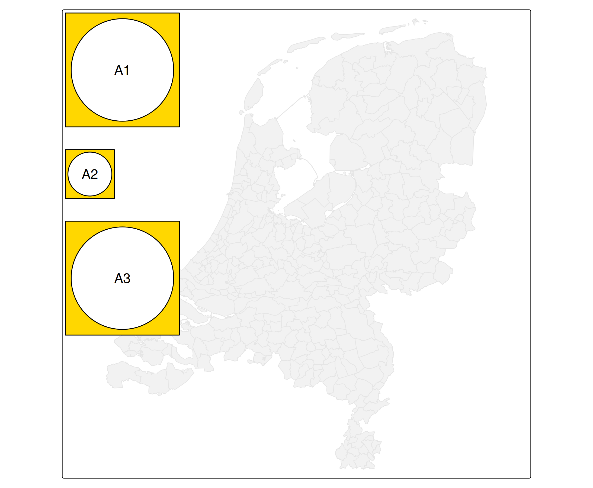
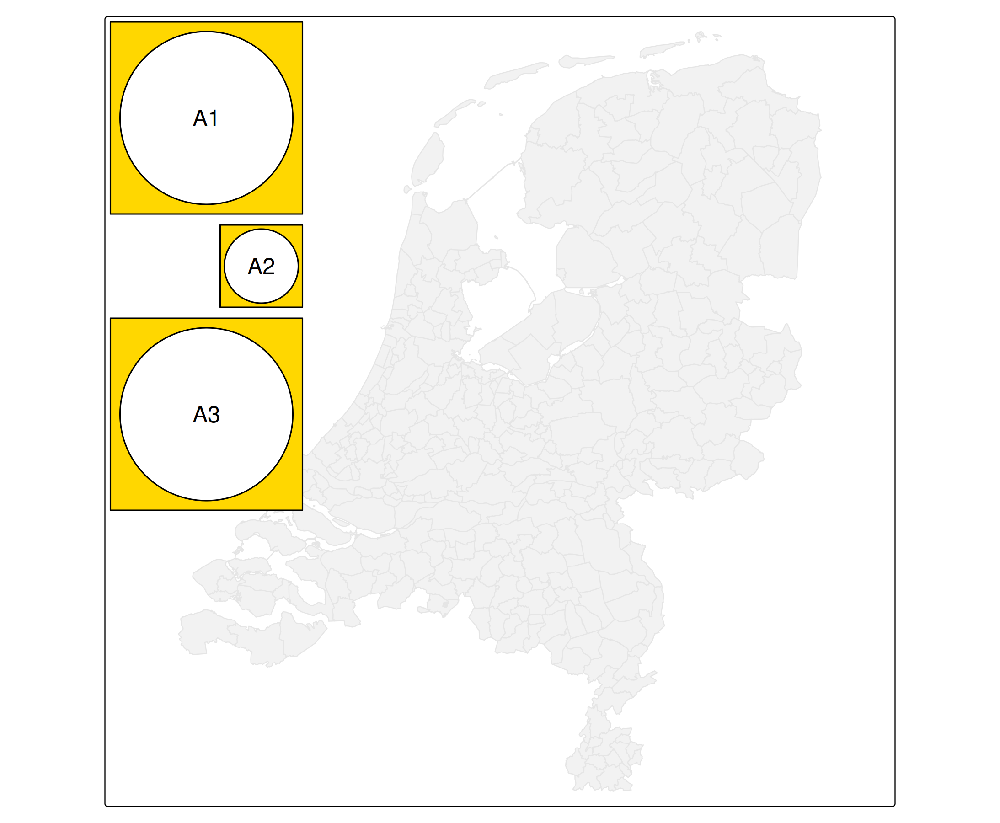
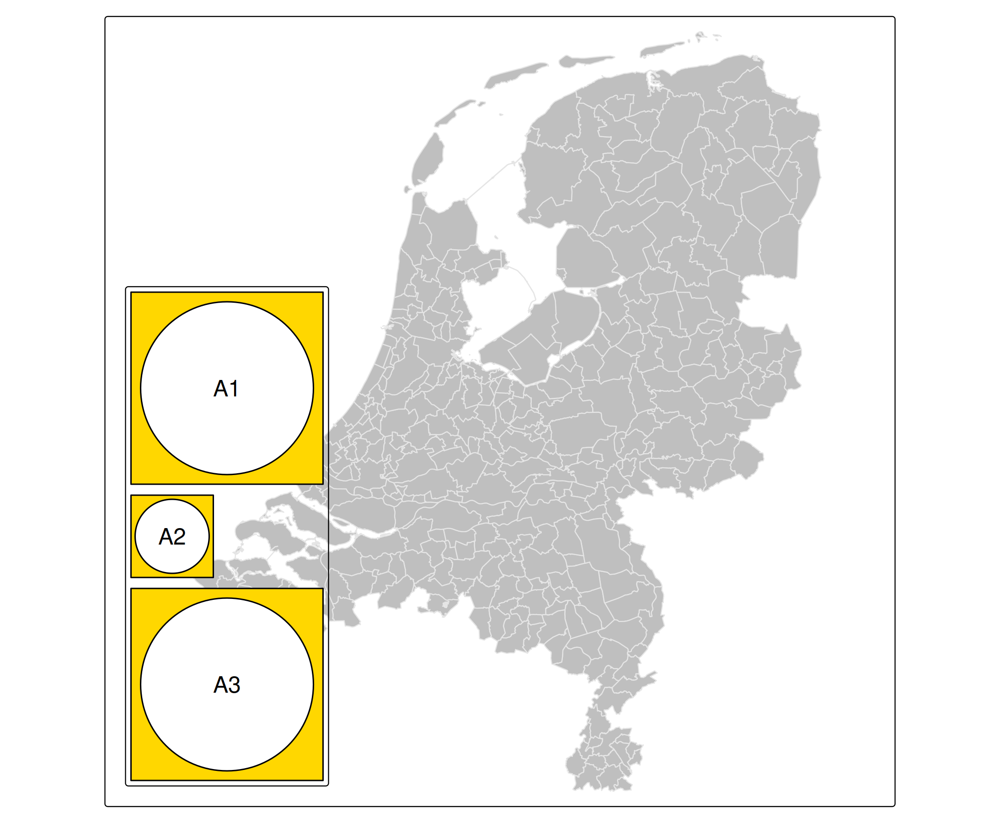

# tmap advanced: grouping of components

Recall from the [vignette about map
components](https://r-tmap.github.io/tmap/articles/basics_components)
that components can be grouped via
[`tm_components()`](https://r-tmap.github.io/tmap/reference/tm_components.md).
In this vignette we will explain how they are grouped and what the
grouping options are.

## Grouping components

### Grouping components via the map component functions

In the following map, each map component is placed in a different
location.

``` r
(tm1 = tm_shape(NLD_muni) +
    tm_bubbles(fill = "dwelling_value", 
               size = "population",
               size.legend = tm_legend(position = tm_pos_out("right", "center", pos.v = "bottom"))) +
    tm_compass(position = c("left", "top")) +
    tm_scalebar() +
    tm_credits("Statistics Netherlands", position = c("left", "bottom")))
```



Let’s put all legends to the left hand side of the map, and the compass
and scale bar below the frame.

``` r
tm1 + 
    tm_components("tm_legend", position = tm_pos_out("left", "center")) +
    tm_components(c("tm_compass", "tm_scalebar"), position = tm_pos_out("center", "bottom"))
```



All map components that are not title, chart, or title can be accessed
via `tm_<other>`:

``` r
tm1 + 
    tm_components("tm_legend", position = tm_pos_out("left", "center")) +
    tm_components("tm_<other>", position = tm_pos_out("center", "bottom"))
```



When `tm_component()` is called without `group_id`, all map components
are affected:

``` r
tm1 + 
    tm_components("tm_legend", position = tm_pos_out("left", "center")) +
    tm_components("tm_<other>", position = tm_pos_out("center", "bottom")) +
    tm_components(position = tm_pos_out("right", "center"))
```


Note that each time a
[`tm_components()`](https://r-tmap.github.io/tmap/reference/tm_components.md)
is called, it will update the map. So in this case, the first two
[`tm_components()`](https://r-tmap.github.io/tmap/reference/tm_components.md)
are overruled with the third one. If we change the order, the map
components are placed in different locations:

``` r
tm1 + 
    tm_components("tm_<other>", position = tm_pos_out("center", "bottom")) +
    tm_components(position = tm_pos_out("right", "center")) +
    tm_components("tm_legend", position = tm_pos_out("left", "center"))
```



Now all components are placed to the right hand side of the map (second
[`tm_components()`](https://r-tmap.github.io/tmap/reference/tm_components.md)
call), except for the legends, which are placed on the left hand side of
the map (third
[`tm_components()`](https://r-tmap.github.io/tmap/reference/tm_components.md)
call).

### Grouping components via `group_id`

Map components can also be grouped via a self-specified `group_id`,
which should also be specified in the map component function
(e.g. [`tm_legend()`](https://r-tmap.github.io/tmap/reference/tm_legend.md)).

To illustrate this and further explain
[`tm_components()`](https://r-tmap.github.io/tmap/reference/tm_components.md),
we will use a self-made map component, made with the grid package that
we show via
[`tm_inset()`](https://r-tmap.github.io/tmap/reference/tm_inset.md).

``` r
g = function(text) grid::gList(
  grid::rectGrob(gp=grid::gpar(fill = "gold")), 
  grid::circleGrob(r = .45), 
  grid::textGrob(text))
b = function(text) grid::gList(
  grid::rectGrob(gp=grid::gpar(fill = "steelblue")), 
  grid::circleGrob(r = .45), 
  grid::textGrob(text))
```

``` r
tm2 = tm_shape(NLD_muni) +
    tm_polygons("grey95", col = "grey90") +
tm_inset(g("A1"), group_id = "A") +
tm_inset(g("A2"), group_id = "A") +
tm_inset(b("B1"), group_id = "B", height = 3, width = 3) +
tm_inset(g("A3"), group_id = "A") +
tm_inset(b("B2"), group_id = "B", height = 3, width = 3) +
tm_layout(asp = 1)

tm2 + 
  tm_components("A", position = tm_pos_in("left", "top")) +
  tm_components("B", position = tm_pos_in("right", "bottom"))
```


Under the hood, the actual grouping is done by position alone: all
components with the same position are considered as a group and
therefore stacked instead of drawn on top of each other. In this example
components of A and B have the same position and are therefore grouped,
even though they have a different `group_id`.

``` r
tm2 + 
  tm_components("A", position = tm_pos_in("right", "bottom")) +
  tm_components("B", position = tm_pos_in("right", "bottom"))
#> [plot mode] legend/component: Some components or legends are too "high" and are
#> therefore rescaled.
#> ℹ Set the tmap option `component.autoscale = FALSE` to disable rescaling.
```


## Grouping options

### Stacking

The goal of
[`tm_components()`](https://r-tmap.github.io/tmap/reference/tm_components.md)
is not only to group map components, but also to specify group related
arguments, as we will show now.

#### Direction

The `stack` argument is either `"horizontal"` or `"vertical"`:

``` r
tm2 + 
  tm_components("A", position = tm_pos_in("left", "top"), stack = "horizontal") +
  tm_components("B", position = tm_pos_in("right", "bottom"), stack = "vertical")
```


#### Order

The stacking order is by default the same as in which the components
appear, but can be changed with the `z` argument in each component
function:

``` r
tm_shape(NLD_muni) +
  tm_polygons("grey95", col = "grey90") +
tm_inset(g("A1"), group_id = "A", z = 1) +
tm_inset(g("A2"), group_id = "A", z = 3) +
tm_inset(g("A3"), group_id = "A", z = 2) +
tm_layout(asp = 1) +
tm_components("A", position = tm_pos_in("left", "top")) 
```


### Frame

#### `frame_combine`

By default `frame_combine = TRUE`, which means that a single frame is
drawn for all components in the same group. This can be disabled with
`frame_combine = FALSE`

``` r
tm_shape(NLD_muni) +
  tm_polygons("grey95", col = "grey90") +
tm_inset(g("A1"), group_id = "A") +
tm_inset(g("A2"), group_id = "A", width = 3, height = 3) +
tm_inset(g("A3"), group_id = "A") +
tm_layout(asp = 1) +
tm_components("A", position = tm_pos_in("left", "top"), frame_combine = FALSE) 
```



#### `equalize`

Equalize (by default `TRUE`) means that components made equal in size,
that is: the widths in case they are stacked vertically (as in this
example), and the heights in case they are stacked horizontally.

``` r
tm_shape(NLD_muni) +
  tm_polygons("grey95", col = "grey90") +
tm_inset(g("A1"), group_id = "A") +
tm_inset(g("A2"), group_id = "A", width = 3, height = 3) +
tm_inset(g("A3"), group_id = "A") +
tm_layout(asp = 1) +
tm_components("A", position = tm_pos_in("left", "top"), frame_combine = FALSE, equalize = FALSE) 
```


### Margins

#### General `offset` and `stack_margin`

The `offset` specifies the distance (in line heights) between the frame
and components. By default 0.75 in case the components are drawn inside
the frame and `pos.h` and `pos.v` are lower case, and 0 otherwise.

The `stack_margin` specifies the distance between components. In case
`frame_combine` it is 0.5 by default, otherwise 0.

``` r
tm_shape(NLD_muni) +
  tm_polygons("grey95", col = "grey90") +
tm_inset(g("A1"), group_id = "A") +
tm_inset(g("A2"), group_id = "A", width = 3, height = 3) +
tm_inset(g("A3"), group_id = "A") +
tm_layout(asp = 1) +
tm_components("A", position = tm_pos_in("left", "top"), frame_combine = FALSE, equalize = FALSE, offset = 0, stack_margin = 1)
```



Note: currently both `offset` and `stack_margin` are applied for all
components for which `pos.h` and `pos.v` are specified as characters.

#### Component specific `margins`

Each component has its own margins, which are the margins to the frame.
These can be specified with a vector of four: bottom, left, top, right.

``` r
tm_shape(NLD_muni) +
  tm_polygons("grey95", col = "grey90") +
tm_inset(g("A1"), group_id = "A", margins = 0) +
tm_inset(g("A2"), group_id = "A", width = 3, height = 3, margins = 0) +
tm_inset(g("A3"), group_id = "A", margins = 0) +
tm_layout(asp = 1) +
tm_components("A", position = tm_pos_in("left", "top"), frame_combine = T, frame = TRUE, offset = 0, stack_margin = 0)
```


### Alignment

Recall that the `align.h` and `align.v` arguments of
[`tm_pos()`](https://r-tmap.github.io/tmap/reference/tm_pos.md) specify
the alignment of the components [see vignette about
positions](https://r-tmap.github.io/tmap/articles/adv_positions)). This
can be set for each component individually, or, in case it is the same
for all components inside
[`tm_components()`](https://r-tmap.github.io/tmap/reference/tm_components.md).

``` r
tm_shape(NLD_muni) +
  tm_polygons("grey95", col = "grey90") +
tm_inset(g("A1"), group_id = "A") +
tm_inset(g("A2"), group_id = "A", width = 3, height = 3) +
tm_inset(g("A3"), group_id = "A") +
tm_layout(asp = 1) +
tm_components("A", position = tm_pos_in("left", "top", align.h = "right"), frame_combine = FALSE, equalize = FALSE, offset = 0, stack_margin = 0) 
```



### Frame and background color and alpha

``` r
tm_shape(NLD_muni) +
  tm_polygons("grey75", col = "grey90") +
tm_inset(g("A1"), group_id = "A") +
tm_inset(g("A2"), group_id = "A", width = 3, height = 3) +
tm_inset(g("A3"), group_id = "A") +
tm_layout(asp = 1) +
tm_components("A", position = tm_pos_in("left", "bottom"), frame = TRUE, bg.color = "purple", bg.alpha = 0.5)
```


