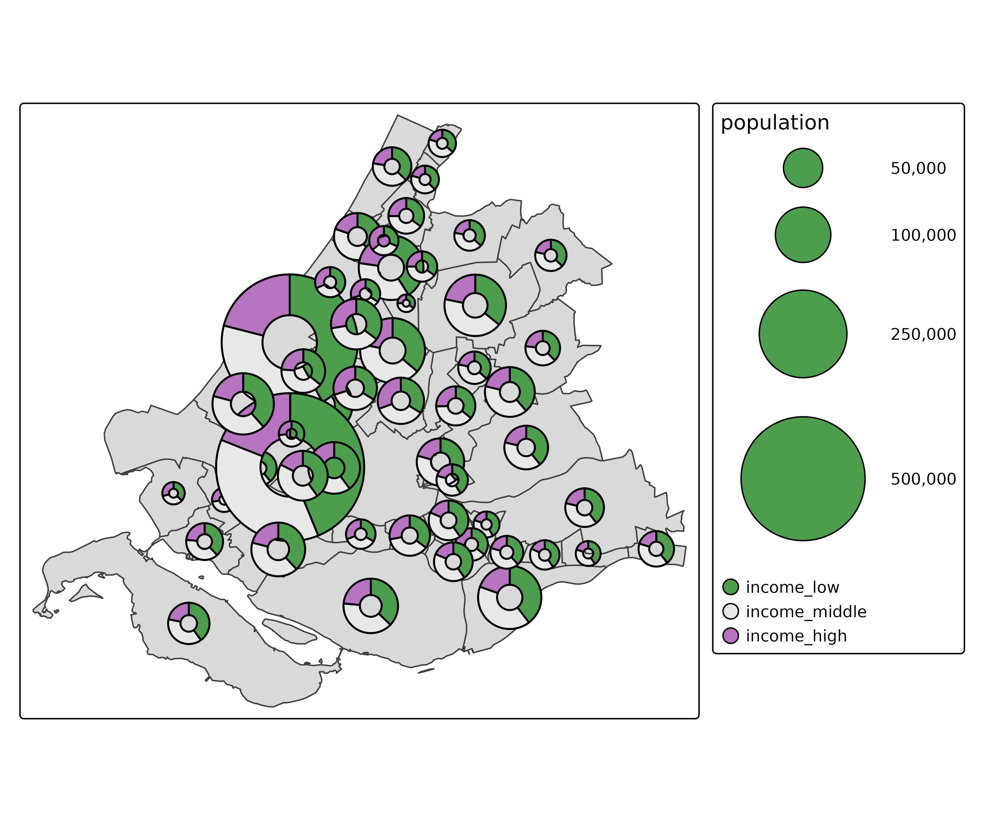
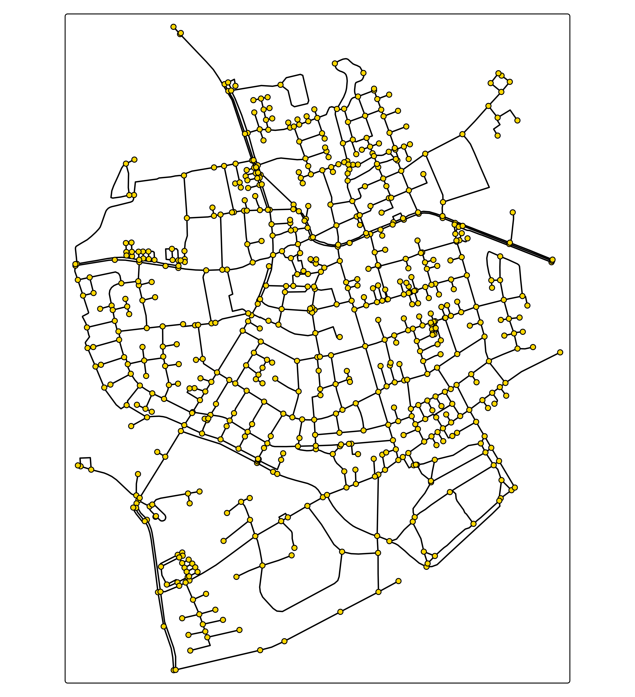

# tmap advanced: extensions

## Extension types

There are three types of tmap extensions:

1.  New map layer types
2.  New spatial data classes
3.  New output modes

Rather than explaining how to extend tmap for each of these three types
(which is rather complex), it is easier to demonstrate with
proof-of-concept extension packages:

## New map layer types

This type of extension requires:

- Specification of visual variables. For new visual variable, options
  need to be added.
- Spatial transformation function needs to be specified: e.g. should
  centroids be used?
- The mapping between visual variables and (standard) visual or
  transformation parameters.

See [`tmap.glyphs`](https://github.com/r-tmap/tmap.glyphs). A layer
function `tm_donuts` is added. More glyph types layer functions will
follow, e.g. `tm_pies`, or `tm_radars`.

``` r
library(tmap.glyphs)
ZH_muni = NLD_muni[NLD_muni$province == "Zuid-Holland", ]
ZH_muni$income_middle = 100 - ZH_muni$income_high - ZH_muni$income_low

tm_shape(ZH_muni) +
  tm_polygons() +
  tm_donuts(
    parts = tm_vars(c("income_low", "income_middle", "income_high"), multivariate = TRUE),
    fill.scale = tm_scale_categorical(values = "-pu_gn_div"),             
    size = "population",
    size.scale = tm_scale_continuous(ticks = c(50000, 100000, 250000, 500000))) 
```



## New spatial data classes

This type of extension requires methods to obtain:

- the spatial geometries (cast to either vectorized objects (`sfc`) or a
  stars object with indices) and
- the data variables and its levels (if any)

See [`tmap.networks`](https://github.com/r-tmap/tmap.networks) which
supports `sfnetworks`

``` r
library(sfnetworks)
library(tmap.networks)

(sfn = as_sfnetwork(roxel))
#> # A sfnetwork with 701 nodes and 851 edges
#> #
#> # CRS:  EPSG:4326 
#> #
#> # A directed multigraph with 14 components with spatially explicit edges
#> #
#> # Node data: 701 × 1 (active)
#>              geometry
#>           <POINT [°]>
#> 1 (7.533722 51.95556)
#> 2 (7.533461 51.95576)
#> 3 (7.532442 51.95422)
#> 4  (7.53209 51.95328)
#> 5 (7.532709 51.95209)
#> 6 (7.532869 51.95257)
#> # ℹ 695 more rows
#> #
#> # Edge data: 851 × 5
#>    from    to name                  type                                geometry
#>   <int> <int> <chr>                 <fct>                       <LINESTRING [°]>
#> 1     1     2 Havixbecker Strasse   residential (7.533722 51.95556, 7.533461 51…
#> 2     3     4 Pienersallee          secondary   (7.532442 51.95422, 7.53236 51.…
#> 3     5     6 Schulte-Bernd-Strasse residential (7.532709 51.95209, 7.532823 51…
#> # ℹ 848 more rows
```

Besides this new spatial data class `"sfnetwork"`, this package also
features new map layers, albeit very basic so far:

``` r
tm_shape(sfn) +
    tm_network()
#> Linking to GEOS 3.12.1, GDAL 3.8.4, PROJ 9.4.0; sf_use_s2() is TRUE
```



``` r
tm_shape(sfn) +
    tm_edges(col = "type", lwd = 4) +
    tm_nodes()
```


## New mode

This type of extension is the most difficult one. It requires:

- Initialization
- Loading of the used spatial object
- Plotting function for each map layer type
- A function for each map component
- Functions to preprocess and show the legends
- Run the plot
- Shiny integration functions

A package in development
[`tmap.mapgl`](https://github.com/r-tmap/tmap.mapgl) contains two new
modes, `"mapbox"` and `"maplibre"`.

The shiny integration may not work yet.

``` r
library(tmap.mapgl)
```

``` r
tmap_mode("maplibre")
#> ℹ tmap modes "plot" -> "view" -> "mapbox" -> "maplibre"
#> ℹ rotate with `tmap::rtm()`switch to "plot" with `tmap::ttm()`

tm_shape(NLD_dist) +
  tm_polygons(
    fill = "employment_rate", 
    fill.scale = tm_scale_intervals(values = "scico.roma"),
    lwd = 0.1) +
tm_shape(NLD_muni) +
  tm_polygons(fill = NULL, lwd = 1) +
tm_maplibre(pitch = 70)
```
