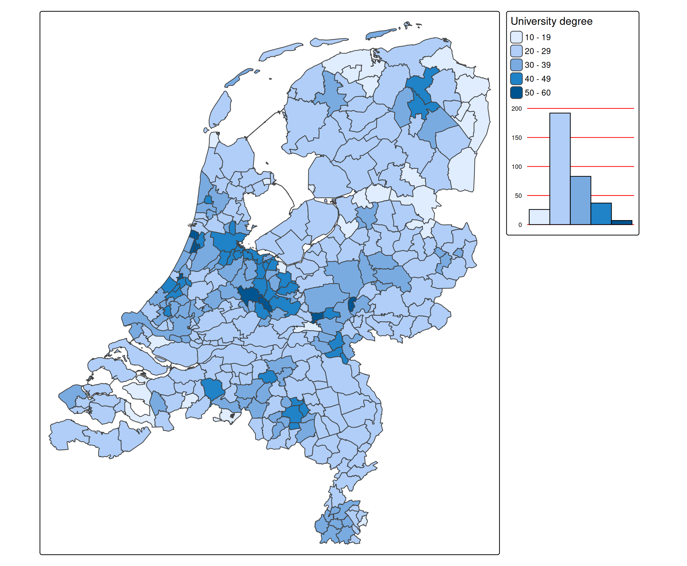
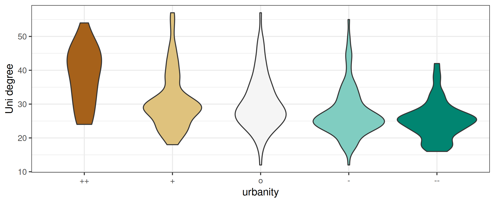
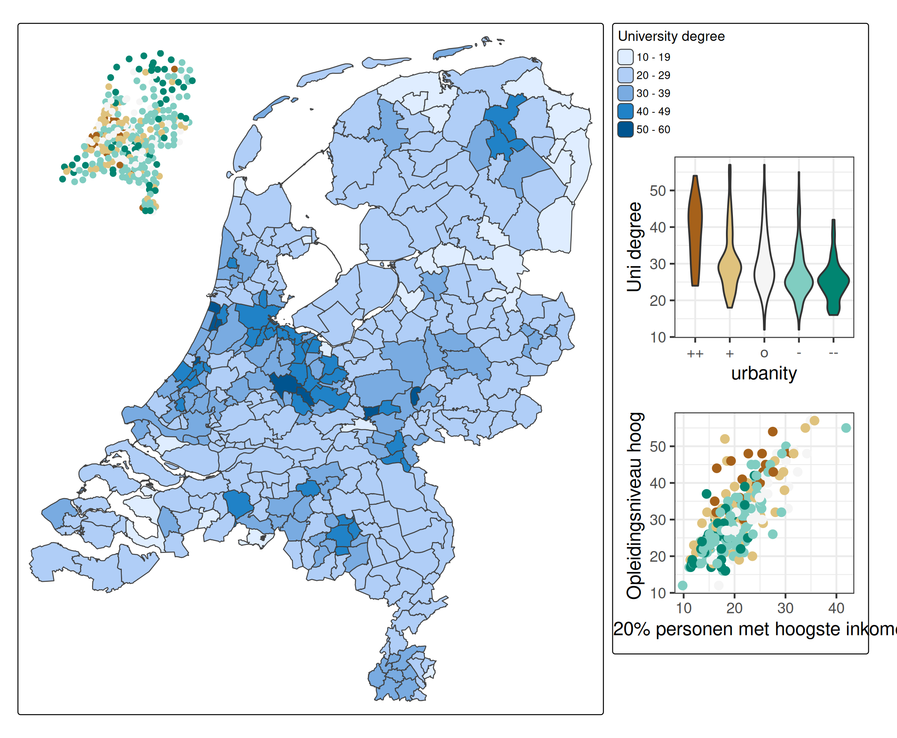

# tmap advanced: ggplot2 integration

Recall from the
[comparison](https://r-tmap.github.io/tmap/articles/versus_ggplot2) that
tmap and ggplot are both flexible packages. The ggplot2 layout can be
[mimicked by
tmap](https://r-tmap.github.io/tmap/articles/versus_ggplot2#mimicking-ggplot2-layout)
and probably the other way round as well.

In this vignette we’ll show how to use **ggplot2** inside **tmap**.

## tmap charts

ggplot2 is already used by tmap to draw
[charts](https://r-tmap.github.io/tmap/articles/basics_charts). Via the
argument `extra.ggplot2` additional ggplot2 code can be provided:

``` r
library(ggplot2)

tm_shape(NLD_muni) +
  tm_polygons("edu_appl_sci",
    fill.legend = tm_legend("University degree"),
    fill.chart = tm_chart_bar(extra.ggplot2 = theme(panel.grid.major.y = element_line(colour = "red")))) 
```



## ggplot2 charts

Much more flexibility is achieved when adding a ggplot2 plot via
[`tm_inset()`](https://r-tmap.github.io/tmap/reference/tm_inset.md).
First, let’s create a violin plot of the distribution of higher
education across municipalities, grouped by level of urbanity.

``` r
(g1 = ggplot(NLD_muni, aes(x = urbanity, y = edu_appl_sci, fill = urbanity)) +
    geom_violin() +
    scale_x_discrete(labels = c("++", "+", "o", "-", "--")) +
    scale_fill_brewer(guide = "none", type = "div") +
    scale_y_continuous("Uni degree") +
    theme_bw())
```



``` r
tm_shape(NLD_muni) +
  tm_polygons("edu_appl_sci",
            fill.legend = tm_legend("University degree")) +
tm_inset(g1, position = c("left", "top"))
```


In the next example we add a scatter plot and another tmap plot, also
added via
[`tm_inset()`](https://r-tmap.github.io/tmap/reference/tm_inset.md).

Both insets plots will be minimal, so without legend:

``` r
(g2 = ggplot(NLD_muni, aes(x = income_high, y = edu_appl_sci, color = urbanity)) +
    geom_point(size = 2) +
    scale_color_brewer(guide = "none", type = "div") +
    theme_bw())
```


``` r
(tm = tm_shape(NLD_muni) +
    tm_dots(fill = "urbanity",
            fill.scale = tm_scale(values = "brewer.br_bg"),
            fill.legend = tm_legend_hide()) +
    tm_layout(frame = FALSE))
```


Putting it all together

``` r
tm_shape(NLD_muni) +
  tm_polygons("edu_appl_sci",
            fill.legend = tm_legend("University degree", group_id = "right")) +
tm_inset(g1, group_id = "right", height = 10, width = 10) +
tm_inset(g2, group_id = "right", height = 10, width = 10) +
tm_inset(tm, group_id = "topleft", position = c("left", "top"), box_frame = FALSE) +
tm_components(group_id = "right", position = tm_pos_out("right", "center"))
```


