# tmap advanced: legends

This vignettes builds on the introduction vignettes about
[legends](https://r-tmap.github.io/tmap/articles/basics_legends) and
[scales](https://r-tmap.github.io/tmap/articles/basics_scales)

For convenience let’s assign the `tm_shape` element to `s`:

``` r
s = tm_shape(World, crs = "+proj=eqearth")
```

## Item labels

### Single numbers

Numbers of numeric legends are formatted with the `label.format`
argument of the scale function, e.g. `tm_scale_continuous`:

``` r
s + tm_polygons("HPI", fill.scale = tm_scale_continuous(values = "pu_gn_div"))
```


``` r
s + tm_polygons("HPI", 
  fill.scale = tm_scale_continuous(
    values = "pu_gn_div", 
    label.format = tm_label_format(digits = 3)))
```

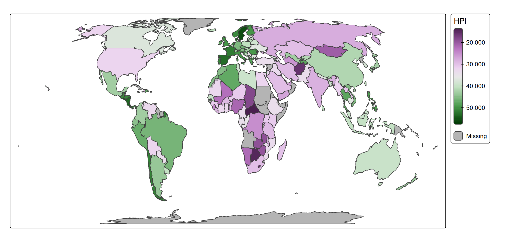

``` r
s + tm_polygons("HPI",
  fill.scale = tm_scale_continuous(
    values = "pu_gn_div", 
    label.format = tm_label_format(scientific = TRUE)))
```


``` r
s + tm_polygons("HPI",
  fill.scale = tm_scale_continuous(
    values = "pu_gn_div", 
    label.format = tm_label_format(prefix = "<", suffix = ">")))
```


``` r
s + tm_polygons("HPI", 
  fill.scale = tm_scale_continuous(
    values = "pu_gn_div", 
    label.format = tm_label_format(fun = function(x) {
        lst = strsplit(sprintf("%05d", x), split = "")
        sapply(lst, function(y) {
            do.call(paste, c(as.list(y), list(collapse = " ")))
        })
    })))
```


### Intervals

For the formatting of interval labels there are a few additional
options.

Consider this map

``` r
s + tm_polygons(
  fill = "HPI",
  fill.scale = tm_scale_intervals(breaks = seq(10, 60, by = 10)))
```

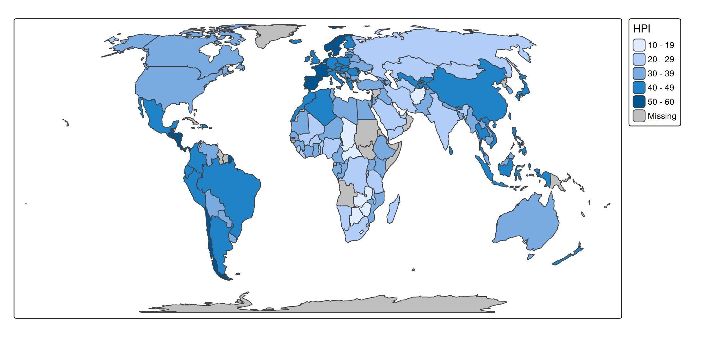

First of all note that intervals are by default closed on the
left-handside, so the first interval represents all values from (and
including) 10 to (and not including) the next break which is 20. How
intervals are closed is configured with `interval.closure`.

Apart from how intervals are closed, another choice is how to present
them. In the old tmap version (\<= 4.1), they were labeled as
`"10 to 20"`, `"20 to 30"`. This lead to a lot of confusion because it
was unclear where 20 belonged to. This old option can be enabled via the
argument `label.disjoint` of
[`tm_label_format()`](https://r-tmap.github.io/tmap/reference/tm_label_format.md):

``` r
s + tm_polygons(
  fill = "HPI",
  fill.scale = tm_scale_intervals(
    breaks = seq(10, 60, by = 10), 
    label.format = tm_label_format(interval.disjoint = FALSE)))
```


With the new default (`interval.disjoint = TRUE`) the argument digits
can be used additionally:

``` r
s + tm_polygons(
  fill = "HPI",
  fill.scale = tm_scale_intervals(
    breaks = seq(10, 60, by = 10), 
    label.format = tm_label_format(digits = 2)))
```

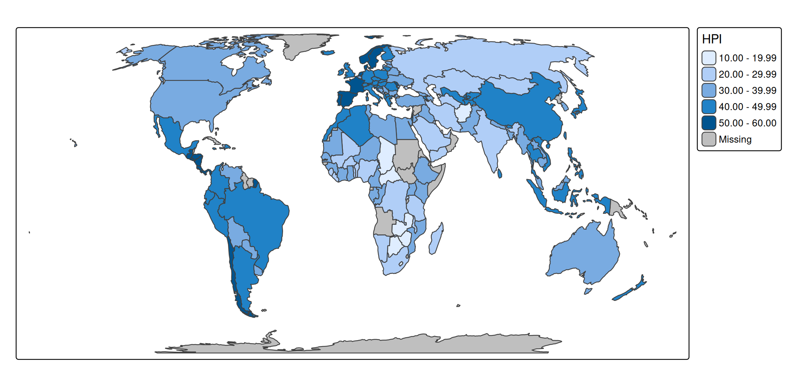

Use `-Inf` for the first break and `Inf` for the last break to trigger
labels that reflect “less than” and “or more” respectively. How these
are formatted can be specified with `label.format`:

``` r
s + tm_polygons(
  fill = "HPI",
  fill.scale = tm_scale_intervals(
    n = 6,
    style = "fixed",    
    breaks = c(-Inf,10,20,30,40,50, Inf),
    values = "pu_gn_div",
    label.format = tm_label_format(
      text.separator = "to", 
      text.less.than = "less than", 
      text.less.than_as.prefix = TRUE,
      text.or.more = "or more", 
      text.or.more_as.prefix = FALSE)
  ))
```

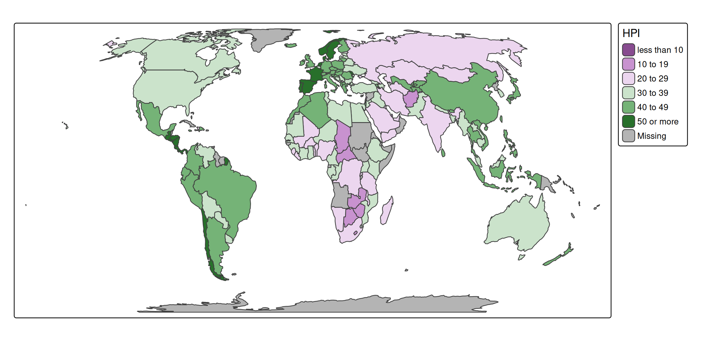

### Big numbers

By default, big numbers are abbreviated. If differences among legend
values are sufficiently large, they are presented in millions, billions
etc.

``` r
s + tm_polygons() +
  tm_bubbles(size = "pop_est")
```

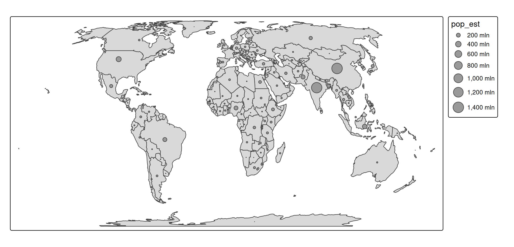

The big number abbreviations are specified in `big.num.abbr`. The
default value is

``` r
tmap_options("label.format")[[1]]$big.num.abbr
#> mln bln trn qdn qnt 
#>   6   9  12  15  18
```

Instead, we can define the population count in ‘thousands’:

``` r
tm_shape(NLD_muni) + 
  tm_bubbles(
    size = "population",
    size.scale = tm_scale_continuous(
      label.format = tm_label_format(
        big.num.abbr = c(thousand = 3))))
```

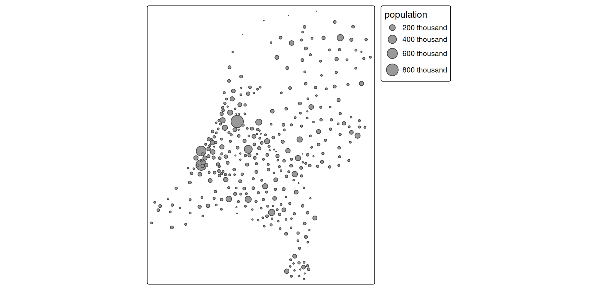

## Multiple legends

When there are multiple data-driven visual variables for which legends
are produced, there are a couple of things to consider

### Neutral values

Each scale function has a `value.neutral` argument. This defines what
visual value is used in the other legends. Example:

``` r
s +
tm_bubbles(
  fill = "HPI", 
  size = "pop_est",
  fill.scale = tm_scale_continuous(values = "-matplotlib.rainbow"))
```


We’ve used a gradient scale to map happy planet index (note that the
minus sign reverses the palette). When `value.neutral` is not specified,
the middle color (green) is used. My personal preference would be to use
a neutral gray color with the same brightness as the palette colors:

``` r
s +
tm_bubbles(
  fill = "HPI", 
  size = "pop_est",
  fill.scale = tm_scale_continuous(
    values = "-matplotlib.rainbow",
    value.neutral = "gray70"))
```


A different approach to achieve the same result is to update the size
legend:

``` r
s +
tm_bubbles(
  fill = "HPI", 
  size = "pop_est",
  size.legend = tm_legend(fill = "gray70"),
  fill.scale = tm_scale_continuous(values = "-matplotlib.rainbow"))
```

This method, where visual variables are passed on via `tm_legend` will
be covered in the section about [setting visual
values](https://r-tmap.github.io/tmap/articles/adv_legends#setting-visual-values).

### Combining legends

It is also possible to combine legends, which is useful if two visual
variables are used to plot the same data variable:

``` r
s +
tm_bubbles(
  fill = "economy", 
  shape = "economy")
#> [plot mode] legend/component: Some components or legends are too "high" and are
#> therefore rescaled.
#> ℹ Set the tmap option `component.autoscale = FALSE` to disable rescaling.
```


Legends combined:

``` r
s +
tm_bubbles(
  fill = "economy", 
  shape = "economy",
  shape.legend = tm_legend_combine("fill"))
```

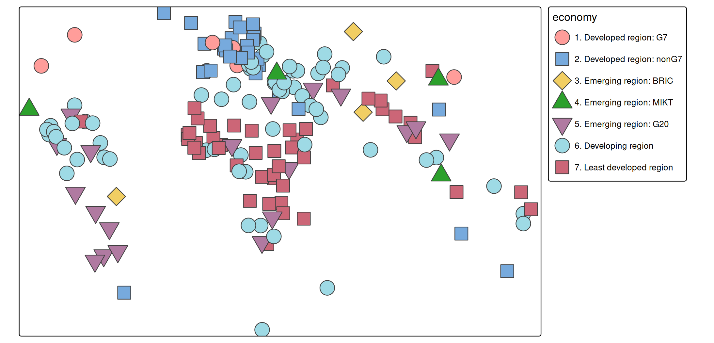

Two legends can be combined if and only if the number of legend items
are the same. The graphical properties are then merged. So in this case
the fill color from legend 1 and the shape of legend 2 are used.

## Visual values

It is possible to create custom legend by specify the visual values that
define the legend items. There are two ways to do this: either to change
the visual values of an existing legend via the `.legend` argument, or
via a new manual legend added with
[`tm_add_legend()`](https://r-tmap.github.io/tmap/reference/tm_add_legend.md).

## Setting visual values

Suppose, for whatever reason, we would like to change some of the visual
values used in the legend symbols. For instance, instead of solid circle
lines, thick dotted lines. In that case, we can simply pass on the
corresponding visual values `lwd` and `lty` to
[`tm_legend()`](https://r-tmap.github.io/tmap/reference/tm_legend.md):

``` r
s + 
  tm_polygons() +
  tm_symbols(
    fill = "economy",
    fill.legend = tm_legend("Economy", 
      lwd = 2, lty = "dotted"))
```


## Manual legends

A new manual legend is created with
[`tm_add_legend()`](https://r-tmap.github.io/tmap/reference/tm_add_legend.md).
For each item, a label and the visual values are specified, and in
addition, a legend title.

``` r
s + 
  tm_polygons() +
  tm_add_legend(
    title = "Countries", 
    fill = "grey80", 
    shape = 22, 
    size = c(1, 2, 4), 
    labels = c("Small", "Medium", "Large"))
```


There are four legend types, specified via the `type` argument:

- `"polygons"` where boxes are shown. This is the default for normal
  color legends.
- `"symbols"` where symbols, e.g. bubbles, stars, etc. are shown. This
  is the default for
  [`tm_add_legend()`](https://r-tmap.github.io/tmap/reference/tm_add_legend.md)
  because it is the most versatile one.
- `"lines"` where lines are shown.
- `"text"` where text is annotated.

``` r
s + 
  tm_polygons() + 
tm_add_legend(
    type = "polygons",
    title = "polygons", 
    fill = c("orange", "purple", "blue"), 
    labels = LETTERS[1:3], width = 7) +
tm_add_legend(
    type = "symbols",
    title = "symbols", 
    fill = c("orange", "purple", "blue"), 
    shape = c(1,4, 19),
    labels = LETTERS[1:3]) + 
tm_add_legend(
    type = "lines",
    title = "lines", 
    fill = c("orange", "purple", "blue"),
    lwd = c(2,4,6),
    labels = LETTERS[1:3]) + 
tm_add_legend(
    type = "text",
    title = "text",
    size = c(.7, .9, 1.5),
    text = c("orange", "purple", "blue"), 
    labels = LETTERS[1:3])
```

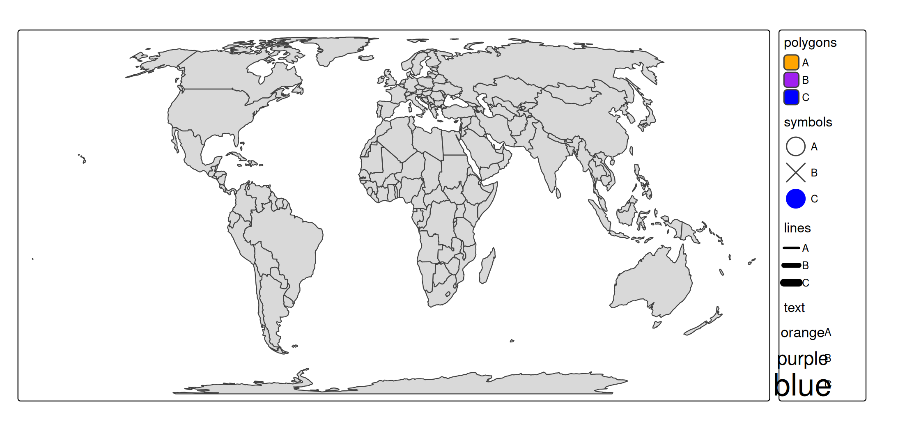

For symbols shapes (`shape`) are the following numbers are pre-defined:

``` r
atlantic_grid = cbind(expand.grid(x = -51:-47, y = 20:24), id = seq_len(25))
x = sf::st_as_sf(atlantic_grid, coords = c("x", "y"), crs = 4326)

tm_shape(x, bbox = tmaptools::bb(x, ext = 1.2)) +
  tm_symbols(
    shape = "id",
    size = 2,
    lwd = 2,
    fill = "orange",
    col = "black",
    shape.scale = tm_scale_asis()) +
  tm_text("id", ymod = -2)
```

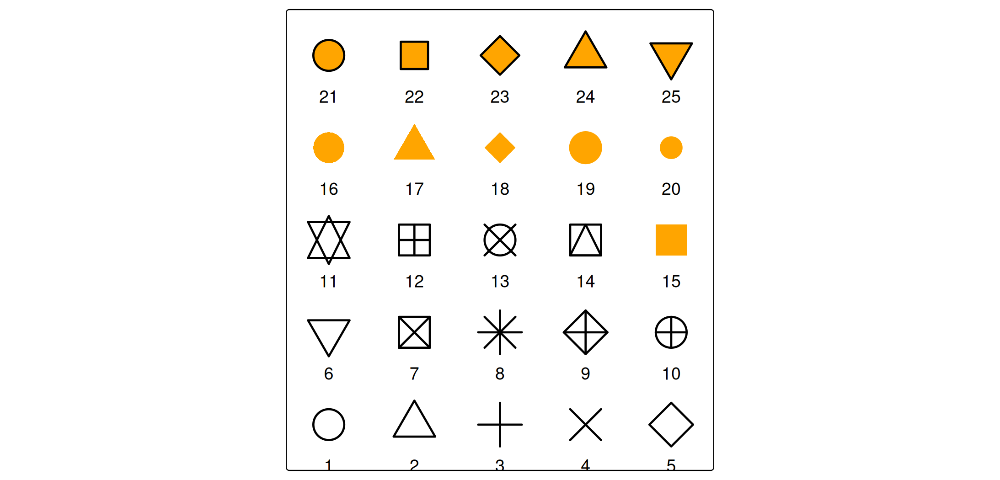

It is also possible to use images or grob objects.

## Layout

There are quite some arguments in
[`tm_legend()`](https://r-tmap.github.io/tmap/reference/tm_legend.md)
that can be used to tweak the layout. For instance broader color boxes:

``` r
s +
  tm_polygons(
    fill = "HPI",
    fill.legend = 
      tm_legend(
        title = "Happy Planet Index",
        item.height = 1.5,
        item.width = 3,
        item.r = 0, 
        item.space = 0.5, 
        item.na.space = 1, 
        title.align = "center"))
```

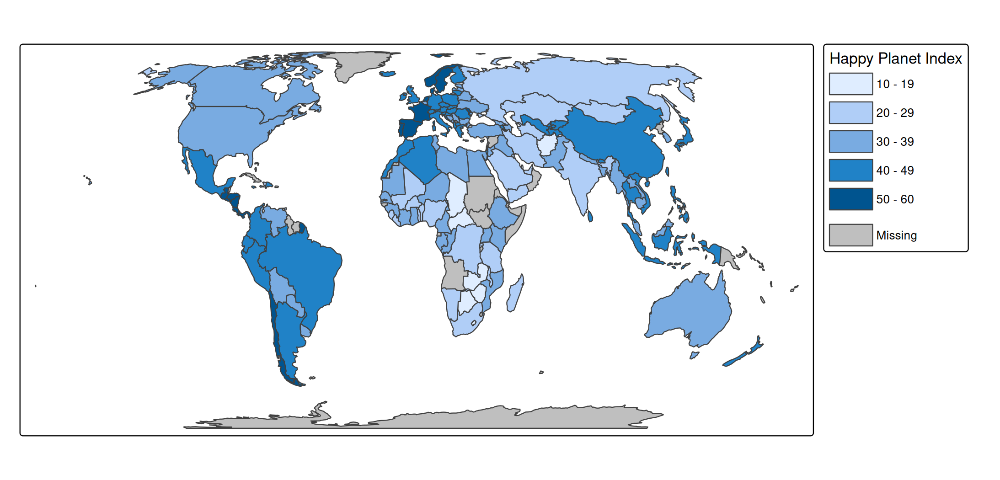

Another example is to configure the legend in ggplot2 style.

``` r
s +
  tm_polygons(
    fill = "HPI",
    col = "grey20",
    lwd = 1,
    fill.scale = tm_scale_continuous(values = "pu_gn", midpoint = 35),
    fill.legend = tm_legend(reverse = TRUE, 
      frame = FALSE, 
      item.height = 2.25, 
      item.width = 1.8, 
      position = tm_pos_out(pos.v = "center"), 
      na.show = FALSE, 
      ticks = list(c(0, 0.1), c(0.9, 1)), 
      ticks.col = "white", 
      col = "white")) +
tm_layout(frame = FALSE, outer.margins = 0)
```

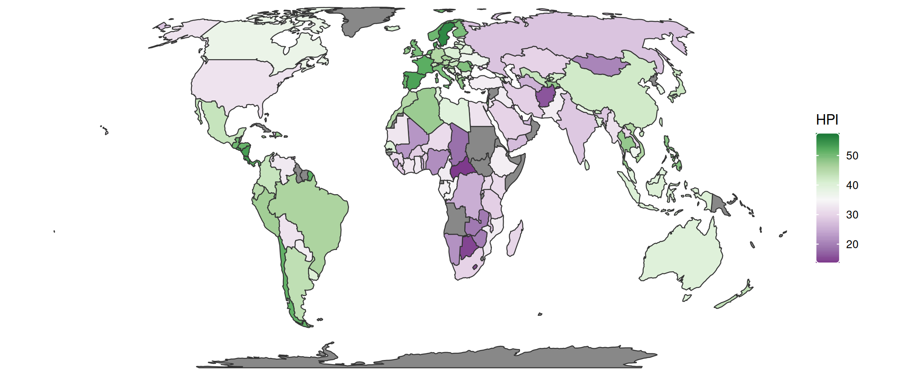

The `ticks` argument defines a dashed line. Each list item is a dash,
the first between 0 and 0.1 of the color box width, and the second
between 0.9 and 1.

The numbers can also be larger than 1. In that case, the tick is drawn
in the small margin between color box and label.

``` r
s +
  tm_polygons(
    fill = "HPI",
    col = "grey20",
    lwd = 1,
    fill.scale = tm_scale_continuous(values = "pu_gn", midpoint = 35),
    fill.legend = tm_legend(reverse = TRUE, 
      frame = FALSE, 
      item.height = 2.25, 
      item.width = 1.8, 
      position = tm_pos_out(pos.v = "center"), 
      na.show = FALSE, 
      ticks = list(c(0, 0.5), c(1, 1.5)), 
      ticks.lwd = 2,
      ticks.col = "red", 
      col = "white")) +
tm_layout(frame = FALSE, outer.margins = 0)
```

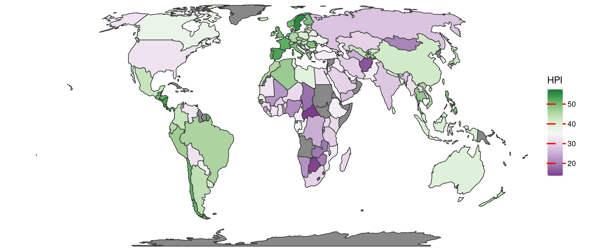

So the first dash `c(0, 0.5)` is drawn in the first half of the color
box, and the second dash `c(1, 1.5)` in the first half of the margin.
