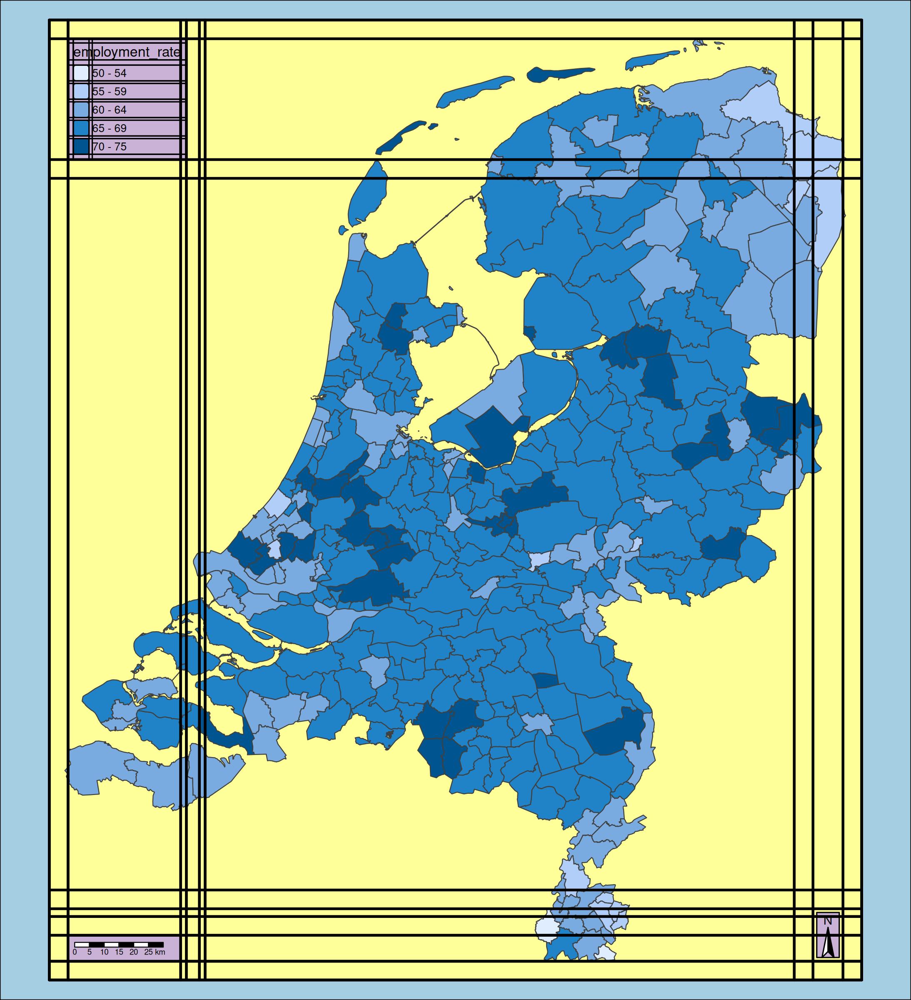
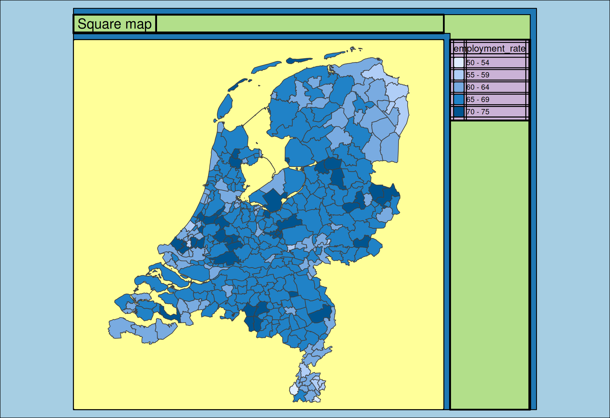

# tmap advanced: margins and aspect ratio

## Design mode

tmap offers a special **design mode**, which can be enabled via
`tmap_design_mode`. Bolow the same map, but the second time with this
design mode enabled:

``` r
(tm = tm_shape(NLD_muni) +
  tm_polygons(fill = "employment_rate", 
    fill.legend = tm_legend(position = tm_pos_in("left", "top"))) +
   tm_compass(position = tm_pos_in("right", "bottom")) +
   tm_scalebar(position = tm_pos_in("left", "bottom")))

tmap_design_mode()
#> design.mode: ON

tm
#> ---------------W (in)-H (in)-asp---
#> | device        7.290 8.000 0.911 |
#> | plot area     6.502 7.680 0.847 |
#> | facets area   6.502 7.680 0.847 |
#> | map area      6.502 7.680 0.847 |
#> -----------------------------------
#> Color codings:
#> - light blue  outer margins
#> - dark blue   buffers around outside cells
#> - light green outside cells
#> - dark green  x and ylab cells
#> - pink        panels
#> - red         margins for outside grid labels
#> - orange      margins around maps for grid labels
#> - yellow      map area
#> - lavender    component areas
#> Guide lines:
#> - thick       component position (legend, scalebar, etc.)
#> - thin        component-element position (e.g. legend items)
```



## tm_layout() and tmap options

All options related to the layout of the map, such as background color
and margins, can be set via `tm_layout`.

These options are a subset of all tmap options, which can be set via
`tmap_options` (a stand-alone function) or `tm_options`, which is
supposed to be stacked with the `+` operator.

## Margins

There are three types of margins:

- `inner.margins` are the margins between the shape (i.e. spatial
  geometries) and the map frame. Vector of four numbers
- `meta.margins` are the margins in which map components are drawn.
- `outer.margins` are the margins between the plot (maps and components)
  and the device borders.

Each is specified with a vector of four numbers that correspond to
respectively the bottom, left, top, and right margin.The inner.margins
are numbers relative to the map frame, and the meta.argins and
outer.margins to the graphics device.

An example where both inner and meta margins are specified:

``` r
tm_shape(NLD_muni) +
  tm_polygons(fill = "employment_rate") +
    tm_layout(
        inner.margins = c(0.2, 0.2, 0.2, 0.2),
        meta.margins = c(0, 0, 0, 0.15))
#> ---------------W (in)-H (in)-asp---
#> | device        7.290 5.000 1.458 |
#> | plot area     5.307 4.800 1.106 |
#> | facets area   4.139 4.800 0.862 |
#> | map area      4.064 4.800 0.847 |
#> -----------------------------------
#> Color codings:
#> - light blue  outer margins
#> - dark blue   buffers around outside cells
#> - light green outside cells
#> - dark green  x and ylab cells
#> - pink        panels
#> - red         margins for outside grid labels
#> - orange      margins around maps for grid labels
#> - yellow      map area
#> - lavender    component areas
#> Guide lines:
#> - thick       component position (legend, scalebar, etc.)
#> - thin        component-element position (e.g. legend items)
```


Via the **inner margins**, the space between the borders of the
Netherlands and the map frame is set to 0.2 in each direction. This
value is relative to the width (for the left and right-handside margin)
and height (top and bottom margin). In other words, the bounding box of
the Netherlands occupies 60 percent of the horizontal space and 60
percent of the vertical space of the map frame, shown as the **yellow**
box in design mode.

The meta margins is the space dedicated for map components that are
outside the map (see [vignette about component
positions](https://r-tmap.github.io/tmap/articles/adv_positions#cell-h-and-cell-v).
The value of the right-handside meta margin 0.15 in this example means
that 15 percent of the total device width is used for the ouside
components (in this example the legend), shown in the **green** box. If
not specified, for single maps this is calculated automatically, using
the other margins and the map component sizes. If there are no outside
map components, `meta.margins` is set to `c(0, 0, 0, 0)`. For complex
maps (e.g. facetted maps) it is set to 0.4 for each side in which map
components are placed.

The outer margins can also be specified. By default these are 0.02 in
each dimension. This is shown in the light blue area. Note that the left
and right-handside margin are larger. This is caused by a mismatch
between the plot (map and outside components) and the device. Because
the aspect ratio of the device is larger (more landscape) than that of
the map and components, the ‘excess’ margin is also added to the outer
margins. It is also possible to add this ‘excess’ margin to the inner
margins by setting `asp = 0`. This is explained in the next section.

## Aspect ratio

The aspect of the map frame can be set via the option `asp`. If so, the
inner margins will be adjusted automatically. The aspect ratio is
defined by width / height, so a value one mean square:

``` r
tm_shape(NLD_muni) +
  tm_polygons(fill = "employment_rate") +
    tm_title("Square map") +
    tm_layout(asp = 1)
#> ---------------W (in)-H (in)-asp---
#> | device        7.29 5.00 1.46 |
#> | plot area     5.53 4.80 1.15 |
#> | facets area   4.50 4.50 1.00 |
#> | map area      4.43 4.43 1.00 |
#> --------------------------------
#> Color codings:
#> - light blue  outer margins
#> - dark blue   buffers around outside cells
#> - light green outside cells
#> - dark green  x and ylab cells
#> - pink        panels
#> - red         margins for outside grid labels
#> - orange      margins around maps for grid labels
#> - yellow      map area
#> - lavender    component areas
#> Guide lines:
#> - thick       component position (legend, scalebar, etc.)
#> - thin        component-element position (e.g. legend items)
```



A special case is the value 0. Then the aspect ratio of the graphics
device is taken. Now the ‘excess’ margin (see previous section) is added
to the inner margins, and the outer margins are unchanged. Hence, a
useful trick is to set both `asp` and `outer.margins` to 0:

``` r
tm_shape(NLD_muni) +
  tm_polygons(fill = "employment_rate") +
    tm_layout(outer.margins = c(0, 0, 0, 0),
              asp = 0)
#> ---------------W (in)-H (in)-asp---
#> | device        7.29 5.00 1.46 |
#> | plot area     7.29 5.00 1.46 |
#> | facets area   6.26 5.00 1.25 |
#> | map area      6.18 5.00 1.24 |
#> --------------------------------
#> Color codings:
#> - light blue  outer margins
#> - dark blue   buffers around outside cells
#> - light green outside cells
#> - dark green  x and ylab cells
#> - pink        panels
#> - red         margins for outside grid labels
#> - orange      margins around maps for grid labels
#> - yellow      map area
#> - lavender    component areas
#> Guide lines:
#> - thick       component position (legend, scalebar, etc.)
#> - thin        component-element position (e.g. legend items)
```


The result is that the map frame (if drawn) corresponds to the borders
of the graphics device.
