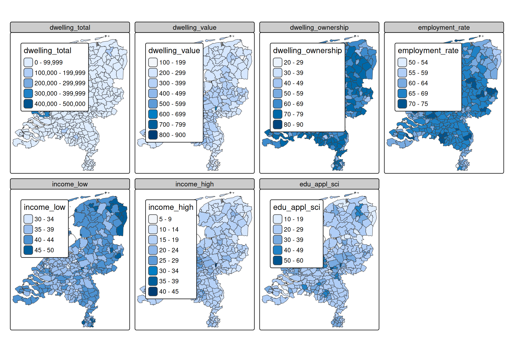

# tmap advanced: multiple visual variables

## Multiple visual variables

Usually we specify a data-driven visual variable with **one** data
variable (see [vignette about visual
variables](https://r-tmap.github.io/tmap/articles/basics_vv)). However,
in several use cases, it is useful to use a few data variables for one
visual variables.

There are two ways to use multiple data variables for one visual
variable: for creating facets, and for multivariate mapping.

## Creating facets

Recall from the [vigentte about
facets](https://r-tmap.github.io/tmap/articles/03_basics_facets)

``` r
tm_shape(NLD_muni) +
  tm_polygons(
    fill = c("pop_0_14", "pop_25_44", "pop_65plus"),
    fill.legend = tm_legend("Percentage"),
    fill.free = FALSE)
```


A facet is create for each specified data variable. More options to
select variables are available via the underlying function
[`tm_vars()`](https://r-tmap.github.io/tmap/reference/tm_vars.md). For
instance, variables 12 to 18 (so columns 12 to 18, disregarding the
geometry column)

``` r
tm_shape(NLD_muni) +
  tm_polygons(
    fill = tm_vars(12:18))
```



Or the first 3 variables:

``` r
tm_shape(NLD_muni) +
  tm_polygons(
    fill = tm_vars(n = 3))
#> Warning: Number of levels of the variable assigned to the aesthetic "fill" of
#> the layer "polygons" is 345, which is larger than n.max (which is 30), so
#> levels are combined.
#> Warning: Number of levels of the variable assigned to the aesthetic "fill" of
#> the layer "polygons" is 345, which is larger than n.max (which is 30), so
#> levels are combined.
#> [plot mode] fit legend/component: Some legend items or map compoments do not
#> fit well, and are therefore rescaled.
#> ℹ Set the tmap option `component.autoscale = FALSE` to disable rescaling.
```


1.  For creating facets. This is the standard way.
2.  For multivariate mapping.

These cases can be divived into two g Before going through these cases,
there is one important There are two

## Multivariate mapping

There are (at least) two use cases:

### RGB image

``` r
library(stars)
#> Loading required package: abind
#> Loading required package: sf
#> Linking to GEOS 3.12.1, GDAL 3.8.4, PROJ 9.4.0; sf_use_s2() is TRUE
tif = system.file("tif/L7_ETMs.tif", package = "stars")
(L7 = read_stars(tif))
#> stars object with 3 dimensions and 1 attribute
#> attribute(s):
#>              Min. 1st Qu. Median     Mean 3rd Qu. Max.
#> L7_ETMs.tif     1      54     69 68.91242      86  255
#> dimension(s):
#>      from  to  offset delta                     refsys point x/y
#> x       1 349  288776  28.5 SIRGAS 2000 / UTM zone 25S FALSE [x]
#> y       1 352 9120761 -28.5 SIRGAS 2000 / UTM zone 25S FALSE [y]
#> band    1   6      NA    NA                         NA    NA
```

Note that the channels are included in the dimenison `"band"`. We can
use the argument `dimvalues` to select them:

``` r
tm_shape(L7) +
    tm_rgb(col = tm_vars(dimvalues = 3:1, multivariate = TRUE))
```


Alternatively, we can split the `stars` object:

``` r
(L7split = split(L7))
#> stars object with 2 dimensions and 6 attributes
#> attribute(s):
#>     Min. 1st Qu. Median     Mean 3rd Qu. Max.
#> X1    47      67     78 79.14772      89  255
#> X2    32      55     66 67.57465      79  255
#> X3    21      49     63 64.35886      77  255
#> X4     9      52     63 59.23541      75  255
#> X5     1      63     89 83.18266     112  255
#> X6     1      32     60 59.97521      88  255
#> dimension(s):
#>   from  to  offset delta                     refsys point x/y
#> x    1 349  288776  28.5 SIRGAS 2000 / UTM zone 25S FALSE [x]
#> y    1 352 9120761 -28.5 SIRGAS 2000 / UTM zone 25S FALSE [y]
```

and plot it like this:

``` r
tm_shape(L7split) +
    tm_rgb(col = tm_vars(3:1, multivariate = TRUE))
```


### Glyphs

Glyph are small charts plotted as symbols. See the \[extention package
[`tmap.glyphs`](https://github.com/r-tmap/tmap.glyphs).

``` r
library(tmap.glyphs)

ZH_muni = NLD_muni[NLD_muni$province == "Zuid-Holland", ]
ZH_muni$income_middle = 100 - ZH_muni$income_high - ZH_muni$income_low

tm_shape(ZH_muni) +
  tm_polygons() +
  tm_donuts(
    parts = tm_vars(c("income_low", "income_middle", "income_high"), multivariate = TRUE),
    fill.scale = tm_scale_categorical(values = "-pu_gn_div"),             
    size = "population",
    size.scale = tm_scale_continuous(ticks = c(50000, 100000, 250000, 500000))) 
```


The visual variable `parts` (introduced in `tmap.glyphs`) is specified
as multivariate visual variable. It specifies the parts (slices) of the
donut charts and uses this also for the `fill` color.
