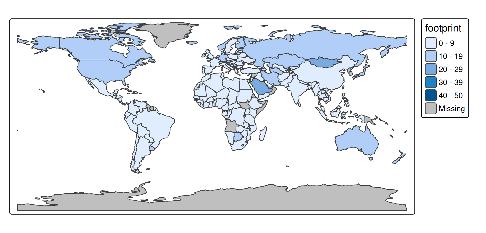

# tmap advanced: options

## tmap options

The options of tmap can be retrieved via
[`tmap_options()`](https://r-tmap.github.io/tmap/reference/tmap_options.md)
which works similar as base R
[`options()`](https://rdrr.io/r/base/options.html):

``` r
opt = tmap_options()
```

Because there are so many options, we need a proper way to print it.
Let’s use `lobstr` for that:

``` r
library(lobstr)
tree(opt)
#> <list>
#> ├─modes: <list>
#> │ ├─plot: <list>
#> │ │ ├─name: "Grid"
#> │ │ ├─use_gradient: FALSE
#> │ │ ├─crs_basemap: 3857
#> │ │ └─limit_latitude_3857<dbl [2]>: -84, 84
#> │ └─view: <list>
#> │   ├─name: "Leaflet"
#> │   ├─use_browser: FALSE
#> │   ├─use_WebGL: NA
#> │   ├─legend.position: S3<tm_pos>
#> │   │ ├─pos.h: "right"
#> │   │ ├─pos.v: "bottom"
#> │   │ ├─align.h: "left"
#> │   │ ├─align.v: "top"
#> │   │ ├─just.h: "left"
#> │   │ ├─just.v: "top"
#> │   │ └─type: "in"
#> │   ├─crs_basemap: <list>
#> │   │ ├─dimensions: 3857
#> │   │ └─4326
#> │   ├─facet.max: 16
#> │   ├─control.position<chr [2]>: "left", "top"
#> │   ├─control.collapse: TRUE
#> │   ├─basemap.show: TRUE
#> │   ├─set_bounds: FALSE
#> │   ├─set_view: NA
#> │   ├─set_zoom_limits: NA
#> │   ├─qtm.scalebar: TRUE
#> │   ├─qtm.minimap: FALSE
#> │   ├─qtm.mouse_coordinates: TRUE
#> │   ├─use_circle_markers: TRUE
#> │   └─leaflet.options: <list>
#> ├─crs: NA
#> ├─bbox: <NULL>
#> ├─facet.max: 64
#> ├─free.scales: <NULL>
#> ├─raster.max_cells: 1e+07
#> ├─raster.warp: TRUE
#> ├─show.messages: TRUE
#> ├─show.warnings: TRUE
#> ├─output.format: "png"
#> ├─output.size: 49
#> ├─output.dpi: 300
#> ├─animation.dpi: 100
#> ├─value.const: <list>
#> │ ├─fill.symbols: "grey60"
#> │ ├─fill.dots: "black"
#> │ ├─fill: "grey85"
#> │ ├─col.polygons: "grey25"
#> │ ├─col.symbols: "grey25"
#> │ ├─col.raster: "grey40"
#> │ ├─col.text: "black"
#> │ ├─col: "black"
#> │ ├─bgcol.labels_highlighted: "white"
#> │ ├─bgcol: "#00000000"
#> │ ├─lwd: 1
#> │ ├─lty: "solid"
#> │ ├─text: "Abc"
#> │ ├─text.labels: ""
#> │ ├─fontface: <NULL>
#> │ ├─shape.squares: 22
#> │ ├─shape.dots: 19
#> │ ├─shape.markers: S3<tmap_icons>
#> │ │ ├─iconUrl: "/home/runner/work/_temp/Library/..."
#> │ │ ├─iconWidth: 25
#> │ │ ├─iconHeight: 41
#> │ │ ├─iconAnchorX: 12
#> │ │ └─iconAnchorY: 41
#> │ ├─shape: 21
#> │ ├─size.bubbles: 1.3333
#> │ ├─size.squares: 1.3333
#> │ ├─size.dots: 0.3
#> │ ├─size: 1
#> │ ├─fill_alpha: 1
#> │ ├─col_alpha: 1
#> │ ├─bgcol_alpha: 1
#> │ ├─angle: 0
#> │ └─num: 1
#> ├─value.na: <list>
#> │ ├─fill: "grey75"
#> │ ├─col: "grey75"
#> │ ├─col.raster: "#00000000"
#> │ ├─bgcol: "grey75"
#> │ ├─lty: "solid"
#> │ ├─text: "Unknown"
#> │ ├─fontface: <NULL>
#> │ ├─fill_alpha: 1
#> │ ├─col_alpha: 1
#> │ ├─bgcol_alpha: 1
#> │ ├─col_alpha.raster: 0
#> │ └─angle: 0
#> ├─value.null: <list>
#> │ ├─fill: "grey95"
#> │ ├─col: "grey95"
#> │ ├─col.polygons: "grey40"
#> │ ├─bgcol: "grey95"
#> │ ├─lty: "solid"
#> │ ├─lwd: 0.2
#> │ ├─shape: 20
#> │ ├─text: ""
#> │ ├─fontface: <NULL>
#> │ ├─fill_alpha: 1
#> │ ├─col_alpha: 1
#> │ ├─bgcol_alpha: 1
#> │ ├─size: 0.2
#> │ ├─angle: 0
#> │ └─num: 0
#> ├─value.blank: <list>
#> │ ├─fill: "#00000000"
#> │ ├─col: "#00000000"
#> │ ├─bgcol: "#00000000"
#> │ ├─lty: "blank"
#> │ ├─lwd: NA
#> │ ├─text: ""
#> │ ├─fontface: <NULL>
#> │ ├─fill_alpha: 0
#> │ ├─col_alpha: 0
#> │ ├─bgcol_alpha: 0
#> │ ├─angle: 0
#> │ └─num: 0
#> ├─values.var: <list>
#> │ ├─fill: <list>
#> │ │ ├─seq: "-hcl.blues3"
#> │ │ ├─div: "pu_gn_div"
#> │ │ ├─unord: "cols4all.area7"
#> │ │ ├─ord: "-hcl.blues3"
#> │ │ ├─cyc: "tol.rainbow_pu_rd"
#> │ │ └─biv: "pu_gn_bivs"
#> │ ├─col: <list>
#> │ │ ├─seq: "-hcl.blues3"
#> │ │ ├─div: "pu_gn_div"
#> │ │ ├─unord: "cols4all.line7"
#> │ │ ├─ord: "-hcl.blues3"
#> │ │ ├─cyc: "tol.rainbow_pu_rd"
#> │ │ └─biv: "pu_gn_bivs"
#> │ ├─fill.dots: <list>
#> │ │ ├─seq: "-hcl.blues3"
#> │ │ ├─div: "pu_gn_div"
#> │ │ ├─unord: "cols4all.line7"
#> │ │ ├─ord: "-hcl.blues3"
#> │ │ ├─cyc: "tol.rainbow_pu_rd"
#> │ │ └─biv: "pu_gn_bivs"
#> │ ├─bgcol: <list>
#> │ │ ├─seq: "-hcl.blues3"
#> │ │ ├─div: "pu_gn_div"
#> │ │ ├─unord: "cols4all.area7"
#> │ │ ├─ord: "-hcl.blues3"
#> │ │ ├─cyc: "tol.rainbow_pu_rd"
#> │ │ └─biv: "pu_gn_bivs"
#> │ ├─size: S3<tmapSeq>
#> │ │ ├─from: 0
#> │ │ ├─to: 1
#> │ │ └─power: "sqrt"
#> │ ├─size.bubbles: S3<tmapSeq>
#> │ │ ├─from: 0
#> │ │ ├─to: 1
#> │ │ └─power: "sqrt"
#> │ ├─lwd<dbl [2]>: 0, 3
#> │ ├─lty<chr [5]>: "dashed", "dotted", "dotdash", "longdash", "twodash"
#> │ ├─text<chr [26]>: "A", "B", "C", "D", "E", "F", "G", "H", "I", "J", ...
#> │ ├─fontface<chr [3]>: "plain", "italic", "bold"
#> │ ├─fill_alpha<dbl [2]>: 0.25, 1
#> │ ├─col_alpha<dbl [2]>: 0.25, 1
#> │ ├─bgcol_alpha<dbl [2]>: 0.25, 1
#> │ ├─shape<int [5]>: 21, 22, 23, 24, 25
#> │ ├─area<dbl [2]>: 0, 1
#> │ ├─xmod<dbl [2]>: 0, 1
#> │ ├─ymod<dbl [2]>: 0, 1
#> │ ├─angle<dbl [2]>: 0, 360
#> │ └─num<dbl [2]>: 0, 1
#> ├─values.range: <list>
#> │ ├─fill: NA
#> │ ├─col: NA
#> │ ├─size<dbl [2]>: 0, 1
#> │ ├─lwd<dbl [2]>: 0, 1
#> │ ├─lty: NA
#> │ ├─text: NA
#> │ ├─fontface: NA
#> │ ├─fill_alpha: NA
#> │ ├─col_alpha: NA
#> │ ├─shape: NA
#> │ ├─angle: NA
#> │ └─num<dbl [2]>: 0, 1
#> ├─value.neutral: <list>
#> │ ├─size: 0.75
#> │ ├─lwd: 2
#> │ ├─lty: "solid"
#> │ ├─fill_alpha: 1
#> │ ├─col_alpha: 1
#> │ ├─bgcol_alpha: 1
#> │ ├─text: "Abc"
#> │ ├─fontface: "plain"
#> │ ├─angle: 0
#> │ └─num: 1
#> ├─values.scale: <list>
#> │ ├─1
#> │ ├─lwd.lines: 1
#> │ ├─size.symbols: 1
#> │ ├─size.bubbles: 1.3333
#> │ └─size.squares: 1.3333
#> ├─scales.var: <list>
#> │ ├─fill: <list>
#> │ │ ├─fact: "categorical"
#> │ │ ├─num: "intervals"
#> │ │ ├─int: "discrete"
#> │ │ ├─datetime: "intervals"
#> │ │ └─date: "intervals"
#> │ ├─col: <list>
#> │ │ ├─fact: "categorical"
#> │ │ ├─num: "intervals"
#> │ │ ├─int: "discrete"
#> │ │ ├─datetime: "intervals"
#> │ │ └─date: "intervals"
#> │ ├─bgcol: <list>
#> │ │ ├─fact: "categorical"
#> │ │ ├─num: "intervals"
#> │ │ ├─int: "discrete"
#> │ │ ├─datetime: "intervals"
#> │ │ └─date: "intervals"
#> │ ├─lwd: <list>
#> │ │ ├─fact: "categorical"
#> │ │ ├─num: "continuous"
#> │ │ ├─int: "discrete"
#> │ │ ├─datetime: "intervals"
#> │ │ └─date: "intervals"
#> │ ├─lty: <list>
#> │ │ ├─fact: "categorical"
#> │ │ ├─num: "intervals"
#> │ │ ├─datetime: "intervals"
#> │ │ └─date: "intervals"
#> │ ├─shape: <list>
#> │ │ ├─fact: "categorical"
#> │ │ ├─num: "intervals"
#> │ │ ├─datetime: "intervals"
#> │ │ └─date: "intervals"
#> │ ├─size: <list>
#> │ │ ├─fact: "continuous"
#> │ │ ├─num: "continuous"
#> │ │ ├─datetime: "continuous"
#> │ │ └─date: "continuous"
#> │ ├─fill_alpha: <list>
#> │ │ ├─fact: "categorical"
#> │ │ ├─num: "intervals"
#> │ │ ├─datetime: "continuous"
#> │ │ └─date: "continuous"
#> │ ├─col_alpha: <list>
#> │ │ ├─fact: "categorical"
#> │ │ ├─num: "intervals"
#> │ │ ├─datetime: "continuous"
#> │ │ └─date: "continuous"
#> │ ├─bgcol_alpha: <list>
#> │ │ ├─fact: "categorical"
#> │ │ ├─num: "intervals"
#> │ │ ├─datetime: "continuous"
#> │ │ └─date: "continuous"
#> │ ├─area: <list>
#> │ │ ├─fact: "categorical"
#> │ │ ├─num: "continuous"
#> │ │ ├─datetime: "continuous"
#> │ │ └─date: "continuous"
#> │ ├─xmod: <list>
#> │ │ ├─fact: "asis"
#> │ │ └─num: "asis"
#> │ ├─ymod: <list>
#> │ │ ├─fact: "asis"
#> │ │ └─num: "asis"
#> │ ├─angle: <list>
#> │ │ ├─fact: "asis"
#> │ │ └─num: "asis"
#> │ ├─text: <list>
#> │ │ ├─fact: "asis"
#> │ │ └─num: "asis"
#> │ └─fontface: <list>
#> │   ├─fact: "categorical"
#> │   ├─num: "categorical"
#> │   ├─datetime: "categorical"
#> │   └─date: "categorical"
#> ├─scale.misc.args: <list>
#> │ ├─continuous: <list>
#> │ │ ├─n<dbl [3]>: 5, 5, 5
#> │ │ ├─outliers.trunc<lgl [2]>: FALSE, FALSE
#> │ │ ├─trans: "identity"
#> │ │ └─limits: <list>
#> │ │   ├─fill: NA
#> │ │   ├─col: NA
#> │ │   └─0
#> │ ├─continuous_log: <list>
#> │ │ ├─n<dbl [3]>: 5, 5, 5
#> │ │ ├─outliers.trunc<lgl [2]>: FALSE, FALSE
#> │ │ └─limits: <list>
#> │ │   ├─fill: NA
#> │ │   ├─col: NA
#> │ │   └─NA
#> │ ├─continuous_log2: <list>
#> │ │ ├─n<dbl [3]>: 5, 5, 5
#> │ │ ├─outliers.trunc<lgl [2]>: FALSE, FALSE
#> │ │ └─limits: <list>
#> │ │   ├─fill: NA
#> │ │   ├─col: NA
#> │ │   └─NA
#> │ ├─continuous_log10: <list>
#> │ │ ├─n<dbl [3]>: 5, 5, 5
#> │ │ ├─outliers.trunc<lgl [2]>: FALSE, FALSE
#> │ │ └─limits: <list>
#> │ │   ├─fill: NA
#> │ │   ├─col: NA
#> │ │   └─NA
#> │ ├─continuous_log1p: <list>
#> │ │ ├─n<dbl [3]>: 5, 5, 5
#> │ │ ├─outliers.trunc<lgl [2]>: FALSE, FALSE
#> │ │ └─limits: <list>
#> │ │   ├─fill: NA
#> │ │   ├─col: NA
#> │ │   └─NA
#> │ ├─continuous_sqrt: <list>
#> │ │ ├─n<dbl [3]>: 5, 5, 5
#> │ │ ├─outliers.trunc<lgl [2]>: FALSE, FALSE
#> │ │ └─limits: <list>
#> │ │   ├─fill: NA
#> │ │   ├─col: NA
#> │ │   └─0
#> │ ├─continuous_pseudo_log: <list>
#> │ │ ├─n<dbl [3]>: 5, 5, 5
#> │ │ ├─outliers.trunc<lgl [2]>: FALSE, FALSE
#> │ │ └─limits: <list>
#> │ │   ├─fill: NA
#> │ │   ├─col: NA
#> │ │   └─NA
#> │ └─rank: <list>
#> │   ├─n: 5
#> │   └─unit: "rank"
#> ├─continuous.nclass_per_legend_break: 50
#> ├─continuous.nclasses: 101
#> ├─label.format: <list>
#> │ ├─fun: <NULL>
#> │ ├─scientific: FALSE
#> │ ├─digits: NA
#> │ ├─interval.disjoint: TRUE
#> │ ├─big.num.abbr<dbl [5]>: 6, 9, 12, 15, 18
#> │ ├─prefix: ""
#> │ ├─suffix: ""
#> │ ├─text.separator: "-"
#> │ ├─text.less.than: "<"
#> │ ├─text.less.than_as.prefix: TRUE
#> │ ├─text.or.more: "≥"
#> │ ├─text.or.more_as.prefix: TRUE
#> │ ├─text.align: NA
#> │ ├─text.to.columns: FALSE
#> │ └─html.escape: TRUE
#> ├─label.na: "Missing"
#> ├─scale: 0.75
#> ├─asp: NA
#> ├─bg: TRUE
#> ├─bg.color: "white"
#> ├─outer.bg: FALSE
#> ├─outer.bg.color: "white"
#> ├─frame: TRUE
#> ├─frame.color: NA
#> ├─frame.alpha: 1
#> ├─frame.lwd: 1
#> ├─frame.r: NA
#> ├─frame.double_line: FALSE
#> ├─outer.margins<dbl [4]>: 0.02, 0.02, 0.02, 0.02
#> ├─inner.margins: <list>
#> │ ├─stars<dbl [4]>: 0, 0, 0, 0
#> │ ├─SpatRaster<dbl [4]>: 0, 0, 0, 0
#> │ └─<dbl [4]>0.02, 0.02, 0.02, 0.02
#> ├─inner.margins.extra<dbl [4]>: 0, 0, 0, 0
#> ├─meta.margins: NA
#> ├─meta.auto_margins<dbl [4]>: 0.4, 0.4, 0.4, 0.4
#> ├─between_margin: 0.5
#> ├─panel.margin<dbl [2]>: 0.4, 0
#> ├─xlab.show: FALSE
#> ├─xlab.text: ""
#> ├─xlab.size: 1
#> ├─xlab.color: "black"
#> ├─xlab.rotation: 0
#> ├─xlab.space: 0.5
#> ├─xlab.fontface: <NULL>
#> ├─xlab.fontfamily: <NULL>
#> ├─xlab.alpha: 1
#> ├─xlab.side: "bottom"
#> ├─ylab.show: FALSE
#> ├─ylab.text: ""
#> ├─ylab.size: 1
#> ├─ylab.color: "black"
#> ├─ylab.rotation: 0
#> ├─ylab.space: 0.5
#> ├─ylab.fontface: <NULL>
#> ├─ylab.fontfamily: <NULL>
#> ├─ylab.alpha: 1
#> ├─ylab.side: "left"
#> ├─panel.type: NA
#> ├─panel.wrap.pos: "top"
#> ├─panel.xtab.pos<chr [2]>: "left", "top"
#> ├─unit: "metric"
#> ├─color.sepia_intensity: 0
#> ├─color.saturation: 1
#> ├─color_vision_deficiency_sim: "none"
#> ├─text.fontface: "plain"
#> ├─text.fontfamily: ""
#> ├─r: 2
#> ├─component.position: <list>
#> │ ├─in: S3<tm_pos>
#> │ │ ├─pos.h: "left"
#> │ │ ├─pos.v: "top"
#> │ │ ├─align.h: "left"
#> │ │ ├─align.v: "top"
#> │ │ ├─just.h: "left"
#> │ │ ├─just.v: "top"
#> │ │ └─type: "in"
#> │ └─out: S3<tm_pos>
#> │   ├─cell.h: "right"
#> │   ├─cell.v: "center"
#> │   ├─pos.h: "left"
#> │   ├─pos.v: "top"
#> │   ├─align.h: "left"
#> │   ├─align.v: "top"
#> │   ├─just.h: "left"
#> │   ├─just.v: "top"
#> │   └─type: "out"
#> ├─component.offset<dbl [4]>: 0.75, 0, 0, 0
#> ├─component.stack_margin<dbl [2]>: 0, 0.5
#> ├─component.autoscale: TRUE
#> ├─component.resize_as_group: FALSE
#> ├─component.frame_combine: TRUE
#> ├─component.stack: "vertical"
#> ├─legend.stack<chr [6]>: "vertical", "horizontal", "horizontal", "vertical", "horizontal", "vertical"
#> ├─chart.stack<chr [6]>: "vertical", "horizontal", "horizontal", "vertical", "horizontal", "vertical"
#> ├─component.equalize: TRUE
#> ├─component.frame: FALSE
#> ├─component.frame.color: NA
#> ├─component.frame.alpha: 1
#> ├─component.frame.lwd: 1
#> ├─component.frame.r: NA
#> ├─component.bg: TRUE
#> ├─component.bg.color: "white"
#> ├─component.bg.alpha: 1
#> ├─legend.show: TRUE
#> ├─legend.orientation: "portrait"
#> ├─legend.position: S3<tm_pos>
#> │ ├─cell.h: "right"
#> │ ├─cell.v: "bottom"
#> │ ├─pos.h: "left"
#> │ ├─pos.v: "top"
#> │ ├─align.h: "left"
#> │ ├─align.v: "top"
#> │ ├─just.h: "left"
#> │ ├─just.v: "top"
#> │ └─type: "autoout"
#> ├─legend.width: NA
#> ├─legend.height: NA
#> ├─legend.reverse: FALSE
#> ├─legend.na.show: NA
#> ├─legend.title.color: NA
#> ├─legend.title.size: 0.9
#> ├─legend.title.fontface: <NULL>
#> ├─legend.title.fontfamily: <NULL>
#> ├─legend.title.alpha: 1
#> ├─legend.xlab.color: NA
#> ├─legend.xlab.size: 0.9
#> ├─legend.xlab.fontface: <NULL>
#> ├─legend.xlab.fontfamily: <NULL>
#> ├─legend.xlab.alpha: 1
#> ├─legend.ylab.color: NA
#> ├─legend.ylab.size: 0.9
#> ├─legend.ylab.fontface: <NULL>
#> ├─legend.ylab.fontfamily: <NULL>
#> ├─legend.xlab.rot: 0
#> ├─legend.ylab.rot: 0
#> ├─legend.ylab.alpha: 1
#> ├─legend.text.color: NA
#> ├─legend.text.size: 0.7
#> ├─legend.text.fontface: <NULL>
#> ├─legend.text.fontfamily: <NULL>
#> ├─legend.text.alpha: 1
#> ├─legend.frame: TRUE
#> ├─legend.frame.color: NA
#> ├─legend.frame.alpha: 1
#> ├─legend.frame.lwd: 1
#> ├─legend.frame.r: NA
#> ├─legend.bg: TRUE
#> ├─legend.bg.color: "white"
#> ├─legend.bg.alpha: 1
#> ├─legend.only: FALSE
#> ├─legend.absolute_fontsize: 14
#> ├─legend.settings.portrait: <list>
#> │ ├─item.height<dbl [6]>: 1.2, 1, 3, 1.2, 1.2, 1.2
#> │ ├─item.width<dbl [6]>: 1.2, 1, 1.2, 1.2, 3, 1.2
#> │ ├─item.r: NA
#> │ ├─item.space<dbl [6]>: 0.2, 0.2, 0, 0.2, 0.2, 0
#> │ ├─item.na.height<dbl [6]>: NA, NA, 1.2, NA, NA, NA
#> │ ├─item.na.width<dbl [6]>: NA, NA, 1.2, NA, NA, NA
#> │ ├─item.na.space<dbl [6]>: 0.2, 0.3, 1, 0.2, 0.2, 0.2
#> │ ├─item.shape: 107
#> │ ├─title.padding<dbl [4]>: 0, 0, 0.25, 0
#> │ ├─xlab.padding<dbl [4]>: 0, 0, 0.25, 0
#> │ ├─ylab.padding<dbl [4]>: 0, 0, 0.25, 0
#> │ ├─title.align<chr [2]>: "right", "left"
#> │ ├─xlab.align: "left"
#> │ ├─ylab.align: "center"
#> │ ├─ticks: <list>
#> │ │ ├─rect: <list>
#> │ │ ├─symbols: <list>
#> │ │ ├─gradient: <list>
#> │ │ │ └─<dbl [2]>0.85, 1.1
#> │ │ ├─lines: <list>
#> │ │ ├─text: <list>
#> │ │ └─bivariate: <list>
#> │ ├─ticks.disable.na<lgl [6]>: FALSE, FALSE, TRUE, FALSE, FALSE, TRUE
#> │ ├─ticks.col: NA
#> │ ├─ticks.lwd: 1
#> │ ├─margins<dbl [4]>: 0.4, 0.4, 0.4, 0.4
#> │ └─item_text.margin<dbl [2]>: 0.5, 0.25
#> ├─legend.settings.landscape: <list>
#> │ ├─item.height<dbl [5]>: 1, 1, 1.2, 1, 1
#> │ ├─item.width<dbl [5]>: 6, 3, 6, 6, 6
#> │ ├─item.r: NA
#> │ ├─item.space<dbl [5]>: 0.2, 0.3, 0, 0.2, 0.2
#> │ ├─item.na.height<dbl [5]>: NA, NA, 2, NA, NA
#> │ ├─item.na.width<dbl [5]>: NA, NA, 4, NA, NA
#> │ ├─item.na.space<dbl [5]>: 0.2, 0.3, 0.3, 0.2, 0.2
#> │ ├─item.shape: 107
#> │ ├─title.padding<dbl [4]>: 0, 0, 0.25, 0
#> │ ├─xlab.padding<dbl [4]>: 0, 0, 0.25, 0
#> │ ├─ylab.padding<dbl [4]>: 0, 0, 0.25, 0
#> │ ├─title.align<chr [2]>: "right", "left"
#> │ ├─xlab.align: "left"
#> │ ├─ylab.align: "center"
#> │ ├─ticks: <list>
#> │ │ ├─rect: <list>
#> │ │ ├─symbols: <list>
#> │ │ ├─gradient: <list>
#> │ │ │ └─<dbl [2]>0.85, 1.1
#> │ │ ├─lines: <list>
#> │ │ └─text: <list>
#> │ ├─ticks.disable.na<lgl [5]>: FALSE, FALSE, TRUE, FALSE, FALSE
#> │ ├─ticks.col: NA
#> │ ├─ticks.lwd: 1
#> │ ├─margins<dbl [4]>: 0.4, 0.4, 0.4, 0.4
#> │ └─item_text.margin: 0.25
#> ├─add_legend.position: <NULL>
#> ├─chart.show: TRUE
#> ├─chart.plot.axis.x: FALSE
#> ├─chart.plot.axis.y: TRUE
#> ├─chart.position: S3<tm_pos>
#> │ ├─cell.h: "right"
#> │ ├─cell.v: "bottom"
#> │ ├─pos.h: "left"
#> │ ├─pos.v: "top"
#> │ ├─align.h: "left"
#> │ ├─align.v: "bottom"
#> │ ├─just.h: "left"
#> │ ├─just.v: "top"
#> │ └─type: "autoout"
#> ├─chart.width<dbl [8]>: 10, 20, 10, 20, 10, 10, 10, 15
#> ├─chart.height<dbl [8]>: 10, 10, 10, 10, 10, 10, 10, 10
#> ├─chart.reverse: FALSE
#> ├─chart.na.show: NA
#> ├─chart.title.color: NA
#> ├─chart.title.size: 0.9
#> ├─chart.title.fontface: <NULL>
#> ├─chart.title.fontfamily: <NULL>
#> ├─chart.title.alpha: <NULL>
#> ├─chart.xlab.color: NA
#> ├─chart.xlab.size: 0.9
#> ├─chart.xlab.fontface: <NULL>
#> ├─chart.xlab.fontfamily: <NULL>
#> ├─chart.xlab.alpha: <NULL>
#> ├─chart.ylab.color: NA
#> ├─chart.ylab.size: 0.9
#> ├─chart.ylab.fontface: <NULL>
#> ├─chart.ylab.fontfamily: <NULL>
#> ├─chart.ylab.alpha: 1
#> ├─chart.text.color: NA
#> ├─chart.text.size: 0.7
#> ├─chart.text.fontface: <NULL>
#> ├─chart.text.fontfamily: <NULL>
#> ├─chart.text.alpha: 1
#> ├─chart.frame: TRUE
#> ├─chart.frame.color: NA
#> ├─chart.frame.alpha: 1
#> ├─chart.frame.lwd: 1
#> ├─chart.frame.r: NA
#> ├─chart.bg: TRUE
#> ├─chart.bg.color: "white"
#> ├─chart.bg.alpha: 1
#> ├─chart.object.color: "#DDDDDD"
#> ├─title.size: 1.3
#> ├─title.color: NA
#> ├─title.fontface: <NULL>
#> ├─title.fontfamily: <NULL>
#> ├─title.alpha: 1
#> ├─title.padding<dbl [4]>: 0.25, 0.25, 0.25, 0.25
#> ├─title.frame: FALSE
#> ├─title.frame.color: NA
#> ├─title.frame.alpha: 1
#> ├─title.frame.lwd: 1
#> ├─title.frame.r: NA
#> ├─title.position: S3<tm_pos>
#> │ ├─cell.h: "center"
#> │ ├─cell.v: "top"
#> │ ├─pos.h: "left"
#> │ ├─pos.v: "top"
#> │ ├─align.h: "left"
#> │ ├─align.v: "top"
#> │ ├─just.h: "left"
#> │ ├─just.v: "top"
#> │ └─type: "out"
#> ├─title.width: NA
#> ├─credits.size: 0.7
#> ├─credits.color: NA
#> ├─credits.fontface: <NULL>
#> ├─credits.fontfamily: <NULL>
#> ├─credits.alpha: 1
#> ├─credits.padding<dbl [4]>: 0.25, 0.25, 0.25, 0.25
#> ├─credits.position: S3<tm_pos>
#> │ ├─pos.h: "right"
#> │ ├─pos.v: "bottom"
#> │ ├─align.h: "right"
#> │ ├─align.v: "top"
#> │ ├─just.h: "left"
#> │ ├─just.v: "top"
#> │ └─type: "in"
#> ├─credits.width: NA
#> ├─credits.height: NA
#> ├─compass.north: 0
#> ├─compass.type: "arrow"
#> ├─compass.text.size: 0.8
#> ├─compass.size: NA
#> ├─compass.show.labels: 1
#> ├─compass.cardinal.directions<chr [4]>: "N", "E", "S", "W"
#> ├─compass.text.color: NA
#> ├─compass.color.dark: NA
#> ├─compass.color.light: NA
#> ├─compass.lwd: 1
#> ├─compass.margins<dbl [4]>: 0.25, 0.25, 0.25, 0.25
#> ├─compass.position: S3<tm_pos>
#> │ ├─pos.h: "right"
#> │ ├─pos.v: "bottom"
#> │ ├─align.h: "right"
#> │ ├─align.v: "top"
#> │ ├─just.h: "left"
#> │ ├─just.v: "top"
#> │ └─type: "in"
#> ├─inset.position: S3<tm_pos>
#> │ ├─pos.h: "right"
#> │ ├─pos.v: "bottom"
#> │ ├─align.h: "right"
#> │ ├─align.v: "top"
#> │ ├─just.h: "left"
#> │ ├─just.v: "top"
#> │ └─type: "in"
#> ├─logo.height: 3
#> ├─logo.margins<dbl [4]>: 0.2, 0.2, 0.2, 0.2
#> ├─logo.between_margin: 0.2
#> ├─logo.position: S3<tm_pos>
#> │ ├─pos.h: "right"
#> │ ├─pos.v: "bottom"
#> │ ├─align.h: "right"
#> │ ├─align.v: "top"
#> │ ├─just.h: "left"
#> │ ├─just.v: "top"
#> │ └─type: "in"
#> ├─inset.height: 3
#> ├─inset.width: 3
#> ├─inset.margins<dbl [4]>: 0.2, 0.2, 0.2, 0.2
#> ├─inset.between_margin: 0.2
#> ├─inset.position: S3<tm_pos>
#> │ ├─pos.h: "right"
#> │ ├─pos.v: "bottom"
#> │ ├─align.h: "right"
#> │ ├─align.v: "top"
#> │ ├─just.h: "left"
#> │ ├─just.v: "top"
#> │ └─type: "in"
#> ├─inset.frame: TRUE
#> ├─inset.bg: TRUE
#> ├─inset.bg.color: "#ffffff"
#> ├─inset.bg.alpha: 1
#> ├─inset.box_frame: TRUE
#> ├─inset.box_frame.color: "#ee2211"
#> ├─inset.box_frame.alpha: 1
#> ├─inset.box_frame.lwd: 2
#> ├─inset.box_frame.lty: "solid"
#> ├─inset.box_bg: FALSE
#> ├─inset.box_bg.color: "#ffffff"
#> ├─inset.box_bg.alpha: 1
#> ├─inset.main_frame: TRUE
#> ├─inset.main_frame.r: NA
#> ├─inset.main_frame.color: NA
#> ├─inset.main_frame.alpha: 1
#> ├─inset.main_frame.lwd: 2
#> ├─inset_map.height: 7
#> ├─inset_map.width: 7
#> ├─inset_map.margins<dbl [4]>: 0.2, 0.2, 0.2, 0.2
#> ├─inset_map.between_margin: 0.2
#> ├─inset_map.position: S3<tm_pos>
#> │ ├─pos.h: "right"
#> │ ├─pos.v: "bottom"
#> │ ├─align.h: "right"
#> │ ├─align.v: "top"
#> │ ├─just.h: "left"
#> │ ├─just.v: "top"
#> │ └─type: "in"
#> ├─inset_map.frame: FALSE
#> ├─inset_tmap.height: 7
#> ├─inset_tmap.width: 7
#> ├─inset_grob.height: 7
#> ├─inset_grob.width: 7
#> ├─inset_gg.height: 7
#> ├─inset_gg.width: 7
#> ├─scalebar.breaks: <NULL>
#> ├─scalebar.width: 12
#> ├─scalebar.allow_clipping: FALSE
#> ├─scalebar.text.size: 0.5
#> ├─scalebar.text.color: NA
#> ├─scalebar.text.fontface: <NULL>
#> ├─scalebar.text.fontfamily: <NULL>
#> ├─scalebar.color.dark: NA
#> ├─scalebar.color.light: NA
#> ├─scalebar.lwd: 1
#> ├─scalebar.size: <NULL>
#> ├─scalebar.margins<dbl [4]>: 0.01, 0.01, 0.01, 0.01
#> ├─scalebar.position: S3<tm_pos>
#> │ ├─pos.h: "right"
#> │ ├─pos.v: "bottom"
#> │ ├─align.h: "right"
#> │ ├─align.v: "top"
#> │ ├─just.h: "left"
#> │ ├─just.v: "top"
#> │ └─type: "in"
#> ├─grid.show: FALSE
#> ├─grid.labels.pos<chr [2]>: "left", "bottom"
#> ├─grid.x: NA
#> ├─grid.y: NA
#> ├─grid.n.x: NA
#> ├─grid.n.y: NA
#> ├─grid.crs: NA
#> ├─grid.col: NA
#> ├─grid.lwd: 1
#> ├─grid.alpha: NA
#> ├─grid.labels.show: TRUE
#> ├─grid.labels.size: 0.6
#> ├─grid.labels.col: NA
#> ├─grid.labels.fontface: <NULL>
#> ├─grid.labels.fontfamily: <NULL>
#> ├─grid.labels.rot<dbl [2]>: 0, 0
#> ├─grid.labels.format: <list>
#> │ └─big.mark: ","
#> ├─grid.labels.cardinal: FALSE
#> ├─grid.labels.margin.x: 0
#> ├─grid.labels.margin.y: 0
#> ├─grid.labels.space.x: NA
#> ├─grid.labels.space.y: NA
#> ├─grid.labels.inside_frame: FALSE
#> ├─grid.ticks: TRUE
#> ├─grid.lines: TRUE
#> ├─grid.ndiscr: 100
#> ├─mouse_coordinates.position: S3<tm_pos>
#> │ ├─pos.h: "right"
#> │ ├─pos.v: "bottom"
#> │ ├─align.h: "right"
#> │ ├─align.v: "top"
#> │ ├─just.h: "left"
#> │ ├─just.v: "top"
#> │ └─type: "in"
#> ├─minimap.server: NA
#> ├─minimap.toggle: TRUE
#> ├─minimap.position: S3<tm_pos>
#> │ ├─pos.h: "right"
#> │ ├─pos.v: "bottom"
#> │ ├─align.h: "right"
#> │ ├─align.v: "top"
#> │ ├─just.h: "left"
#> │ ├─just.v: "top"
#> │ └─type: "in"
#> ├─minimap.height: 7
#> ├─minimap.width: 7
#> ├─minimap.margins<dbl [4]>: 0.2, 0.2, 0.2, 0.2
#> ├─minimap.between_margin: 0.2
#> ├─minimap.frame: FALSE
#> ├─minimap.bg: TRUE
#> ├─panel.show: NA
#> ├─panel.labels: NA
#> ├─panel.label.size: 1
#> ├─panel.label.color: "black"
#> ├─panel.label.fontface: <NULL>
#> ├─panel.label.fontfamily: <NULL>
#> ├─panel.label.alpha: 1
#> ├─panel.label.bg: TRUE
#> ├─panel.label.bg.color: "grey80"
#> ├─panel.label.bg.alpha: 1
#> ├─panel.label.frame: TRUE
#> ├─panel.label.frame.color: NA
#> ├─panel.label.frame.alpha: 1
#> ├─panel.label.frame.lwd: 1
#> ├─panel.label.frame.r: NA
#> ├─panel.label.height: 1
#> ├─panel.label.rot<dbl [4]>: 90, 0, 270, 0
#> ├─qtm.scalebar: FALSE
#> ├─qtm.minimap: FALSE
#> ├─qtm.mouse_coordinates: FALSE
#> ├─earth_boundary: FALSE
#> ├─earth_boundary.color: NA
#> ├─earth_boundary.lwd: 1
#> ├─earth_datum: "OGC:CRS84"
#> ├─space: TRUE
#> ├─space.color: "#ffffff"
#> ├─space_overlay: NA
#> ├─check_and_fix: FALSE
#> ├─basemap.show: FALSE
#> ├─basemap.server<chr [3]>: "Esri.WorldGr...", "OpenStreetMap", "Esri.WorldTo..."
#> ├─basemap.alpha: 1
#> ├─basemap.zoom: NA
#> ├─tiles.show: FALSE
#> ├─tiles.server: ""
#> ├─tiles.alpha: 1
#> ├─tiles.zoom: NA
#> ├─attr.color: "black"
#> ├─crs_extra: ""
#> └─crs_global: "+proj=eqearth"
```

## Mode-specific options

Note that the first option, called `"modes"` is not really an option,
but rather a list of mode-specific options, where the first subitem of
each item is the name of that mode. Here, the technical rather than the
user interface mode names are used: `"Grid"` for the `"plot"` mode and
`"Leaflet"` for the `"view"` mode. The other subitems are either totally
new options, or standard options (also listed further below) but with
different defaults.

The list of options for a specific mode can be obtained as follows:

``` r
# only the mode-specific options:
tree(tmap_options_mode("view"))
#> <list>
#> ├─use_browser: FALSE
#> ├─use_WebGL: NA
#> ├─legend.position: S3<tm_pos>
#> │ ├─pos.h: "right"
#> │ ├─pos.v: "bottom"
#> │ ├─align.h: "left"
#> │ ├─align.v: "top"
#> │ ├─just.h: "left"
#> │ ├─just.v: "top"
#> │ └─type: "in"
#> ├─crs_basemap: <list>
#> │ ├─dimensions: 3857
#> │ └─4326
#> ├─facet.max: 16
#> ├─control.position<chr [2]>: "left", "top"
#> ├─control.collapse: TRUE
#> ├─basemap.show: TRUE
#> ├─set_bounds: FALSE
#> ├─set_view: NA
#> ├─set_zoom_limits: NA
#> ├─qtm.scalebar: TRUE
#> ├─qtm.minimap: FALSE
#> ├─qtm.mouse_coordinates: TRUE
#> ├─use_circle_markers: TRUE
#> └─leaflet.options: <list>

# all options
tree(tmap_options_mode("view", mode.specific = FALSE))
#> <list>
#> ├─crs: NA
#> ├─bbox: <NULL>
#> ├─facet.max: 16
#> ├─free.scales: <NULL>
#> ├─raster.max_cells: 1e+07
#> ├─raster.warp: TRUE
#> ├─show.messages: TRUE
#> ├─show.warnings: TRUE
#> ├─output.format: "png"
#> ├─output.size: 49
#> ├─output.dpi: 300
#> ├─animation.dpi: 100
#> ├─value.const: <list>
#> │ ├─fill.symbols: "grey60"
#> │ ├─fill.dots: "black"
#> │ ├─fill: "grey85"
#> │ ├─col.polygons: "grey25"
#> │ ├─col.symbols: "grey25"
#> │ ├─col.raster: "grey40"
#> │ ├─col.text: "black"
#> │ ├─col: "black"
#> │ ├─bgcol.labels_highlighted: "white"
#> │ ├─bgcol: "#00000000"
#> │ ├─lwd: 1
#> │ ├─lty: "solid"
#> │ ├─text: "Abc"
#> │ ├─text.labels: ""
#> │ ├─fontface: <NULL>
#> │ ├─shape.squares: 22
#> │ ├─shape.dots: 19
#> │ ├─shape.markers: S3<tmap_icons>
#> │ │ ├─iconUrl: "/home/runner/work/_temp/Library/..."
#> │ │ ├─iconWidth: 25
#> │ │ ├─iconHeight: 41
#> │ │ ├─iconAnchorX: 12
#> │ │ └─iconAnchorY: 41
#> │ ├─shape: 21
#> │ ├─size.bubbles: 1.3333
#> │ ├─size.squares: 1.3333
#> │ ├─size.dots: 0.3
#> │ ├─size: 1
#> │ ├─fill_alpha: 1
#> │ ├─col_alpha: 1
#> │ ├─bgcol_alpha: 1
#> │ ├─angle: 0
#> │ └─num: 1
#> ├─value.na: <list>
#> │ ├─fill: "grey75"
#> │ ├─col: "grey75"
#> │ ├─col.raster: "#00000000"
#> │ ├─bgcol: "grey75"
#> │ ├─lty: "solid"
#> │ ├─text: "Unknown"
#> │ ├─fontface: <NULL>
#> │ ├─fill_alpha: 1
#> │ ├─col_alpha: 1
#> │ ├─bgcol_alpha: 1
#> │ ├─col_alpha.raster: 0
#> │ └─angle: 0
#> ├─value.null: <list>
#> │ ├─fill: "grey95"
#> │ ├─col: "grey95"
#> │ ├─col.polygons: "grey40"
#> │ ├─bgcol: "grey95"
#> │ ├─lty: "solid"
#> │ ├─lwd: 0.2
#> │ ├─shape: 20
#> │ ├─text: ""
#> │ ├─fontface: <NULL>
#> │ ├─fill_alpha: 1
#> │ ├─col_alpha: 1
#> │ ├─bgcol_alpha: 1
#> │ ├─size: 0.2
#> │ ├─angle: 0
#> │ └─num: 0
#> ├─value.blank: <list>
#> │ ├─fill: "#00000000"
#> │ ├─col: "#00000000"
#> │ ├─bgcol: "#00000000"
#> │ ├─lty: "blank"
#> │ ├─lwd: NA
#> │ ├─text: ""
#> │ ├─fontface: <NULL>
#> │ ├─fill_alpha: 0
#> │ ├─col_alpha: 0
#> │ ├─bgcol_alpha: 0
#> │ ├─angle: 0
#> │ └─num: 0
#> ├─values.var: <list>
#> │ ├─fill: <list>
#> │ │ ├─seq: "-hcl.blues3"
#> │ │ ├─div: "pu_gn_div"
#> │ │ ├─unord: "cols4all.area7"
#> │ │ ├─ord: "-hcl.blues3"
#> │ │ ├─cyc: "tol.rainbow_pu_rd"
#> │ │ └─biv: "pu_gn_bivs"
#> │ ├─col: <list>
#> │ │ ├─seq: "-hcl.blues3"
#> │ │ ├─div: "pu_gn_div"
#> │ │ ├─unord: "cols4all.line7"
#> │ │ ├─ord: "-hcl.blues3"
#> │ │ ├─cyc: "tol.rainbow_pu_rd"
#> │ │ └─biv: "pu_gn_bivs"
#> │ ├─fill.dots: <list>
#> │ │ ├─seq: "-hcl.blues3"
#> │ │ ├─div: "pu_gn_div"
#> │ │ ├─unord: "cols4all.line7"
#> │ │ ├─ord: "-hcl.blues3"
#> │ │ ├─cyc: "tol.rainbow_pu_rd"
#> │ │ └─biv: "pu_gn_bivs"
#> │ ├─bgcol: <list>
#> │ │ ├─seq: "-hcl.blues3"
#> │ │ ├─div: "pu_gn_div"
#> │ │ ├─unord: "cols4all.area7"
#> │ │ ├─ord: "-hcl.blues3"
#> │ │ ├─cyc: "tol.rainbow_pu_rd"
#> │ │ └─biv: "pu_gn_bivs"
#> │ ├─size: S3<tmapSeq>
#> │ │ ├─from: 0
#> │ │ ├─to: 1
#> │ │ └─power: "sqrt"
#> │ ├─size.bubbles: S3<tmapSeq>
#> │ │ ├─from: 0
#> │ │ ├─to: 1
#> │ │ └─power: "sqrt"
#> │ ├─lwd<dbl [2]>: 0, 3
#> │ ├─lty<chr [5]>: "dashed", "dotted", "dotdash", "longdash", "twodash"
#> │ ├─text<chr [26]>: "A", "B", "C", "D", "E", "F", "G", "H", "I", "J", ...
#> │ ├─fontface<chr [3]>: "plain", "italic", "bold"
#> │ ├─fill_alpha<dbl [2]>: 0.25, 1
#> │ ├─col_alpha<dbl [2]>: 0.25, 1
#> │ ├─bgcol_alpha<dbl [2]>: 0.25, 1
#> │ ├─shape<int [5]>: 21, 22, 23, 24, 25
#> │ ├─area<dbl [2]>: 0, 1
#> │ ├─xmod<dbl [2]>: 0, 1
#> │ ├─ymod<dbl [2]>: 0, 1
#> │ ├─angle<dbl [2]>: 0, 360
#> │ └─num<dbl [2]>: 0, 1
#> ├─values.range: <list>
#> │ ├─fill: NA
#> │ ├─col: NA
#> │ ├─size<dbl [2]>: 0, 1
#> │ ├─lwd<dbl [2]>: 0, 1
#> │ ├─lty: NA
#> │ ├─text: NA
#> │ ├─fontface: NA
#> │ ├─fill_alpha: NA
#> │ ├─col_alpha: NA
#> │ ├─shape: NA
#> │ ├─angle: NA
#> │ └─num<dbl [2]>: 0, 1
#> ├─value.neutral: <list>
#> │ ├─size: 0.75
#> │ ├─lwd: 2
#> │ ├─lty: "solid"
#> │ ├─fill_alpha: 1
#> │ ├─col_alpha: 1
#> │ ├─bgcol_alpha: 1
#> │ ├─text: "Abc"
#> │ ├─fontface: "plain"
#> │ ├─angle: 0
#> │ └─num: 1
#> ├─values.scale: <list>
#> │ ├─1
#> │ ├─lwd.lines: 1
#> │ ├─size.symbols: 1
#> │ ├─size.bubbles: 1.3333
#> │ └─size.squares: 1.3333
#> ├─scales.var: <list>
#> │ ├─fill: <list>
#> │ │ ├─fact: "categorical"
#> │ │ ├─num: "intervals"
#> │ │ ├─int: "discrete"
#> │ │ ├─datetime: "intervals"
#> │ │ └─date: "intervals"
#> │ ├─col: <list>
#> │ │ ├─fact: "categorical"
#> │ │ ├─num: "intervals"
#> │ │ ├─int: "discrete"
#> │ │ ├─datetime: "intervals"
#> │ │ └─date: "intervals"
#> │ ├─bgcol: <list>
#> │ │ ├─fact: "categorical"
#> │ │ ├─num: "intervals"
#> │ │ ├─int: "discrete"
#> │ │ ├─datetime: "intervals"
#> │ │ └─date: "intervals"
#> │ ├─lwd: <list>
#> │ │ ├─fact: "categorical"
#> │ │ ├─num: "continuous"
#> │ │ ├─int: "discrete"
#> │ │ ├─datetime: "intervals"
#> │ │ └─date: "intervals"
#> │ ├─lty: <list>
#> │ │ ├─fact: "categorical"
#> │ │ ├─num: "intervals"
#> │ │ ├─datetime: "intervals"
#> │ │ └─date: "intervals"
#> │ ├─shape: <list>
#> │ │ ├─fact: "categorical"
#> │ │ ├─num: "intervals"
#> │ │ ├─datetime: "intervals"
#> │ │ └─date: "intervals"
#> │ ├─size: <list>
#> │ │ ├─fact: "continuous"
#> │ │ ├─num: "continuous"
#> │ │ ├─datetime: "continuous"
#> │ │ └─date: "continuous"
#> │ ├─fill_alpha: <list>
#> │ │ ├─fact: "categorical"
#> │ │ ├─num: "intervals"
#> │ │ ├─datetime: "continuous"
#> │ │ └─date: "continuous"
#> │ ├─col_alpha: <list>
#> │ │ ├─fact: "categorical"
#> │ │ ├─num: "intervals"
#> │ │ ├─datetime: "continuous"
#> │ │ └─date: "continuous"
#> │ ├─bgcol_alpha: <list>
#> │ │ ├─fact: "categorical"
#> │ │ ├─num: "intervals"
#> │ │ ├─datetime: "continuous"
#> │ │ └─date: "continuous"
#> │ ├─area: <list>
#> │ │ ├─fact: "categorical"
#> │ │ ├─num: "continuous"
#> │ │ ├─datetime: "continuous"
#> │ │ └─date: "continuous"
#> │ ├─xmod: <list>
#> │ │ ├─fact: "asis"
#> │ │ └─num: "asis"
#> │ ├─ymod: <list>
#> │ │ ├─fact: "asis"
#> │ │ └─num: "asis"
#> │ ├─angle: <list>
#> │ │ ├─fact: "asis"
#> │ │ └─num: "asis"
#> │ ├─text: <list>
#> │ │ ├─fact: "asis"
#> │ │ └─num: "asis"
#> │ └─fontface: <list>
#> │   ├─fact: "categorical"
#> │   ├─num: "categorical"
#> │   ├─datetime: "categorical"
#> │   └─date: "categorical"
#> ├─scale.misc.args: <list>
#> │ ├─continuous: <list>
#> │ │ ├─n<dbl [3]>: 5, 5, 5
#> │ │ ├─outliers.trunc<lgl [2]>: FALSE, FALSE
#> │ │ ├─trans: "identity"
#> │ │ └─limits: <list>
#> │ │   ├─fill: NA
#> │ │   ├─col: NA
#> │ │   └─0
#> │ ├─continuous_log: <list>
#> │ │ ├─n<dbl [3]>: 5, 5, 5
#> │ │ ├─outliers.trunc<lgl [2]>: FALSE, FALSE
#> │ │ └─limits: <list>
#> │ │   ├─fill: NA
#> │ │   ├─col: NA
#> │ │   └─NA
#> │ ├─continuous_log2: <list>
#> │ │ ├─n<dbl [3]>: 5, 5, 5
#> │ │ ├─outliers.trunc<lgl [2]>: FALSE, FALSE
#> │ │ └─limits: <list>
#> │ │   ├─fill: NA
#> │ │   ├─col: NA
#> │ │   └─NA
#> │ ├─continuous_log10: <list>
#> │ │ ├─n<dbl [3]>: 5, 5, 5
#> │ │ ├─outliers.trunc<lgl [2]>: FALSE, FALSE
#> │ │ └─limits: <list>
#> │ │   ├─fill: NA
#> │ │   ├─col: NA
#> │ │   └─NA
#> │ ├─continuous_log1p: <list>
#> │ │ ├─n<dbl [3]>: 5, 5, 5
#> │ │ ├─outliers.trunc<lgl [2]>: FALSE, FALSE
#> │ │ └─limits: <list>
#> │ │   ├─fill: NA
#> │ │   ├─col: NA
#> │ │   └─NA
#> │ ├─continuous_sqrt: <list>
#> │ │ ├─n<dbl [3]>: 5, 5, 5
#> │ │ ├─outliers.trunc<lgl [2]>: FALSE, FALSE
#> │ │ └─limits: <list>
#> │ │   ├─fill: NA
#> │ │   ├─col: NA
#> │ │   └─0
#> │ ├─continuous_pseudo_log: <list>
#> │ │ ├─n<dbl [3]>: 5, 5, 5
#> │ │ ├─outliers.trunc<lgl [2]>: FALSE, FALSE
#> │ │ └─limits: <list>
#> │ │   ├─fill: NA
#> │ │   ├─col: NA
#> │ │   └─NA
#> │ └─rank: <list>
#> │   ├─n: 5
#> │   └─unit: "rank"
#> ├─continuous.nclass_per_legend_break: 50
#> ├─continuous.nclasses: 101
#> ├─label.format: <list>
#> │ ├─fun: <NULL>
#> │ ├─scientific: FALSE
#> │ ├─digits: NA
#> │ ├─interval.disjoint: TRUE
#> │ ├─big.num.abbr<dbl [5]>: 6, 9, 12, 15, 18
#> │ ├─prefix: ""
#> │ ├─suffix: ""
#> │ ├─text.separator: "-"
#> │ ├─text.less.than: "<"
#> │ ├─text.less.than_as.prefix: TRUE
#> │ ├─text.or.more: "≥"
#> │ ├─text.or.more_as.prefix: TRUE
#> │ ├─text.align: NA
#> │ ├─text.to.columns: FALSE
#> │ └─html.escape: TRUE
#> ├─label.na: "Missing"
#> ├─scale: 0.75
#> ├─asp: NA
#> ├─bg: TRUE
#> ├─bg.color: "white"
#> ├─outer.bg: FALSE
#> ├─outer.bg.color: "white"
#> ├─frame: TRUE
#> ├─frame.color: NA
#> ├─frame.alpha: 1
#> ├─frame.lwd: 1
#> ├─frame.r: NA
#> ├─frame.double_line: FALSE
#> ├─outer.margins<dbl [4]>: 0.02, 0.02, 0.02, 0.02
#> ├─inner.margins: <list>
#> │ ├─stars<dbl [4]>: 0, 0, 0, 0
#> │ ├─SpatRaster<dbl [4]>: 0, 0, 0, 0
#> │ └─<dbl [4]>0.02, 0.02, 0.02, 0.02
#> ├─inner.margins.extra<dbl [4]>: 0, 0, 0, 0
#> ├─meta.margins: NA
#> ├─meta.auto_margins<dbl [4]>: 0.4, 0.4, 0.4, 0.4
#> ├─between_margin: 0.5
#> ├─panel.margin<dbl [2]>: 0.4, 0
#> ├─xlab.show: FALSE
#> ├─xlab.text: ""
#> ├─xlab.size: 1
#> ├─xlab.color: "black"
#> ├─xlab.rotation: 0
#> ├─xlab.space: 0.5
#> ├─xlab.fontface: <NULL>
#> ├─xlab.fontfamily: <NULL>
#> ├─xlab.alpha: 1
#> ├─xlab.side: "bottom"
#> ├─ylab.show: FALSE
#> ├─ylab.text: ""
#> ├─ylab.size: 1
#> ├─ylab.color: "black"
#> ├─ylab.rotation: 0
#> ├─ylab.space: 0.5
#> ├─ylab.fontface: <NULL>
#> ├─ylab.fontfamily: <NULL>
#> ├─ylab.alpha: 1
#> ├─ylab.side: "left"
#> ├─panel.type: NA
#> ├─panel.wrap.pos: "top"
#> ├─panel.xtab.pos<chr [2]>: "left", "top"
#> ├─unit: "metric"
#> ├─color.sepia_intensity: 0
#> ├─color.saturation: 1
#> ├─color_vision_deficiency_sim: "none"
#> ├─text.fontface: "plain"
#> ├─text.fontfamily: ""
#> ├─r: 2
#> ├─component.position: <list>
#> │ ├─in: S3<tm_pos>
#> │ │ ├─pos.h: "left"
#> │ │ ├─pos.v: "top"
#> │ │ ├─align.h: "left"
#> │ │ ├─align.v: "top"
#> │ │ ├─just.h: "left"
#> │ │ ├─just.v: "top"
#> │ │ └─type: "in"
#> │ └─out: S3<tm_pos>
#> │   ├─cell.h: "right"
#> │   ├─cell.v: "center"
#> │   ├─pos.h: "left"
#> │   ├─pos.v: "top"
#> │   ├─align.h: "left"
#> │   ├─align.v: "top"
#> │   ├─just.h: "left"
#> │   ├─just.v: "top"
#> │   └─type: "out"
#> ├─component.offset<dbl [4]>: 0.75, 0, 0, 0
#> ├─component.stack_margin<dbl [2]>: 0, 0.5
#> ├─component.autoscale: TRUE
#> ├─component.resize_as_group: FALSE
#> ├─component.frame_combine: TRUE
#> ├─component.stack: "vertical"
#> ├─legend.stack<chr [6]>: "vertical", "horizontal", "horizontal", "vertical", "horizontal", "vertical"
#> ├─chart.stack<chr [6]>: "vertical", "horizontal", "horizontal", "vertical", "horizontal", "vertical"
#> ├─component.equalize: TRUE
#> ├─component.frame: FALSE
#> ├─component.frame.color: NA
#> ├─component.frame.alpha: 1
#> ├─component.frame.lwd: 1
#> ├─component.frame.r: NA
#> ├─component.bg: TRUE
#> ├─component.bg.color: "white"
#> ├─component.bg.alpha: 1
#> ├─legend.show: TRUE
#> ├─legend.orientation: "portrait"
#> ├─legend.position: S3<tm_pos>
#> │ ├─pos.h: "right"
#> │ ├─pos.v: "bottom"
#> │ ├─align.h: "left"
#> │ ├─align.v: "top"
#> │ ├─just.h: "left"
#> │ ├─just.v: "top"
#> │ └─type: "in"
#> ├─legend.width: NA
#> ├─legend.height: NA
#> ├─legend.reverse: FALSE
#> ├─legend.na.show: NA
#> ├─legend.title.color: NA
#> ├─legend.title.size: 0.9
#> ├─legend.title.fontface: <NULL>
#> ├─legend.title.fontfamily: <NULL>
#> ├─legend.title.alpha: 1
#> ├─legend.xlab.color: NA
#> ├─legend.xlab.size: 0.9
#> ├─legend.xlab.fontface: <NULL>
#> ├─legend.xlab.fontfamily: <NULL>
#> ├─legend.xlab.alpha: 1
#> ├─legend.ylab.color: NA
#> ├─legend.ylab.size: 0.9
#> ├─legend.ylab.fontface: <NULL>
#> ├─legend.ylab.fontfamily: <NULL>
#> ├─legend.xlab.rot: 0
#> ├─legend.ylab.rot: 0
#> ├─legend.ylab.alpha: 1
#> ├─legend.text.color: NA
#> ├─legend.text.size: 0.7
#> ├─legend.text.fontface: <NULL>
#> ├─legend.text.fontfamily: <NULL>
#> ├─legend.text.alpha: 1
#> ├─legend.frame: TRUE
#> ├─legend.frame.color: NA
#> ├─legend.frame.alpha: 1
#> ├─legend.frame.lwd: 1
#> ├─legend.frame.r: NA
#> ├─legend.bg: TRUE
#> ├─legend.bg.color: "white"
#> ├─legend.bg.alpha: 1
#> ├─legend.only: FALSE
#> ├─legend.absolute_fontsize: 14
#> ├─legend.settings.portrait: <list>
#> │ ├─item.height<dbl [6]>: 1.2, 1, 3, 1.2, 1.2, 1.2
#> │ ├─item.width<dbl [6]>: 1.2, 1, 1.2, 1.2, 3, 1.2
#> │ ├─item.r: NA
#> │ ├─item.space<dbl [6]>: 0.2, 0.2, 0, 0.2, 0.2, 0
#> │ ├─item.na.height<dbl [6]>: NA, NA, 1.2, NA, NA, NA
#> │ ├─item.na.width<dbl [6]>: NA, NA, 1.2, NA, NA, NA
#> │ ├─item.na.space<dbl [6]>: 0.2, 0.3, 1, 0.2, 0.2, 0.2
#> │ ├─item.shape: 107
#> │ ├─title.padding<dbl [4]>: 0, 0, 0.25, 0
#> │ ├─xlab.padding<dbl [4]>: 0, 0, 0.25, 0
#> │ ├─ylab.padding<dbl [4]>: 0, 0, 0.25, 0
#> │ ├─title.align<chr [2]>: "right", "left"
#> │ ├─xlab.align: "left"
#> │ ├─ylab.align: "center"
#> │ ├─ticks: <list>
#> │ │ ├─rect: <list>
#> │ │ ├─symbols: <list>
#> │ │ ├─gradient: <list>
#> │ │ │ └─<dbl [2]>0.85, 1.1
#> │ │ ├─lines: <list>
#> │ │ ├─text: <list>
#> │ │ └─bivariate: <list>
#> │ ├─ticks.disable.na<lgl [6]>: FALSE, FALSE, TRUE, FALSE, FALSE, TRUE
#> │ ├─ticks.col: NA
#> │ ├─ticks.lwd: 1
#> │ ├─margins<dbl [4]>: 0.4, 0.4, 0.4, 0.4
#> │ └─item_text.margin<dbl [2]>: 0.5, 0.25
#> ├─legend.settings.landscape: <list>
#> │ ├─item.height<dbl [5]>: 1, 1, 1.2, 1, 1
#> │ ├─item.width<dbl [5]>: 6, 3, 6, 6, 6
#> │ ├─item.r: NA
#> │ ├─item.space<dbl [5]>: 0.2, 0.3, 0, 0.2, 0.2
#> │ ├─item.na.height<dbl [5]>: NA, NA, 2, NA, NA
#> │ ├─item.na.width<dbl [5]>: NA, NA, 4, NA, NA
#> │ ├─item.na.space<dbl [5]>: 0.2, 0.3, 0.3, 0.2, 0.2
#> │ ├─item.shape: 107
#> │ ├─title.padding<dbl [4]>: 0, 0, 0.25, 0
#> │ ├─xlab.padding<dbl [4]>: 0, 0, 0.25, 0
#> │ ├─ylab.padding<dbl [4]>: 0, 0, 0.25, 0
#> │ ├─title.align<chr [2]>: "right", "left"
#> │ ├─xlab.align: "left"
#> │ ├─ylab.align: "center"
#> │ ├─ticks: <list>
#> │ │ ├─rect: <list>
#> │ │ ├─symbols: <list>
#> │ │ ├─gradient: <list>
#> │ │ │ └─<dbl [2]>0.85, 1.1
#> │ │ ├─lines: <list>
#> │ │ └─text: <list>
#> │ ├─ticks.disable.na<lgl [5]>: FALSE, FALSE, TRUE, FALSE, FALSE
#> │ ├─ticks.col: NA
#> │ ├─ticks.lwd: 1
#> │ ├─margins<dbl [4]>: 0.4, 0.4, 0.4, 0.4
#> │ └─item_text.margin: 0.25
#> ├─add_legend.position: <NULL>
#> ├─chart.show: TRUE
#> ├─chart.plot.axis.x: FALSE
#> ├─chart.plot.axis.y: TRUE
#> ├─chart.position: S3<tm_pos>
#> │ ├─cell.h: "right"
#> │ ├─cell.v: "bottom"
#> │ ├─pos.h: "left"
#> │ ├─pos.v: "top"
#> │ ├─align.h: "left"
#> │ ├─align.v: "bottom"
#> │ ├─just.h: "left"
#> │ ├─just.v: "top"
#> │ └─type: "autoout"
#> ├─chart.width<dbl [8]>: 10, 20, 10, 20, 10, 10, 10, 15
#> ├─chart.height<dbl [8]>: 10, 10, 10, 10, 10, 10, 10, 10
#> ├─chart.reverse: FALSE
#> ├─chart.na.show: NA
#> ├─chart.title.color: NA
#> ├─chart.title.size: 0.9
#> ├─chart.title.fontface: <NULL>
#> ├─chart.title.fontfamily: <NULL>
#> ├─chart.title.alpha: <NULL>
#> ├─chart.xlab.color: NA
#> ├─chart.xlab.size: 0.9
#> ├─chart.xlab.fontface: <NULL>
#> ├─chart.xlab.fontfamily: <NULL>
#> ├─chart.xlab.alpha: <NULL>
#> ├─chart.ylab.color: NA
#> ├─chart.ylab.size: 0.9
#> ├─chart.ylab.fontface: <NULL>
#> ├─chart.ylab.fontfamily: <NULL>
#> ├─chart.ylab.alpha: 1
#> ├─chart.text.color: NA
#> ├─chart.text.size: 0.7
#> ├─chart.text.fontface: <NULL>
#> ├─chart.text.fontfamily: <NULL>
#> ├─chart.text.alpha: 1
#> ├─chart.frame: TRUE
#> ├─chart.frame.color: NA
#> ├─chart.frame.alpha: 1
#> ├─chart.frame.lwd: 1
#> ├─chart.frame.r: NA
#> ├─chart.bg: TRUE
#> ├─chart.bg.color: "white"
#> ├─chart.bg.alpha: 1
#> ├─chart.object.color: "#DDDDDD"
#> ├─title.size: 1.3
#> ├─title.color: NA
#> ├─title.fontface: <NULL>
#> ├─title.fontfamily: <NULL>
#> ├─title.alpha: 1
#> ├─title.padding<dbl [4]>: 0.25, 0.25, 0.25, 0.25
#> ├─title.frame: FALSE
#> ├─title.frame.color: NA
#> ├─title.frame.alpha: 1
#> ├─title.frame.lwd: 1
#> ├─title.frame.r: NA
#> ├─title.position: S3<tm_pos>
#> │ ├─cell.h: "center"
#> │ ├─cell.v: "top"
#> │ ├─pos.h: "left"
#> │ ├─pos.v: "top"
#> │ ├─align.h: "left"
#> │ ├─align.v: "top"
#> │ ├─just.h: "left"
#> │ ├─just.v: "top"
#> │ └─type: "out"
#> ├─title.width: NA
#> ├─credits.size: 0.7
#> ├─credits.color: NA
#> ├─credits.fontface: <NULL>
#> ├─credits.fontfamily: <NULL>
#> ├─credits.alpha: 1
#> ├─credits.padding<dbl [4]>: 0.25, 0.25, 0.25, 0.25
#> ├─credits.position: S3<tm_pos>
#> │ ├─pos.h: "right"
#> │ ├─pos.v: "bottom"
#> │ ├─align.h: "right"
#> │ ├─align.v: "top"
#> │ ├─just.h: "left"
#> │ ├─just.v: "top"
#> │ └─type: "in"
#> ├─credits.width: NA
#> ├─credits.height: NA
#> ├─compass.north: 0
#> ├─compass.type: "arrow"
#> ├─compass.text.size: 0.8
#> ├─compass.size: NA
#> ├─compass.show.labels: 1
#> ├─compass.cardinal.directions<chr [4]>: "N", "E", "S", "W"
#> ├─compass.text.color: NA
#> ├─compass.color.dark: NA
#> ├─compass.color.light: NA
#> ├─compass.lwd: 1
#> ├─compass.margins<dbl [4]>: 0.25, 0.25, 0.25, 0.25
#> ├─compass.position: S3<tm_pos>
#> │ ├─pos.h: "right"
#> │ ├─pos.v: "bottom"
#> │ ├─align.h: "right"
#> │ ├─align.v: "top"
#> │ ├─just.h: "left"
#> │ ├─just.v: "top"
#> │ └─type: "in"
#> ├─inset.position: S3<tm_pos>
#> │ ├─pos.h: "right"
#> │ ├─pos.v: "bottom"
#> │ ├─align.h: "right"
#> │ ├─align.v: "top"
#> │ ├─just.h: "left"
#> │ ├─just.v: "top"
#> │ └─type: "in"
#> ├─logo.height: 3
#> ├─logo.margins<dbl [4]>: 0.2, 0.2, 0.2, 0.2
#> ├─logo.between_margin: 0.2
#> ├─logo.position: S3<tm_pos>
#> │ ├─pos.h: "right"
#> │ ├─pos.v: "bottom"
#> │ ├─align.h: "right"
#> │ ├─align.v: "top"
#> │ ├─just.h: "left"
#> │ ├─just.v: "top"
#> │ └─type: "in"
#> ├─inset.height: 3
#> ├─inset.width: 3
#> ├─inset.margins<dbl [4]>: 0.2, 0.2, 0.2, 0.2
#> ├─inset.between_margin: 0.2
#> ├─inset.position: S3<tm_pos>
#> │ ├─pos.h: "right"
#> │ ├─pos.v: "bottom"
#> │ ├─align.h: "right"
#> │ ├─align.v: "top"
#> │ ├─just.h: "left"
#> │ ├─just.v: "top"
#> │ └─type: "in"
#> ├─inset.frame: TRUE
#> ├─inset.bg: TRUE
#> ├─inset.bg.color: "#ffffff"
#> ├─inset.bg.alpha: 1
#> ├─inset.box_frame: TRUE
#> ├─inset.box_frame.color: "#ee2211"
#> ├─inset.box_frame.alpha: 1
#> ├─inset.box_frame.lwd: 2
#> ├─inset.box_frame.lty: "solid"
#> ├─inset.box_bg: FALSE
#> ├─inset.box_bg.color: "#ffffff"
#> ├─inset.box_bg.alpha: 1
#> ├─inset.main_frame: TRUE
#> ├─inset.main_frame.r: NA
#> ├─inset.main_frame.color: NA
#> ├─inset.main_frame.alpha: 1
#> ├─inset.main_frame.lwd: 2
#> ├─inset_map.height: 7
#> ├─inset_map.width: 7
#> ├─inset_map.margins<dbl [4]>: 0.2, 0.2, 0.2, 0.2
#> ├─inset_map.between_margin: 0.2
#> ├─inset_map.position: S3<tm_pos>
#> │ ├─pos.h: "right"
#> │ ├─pos.v: "bottom"
#> │ ├─align.h: "right"
#> │ ├─align.v: "top"
#> │ ├─just.h: "left"
#> │ ├─just.v: "top"
#> │ └─type: "in"
#> ├─inset_map.frame: FALSE
#> ├─inset_tmap.height: 7
#> ├─inset_tmap.width: 7
#> ├─inset_grob.height: 7
#> ├─inset_grob.width: 7
#> ├─inset_gg.height: 7
#> ├─inset_gg.width: 7
#> ├─scalebar.breaks: <NULL>
#> ├─scalebar.width: 12
#> ├─scalebar.allow_clipping: FALSE
#> ├─scalebar.text.size: 0.5
#> ├─scalebar.text.color: NA
#> ├─scalebar.text.fontface: <NULL>
#> ├─scalebar.text.fontfamily: <NULL>
#> ├─scalebar.color.dark: NA
#> ├─scalebar.color.light: NA
#> ├─scalebar.lwd: 1
#> ├─scalebar.size: <NULL>
#> ├─scalebar.margins<dbl [4]>: 0.01, 0.01, 0.01, 0.01
#> ├─scalebar.position: S3<tm_pos>
#> │ ├─pos.h: "right"
#> │ ├─pos.v: "bottom"
#> │ ├─align.h: "right"
#> │ ├─align.v: "top"
#> │ ├─just.h: "left"
#> │ ├─just.v: "top"
#> │ └─type: "in"
#> ├─grid.show: FALSE
#> ├─grid.labels.pos<chr [2]>: "left", "bottom"
#> ├─grid.x: NA
#> ├─grid.y: NA
#> ├─grid.n.x: NA
#> ├─grid.n.y: NA
#> ├─grid.crs: NA
#> ├─grid.col: NA
#> ├─grid.lwd: 1
#> ├─grid.alpha: NA
#> ├─grid.labels.show: TRUE
#> ├─grid.labels.size: 0.6
#> ├─grid.labels.col: NA
#> ├─grid.labels.fontface: <NULL>
#> ├─grid.labels.fontfamily: <NULL>
#> ├─grid.labels.rot<dbl [2]>: 0, 0
#> ├─grid.labels.format: <list>
#> │ └─big.mark: ","
#> ├─grid.labels.cardinal: FALSE
#> ├─grid.labels.margin.x: 0
#> ├─grid.labels.margin.y: 0
#> ├─grid.labels.space.x: NA
#> ├─grid.labels.space.y: NA
#> ├─grid.labels.inside_frame: FALSE
#> ├─grid.ticks: TRUE
#> ├─grid.lines: TRUE
#> ├─grid.ndiscr: 100
#> ├─mouse_coordinates.position: S3<tm_pos>
#> │ ├─pos.h: "right"
#> │ ├─pos.v: "bottom"
#> │ ├─align.h: "right"
#> │ ├─align.v: "top"
#> │ ├─just.h: "left"
#> │ ├─just.v: "top"
#> │ └─type: "in"
#> ├─minimap.server: NA
#> ├─minimap.toggle: TRUE
#> ├─minimap.position: S3<tm_pos>
#> │ ├─pos.h: "right"
#> │ ├─pos.v: "bottom"
#> │ ├─align.h: "right"
#> │ ├─align.v: "top"
#> │ ├─just.h: "left"
#> │ ├─just.v: "top"
#> │ └─type: "in"
#> ├─minimap.height: 7
#> ├─minimap.width: 7
#> ├─minimap.margins<dbl [4]>: 0.2, 0.2, 0.2, 0.2
#> ├─minimap.between_margin: 0.2
#> ├─minimap.frame: FALSE
#> ├─minimap.bg: TRUE
#> ├─panel.show: NA
#> ├─panel.labels: NA
#> ├─panel.label.size: 1
#> ├─panel.label.color: "black"
#> ├─panel.label.fontface: <NULL>
#> ├─panel.label.fontfamily: <NULL>
#> ├─panel.label.alpha: 1
#> ├─panel.label.bg: TRUE
#> ├─panel.label.bg.color: "grey80"
#> ├─panel.label.bg.alpha: 1
#> ├─panel.label.frame: TRUE
#> ├─panel.label.frame.color: NA
#> ├─panel.label.frame.alpha: 1
#> ├─panel.label.frame.lwd: 1
#> ├─panel.label.frame.r: NA
#> ├─panel.label.height: 1
#> ├─panel.label.rot<dbl [4]>: 90, 0, 270, 0
#> ├─qtm.scalebar: TRUE
#> ├─qtm.minimap: FALSE
#> ├─qtm.mouse_coordinates: TRUE
#> ├─earth_boundary: FALSE
#> ├─earth_boundary.color: NA
#> ├─earth_boundary.lwd: 1
#> ├─earth_datum: "OGC:CRS84"
#> ├─space: TRUE
#> ├─space.color: "#ffffff"
#> ├─space_overlay: NA
#> ├─check_and_fix: FALSE
#> ├─basemap.show: TRUE
#> ├─basemap.server<chr [3]>: "Esri.WorldGr...", "OpenStreetMap", "Esri.WorldTo..."
#> ├─basemap.alpha: 1
#> ├─basemap.zoom: NA
#> ├─tiles.show: FALSE
#> ├─tiles.server: ""
#> ├─tiles.alpha: 1
#> ├─tiles.zoom: NA
#> ├─attr.color: "black"
#> ├─crs_extra: ""
#> ├─crs_global: "+proj=eqearth"
#> ├─name: "Leaflet"
#> ├─use_browser: FALSE
#> ├─use_WebGL: NA
#> ├─crs_basemap: <list>
#> │ ├─dimensions: 3857
#> │ └─4326
#> ├─control.position<chr [2]>: "left", "top"
#> ├─control.collapse: TRUE
#> ├─set_bounds: FALSE
#> ├─set_view: NA
#> ├─set_zoom_limits: NA
#> ├─use_circle_markers: TRUE
#> └─leaflet.options: <list>
```

This last method is used internally throughout tmap. It takes both the
mode and the style into account.

## Style-specific options

Let’s enable a certain style, say `"cobalt"`

``` r
tmap_style("cobalt")
#> style set to "cobalt"
#> other available styles are: "white" (tmap default), "gray", "natural", "albatross", "beaver", "bw", "classic", "watercolor"
#> tmap v3 styles: "v3" (tmap v3 default), "gray_v3", "natural_v3", "cobalt_v3", "albatross_v3", "beaver_v3", "bw_v3", "classic_v3", "watercolor_v3"
```

The total changed list of options can be retrieved via
[`tmap_options()`](https://r-tmap.github.io/tmap/reference/tmap_options.md).
It is also possible to only obtain the changed options:

``` r
tree(tmap_options_diff())
#> current tmap options (style "cobalt") that are different from default tmap options (style "white"):
#> <list>
#> ├─value.const: <list>
#> │ ├─fill.polygons: "#0088FF"
#> │ ├─fill: "#FF9D00"
#> │ ├─col.text: "white"
#> │ ├─col: "#FFEE80"
#> │ ├─bgcol.labels_highlighted: "#002240"
#> │ ├─bgcol: "#00000000"
#> │ ├─lwd: 1
#> │ ├─lty: "solid"
#> │ ├─text: "Abc"
#> │ ├─text.labels: ""
#> │ ├─fontface: <NULL>
#> │ ├─shape.squares: 22
#> │ ├─shape.dots: 19
#> │ ├─shape.markers: S3<tmap_icons>
#> │ │ ├─iconUrl: "/home/runner/work/_temp/Library/..."
#> │ │ ├─iconWidth: 25
#> │ │ ├─iconHeight: 41
#> │ │ ├─iconAnchorX: 12
#> │ │ └─iconAnchorY: 41
#> │ ├─shape: 21
#> │ ├─size.bubbles: 1.3333
#> │ ├─size.squares: 1.3333
#> │ ├─size.dots: 0.3
#> │ ├─size: 1
#> │ ├─fill_alpha: 1
#> │ ├─col_alpha: 1
#> │ ├─bgcol_alpha: 1
#> │ ├─angle: 0
#> │ └─num: 1
#> ├─value.na: <list>
#> │ ├─fill: "grey60"
#> │ ├─col: "grey60"
#> │ ├─col.raster: "grey60"
#> │ ├─bgcol: "grey75"
#> │ ├─lty: "solid"
#> │ ├─text: "Unknown"
#> │ ├─fontface: <NULL>
#> │ ├─fill_alpha: 1
#> │ ├─col_alpha: 1
#> │ ├─bgcol_alpha: 1
#> │ ├─col_alpha.raster: 0
#> │ └─angle: 0
#> ├─value.null: <list>
#> │ ├─fill: "grey40"
#> │ ├─col: "grey40"
#> │ ├─col.polygons: "grey40"
#> │ ├─bgcol: "grey95"
#> │ ├─lty: "solid"
#> │ ├─lwd: 0.2
#> │ ├─shape: 20
#> │ ├─text: ""
#> │ ├─fontface: <NULL>
#> │ ├─fill_alpha: 1
#> │ ├─col_alpha: 1
#> │ ├─bgcol_alpha: 1
#> │ ├─size: 0.2
#> │ ├─angle: 0
#> │ └─num: 0
#> ├─values.var: <list>
#> │ ├─fill: <list>
#> │ │ ├─seq: "brewer.yl_gn"
#> │ │ ├─div: "brewer.rd_yl_gn"
#> │ │ ├─unord: "brewer.set3"
#> │ │ └─ord: "brewer.yl_gn"
#> │ ├─col: <list>
#> │ │ ├─seq: "brewer.yl_gn"
#> │ │ ├─div: "brewer.rd_yl_gn"
#> │ │ ├─unord: "brewer.set3"
#> │ │ └─ord: "brewer.yl_gn"
#> │ ├─bgcol: <list>
#> │ │ ├─seq: "-hcl.blues3"
#> │ │ ├─div: "pu_gn_div"
#> │ │ ├─unord: "cols4all.area7"
#> │ │ ├─ord: "-hcl.blues3"
#> │ │ ├─cyc: "tol.rainbow_pu_rd"
#> │ │ └─biv: "pu_gn_bivs"
#> │ ├─size: S3<tmapSeq>
#> │ │ ├─from: 0
#> │ │ ├─to: 1
#> │ │ └─power: "sqrt"
#> │ ├─size.bubbles: S3<tmapSeq>
#> │ │ ├─from: 0
#> │ │ ├─to: 1
#> │ │ └─power: "sqrt"
#> │ ├─lwd<dbl [2]>: 0, 3
#> │ ├─lty<chr [5]>: "dashed", "dotted", "dotdash", "longdash", "twodash"
#> │ ├─text<chr [26]>: "A", "B", "C", "D", "E", "F", "G", "H", "I", "J", ...
#> │ ├─fontface<chr [3]>: "plain", "italic", "bold"
#> │ ├─fill_alpha<dbl [2]>: 0.25, 1
#> │ ├─col_alpha<dbl [2]>: 0.25, 1
#> │ ├─bgcol_alpha<dbl [2]>: 0.25, 1
#> │ ├─shape<int [5]>: 21, 22, 23, 24, 25
#> │ ├─area<dbl [2]>: 0, 1
#> │ ├─xmod<dbl [2]>: 0, 1
#> │ ├─ymod<dbl [2]>: 0, 1
#> │ ├─angle<dbl [2]>: 0, 360
#> │ └─num<dbl [2]>: 0, 1
#> ├─bg.color: "#002240"
#> ├─outer.bg: TRUE
#> ├─outer.bg.color: "#002240"
#> ├─legend.bg.color: "#002240"
#> ├─chart.title.color: "white"
#> ├─chart.text.color: "white"
#> ├─space.color: "#002240"
#> ├─basemap.server: "CartoDB.DarkMatter"
#> ├─basemap.alpha: 0.5
#> └─attr.color: "white"
```

## What are the options for?

All options with the name prefix `value(s)` refer to default values for
visual variables/values. E.g. `value.const` and subitem `fill.polygons`
is the default polygon fill color.

The `scales.var` options specify which scales are used by default to map
data variables to visual variables. This depends on the visual variable
and the data type. E.g. for numeric data (“num”) and the visual variable
`size`, the `continuous` scale is used, so
[`tm_scale_continuous()`](https://r-tmap.github.io/tmap/reference/tm_scale_continuous.md).
For the visual variable `text` (of
[`tm_text()`](https://r-tmap.github.io/tmap/reference/tm_text.md)) the
scale `asis` is used, so
[`tm_scale_asis()`](https://r-tmap.github.io/tmap/reference/tm_scale_asis.md).

There are several options that deal with the margins and aspect ratio.
These are explained in [another
vignette](https://r-tmap.github.io/tmap/articles/adv_margins).

Most other options are default values of arguments of component
functions. E.g., `compass.type` specifies the default compass type.

The options with the prefix `qtm` specify what components are shown by
default (in view mode).

## Setting options and styles

Let’s reset all options, and set of couple of options:

``` r
tmap_options_reset()
#> tmap options successfully reset

tmap_options(
  bg.color = "steelblue",
  outer.bg = TRUE,
  outer.bg.color = "salmon",
  frame.color = "purple3",
  frame.lwd = 5,
  compass.type = "8star",
  legend.bg.color = "gold",
  legend.position = tm_pos_in(pos.h = "left", pos.v = "top")
 )
```

To check the differences:

``` r
tree(tmap_options_diff())
#> current tmap options (style "white (modified)") that are different from default tmap options (style "white"):
#> <list>
#> ├─bg.color: "steelblue"
#> ├─outer.bg: TRUE
#> ├─outer.bg.color: "salmon"
#> ├─frame.color: "purple3"
#> ├─frame.lwd: 5
#> ├─legend.position: S3<tm_pos>
#> │ ├─cell.h: "right"
#> │ ├─cell.v: "bottom"
#> │ ├─pos.h: "left"
#> │ ├─pos.v: "top"
#> │ ├─align.h: "left"
#> │ ├─align.v: "top"
#> │ ├─just.h: "left"
#> │ ├─just.v: "top"
#> │ └─type: "in"
#> ├─legend.bg.color: "gold"
#> └─compass.type: "8star"
```

Note that the position argument is completed with default settings
(found in the option `component.position`).

To illustrate the effect:

``` r
tm_shape(World) +
    tm_polygons("footprint")
#> [tip] Consider a suitable map projection, e.g. by adding `+ tm_crs("auto")`.
#> This message is displayed once per session.
```


Let’s save this mode as `"fancy"`.:

``` r
tmap_options_save("fancy")
#> current tmap options saved as style "fancy"
```

The default style can be obtained via `tmap_style("white")` (the name of
the default style):

``` r
tmap_style("white")
#> style set to "white" (tmap default)
#> other available styles are: "gray", "natural", "cobalt", "albatross", "beaver", "bw", "classic", "watercolor", "fancy"
#> tmap v3 styles: "v3" (tmap v3 default), "gray_v3", "natural_v3", "cobalt_v3", "albatross_v3", "beaver_v3", "bw_v3", "classic_v3", "watercolor_v3"

tm_shape(World) +
    tm_polygons("footprint")
```


