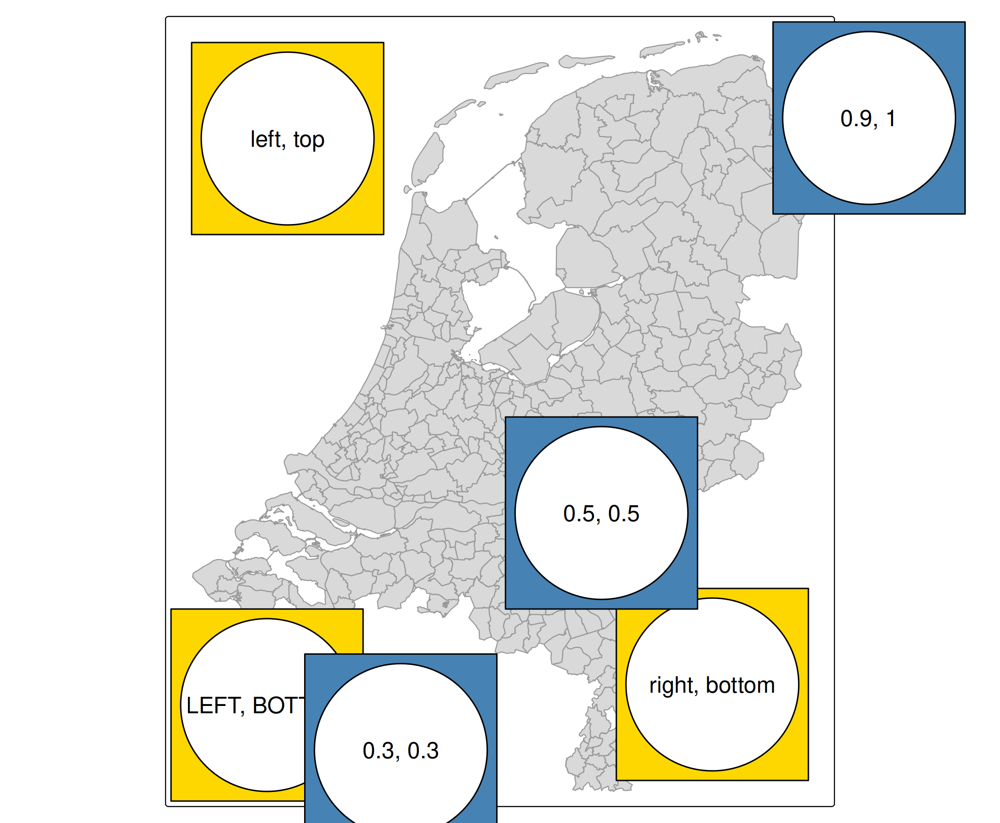
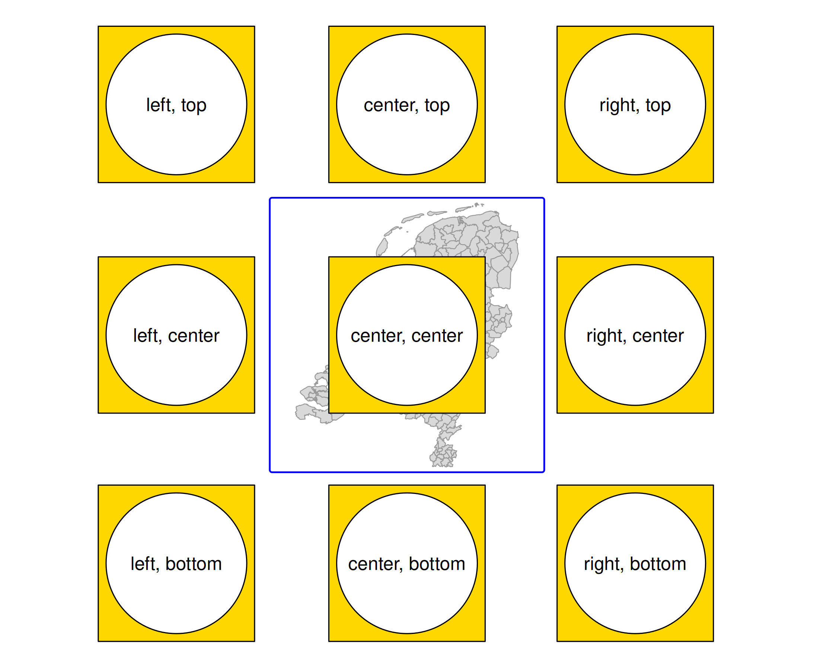
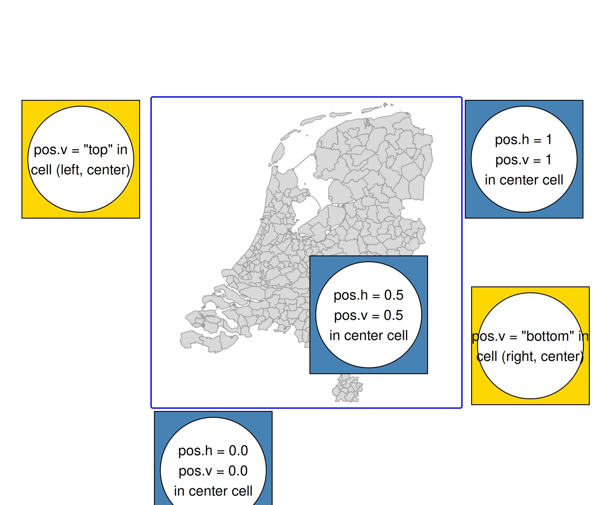
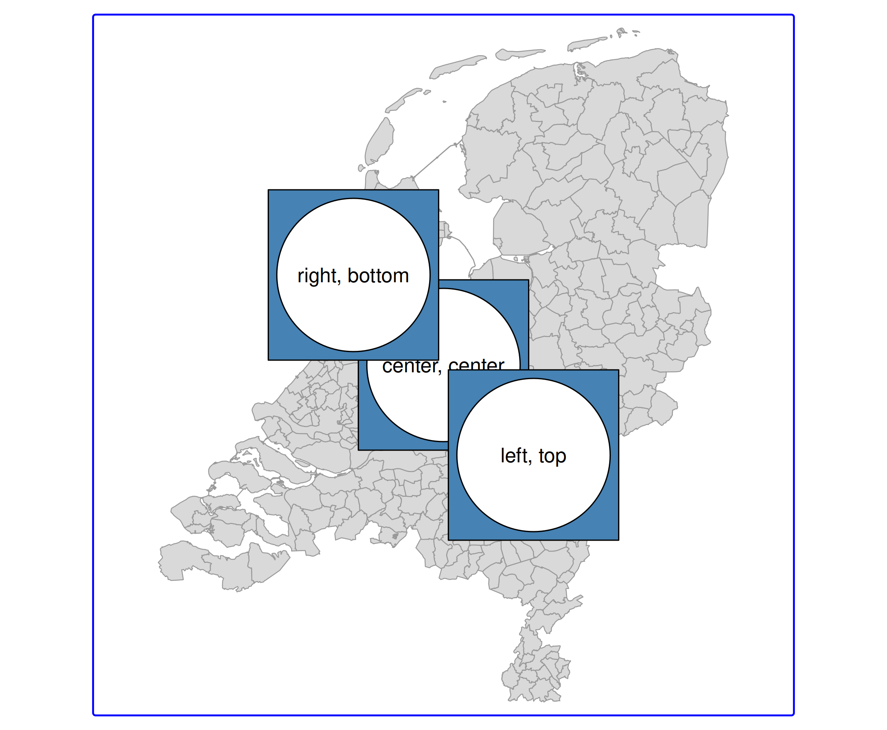

# tmap advanced: positioning of components

Recall from the [vignette about
components](https://r-tmap.github.io/tmap/articles/basics_components)
that the `position` argument of map components specifies their position.

It can be specified in two ways:

- An object from the
  [`tm_pos()`](https://r-tmap.github.io/tmap/reference/tm_pos.md), or
  one of its wrappers, such as
  [`tm_pos_in()`](https://r-tmap.github.io/tmap/reference/tm_pos.md) and
  [`tm_pos_out()`](https://r-tmap.github.io/tmap/reference/tm_pos.md).
- A vector of length two, which is a shortcut for placement inside the
  map frame, a shortcut for
  [`tm_pos_in()`](https://r-tmap.github.io/tmap/reference/tm_pos.md)

We will use a self-made map component, made with the grid package that
we show via
[`tm_inset()`](https://r-tmap.github.io/tmap/reference/tm_inset.md).

``` r
g = function(text) grid::gList(
  grid::rectGrob(gp=grid::gpar(fill = "gold")), 
  grid::circleGrob(r = .45), 
  grid::textGrob(text))
b = function(text) grid::gList(
  grid::rectGrob(gp=grid::gpar(fill = "steelblue")), 
  grid::circleGrob(r = .45), 
  grid::textGrob(text))
```

## Shortcut method (inside the map frame)

The `position` can be a vector of two values, where the first is the
horizontal position and the second the vertical position. It is a
shortcut for
[`tm_pos_in()`](https://r-tmap.github.io/tmap/reference/tm_pos.md),
which is explained in the next sections.

There are two options:

### Character vector of two

- the first value specifies the horizontal position (`"left"`,
  `"center"`, `"right"`), and
- the second one the vertical position (`"top"`, `"center"`,
  `"bottom"`).

Upper case means tight to the frame. Otherwise an offset margin is
applied (can be specified with `offset`, see below).

### Numeric vector of two

This can be seen as the ‘manual’ mode, because it provides more freedom.

- the first value specifies the horizontal position, where 0 corresponds
  to left and 1 to right.
- the second value specifies the vertical position where 0 is bottom and
  1 top.

By default, these values will specify the position of the **left top
corner** of the component. This justification point can be changed using
the `just.h` and `just.v` arguments of
[`tm_pos()`](https://r-tmap.github.io/tmap/reference/tm_pos.md), see
below.

### Example

The character positioned components are in gold and the numeric
positioned components in blue.

``` r
tm_shape(NLD_muni) +
    tm_polygons("grey85", col = "grey60") +
    tm_inset(g("left, top"), position = c("left", "top")) +
    tm_inset(g("right, bottom"), position = c("right", "bottom")) +
    tm_inset(g("LEFT, BOTTOM"), position = c("LEFT", "BOTTOM")) +
    tm_inset(b("0.3, 0.3"), position = c(0.2, 0.2)) +
    tm_inset(b("0.5, 0.5"), position = c(0.5, 0.5)) +       
    tm_inset(b("0.9, 1"), position = c(0.9, 1))     
```



## Advanced method with `tm_pos()`

### The 3 x 3 grid

The whole plot area is a 3 x 3 grid, where the map (or facets) are drawn
in the center grid cell.

There are three variants (wrappers) of the main function
[`tm_pos()`](https://r-tmap.github.io/tmap/reference/tm_pos.md):

- [`tm_pos_out()`](https://r-tmap.github.io/tmap/reference/tm_pos.md)
  draws the component outside the map frame (so in one of the 3 x 3 grid
  cells)
- [`tm_pos_in()`](https://r-tmap.github.io/tmap/reference/tm_pos.md) and
  [`tm_pos_on_top()`](https://r-tmap.github.io/tmap/reference/tm_pos.md)
  draw the component in the middle grid cell. The difference is that the
  former takes the frame (and offset from it) into account while the
  latter doesn’t.

### `cell.h` and `cell.v`

The arguments `cell.h` and `cell.v` determine the grid cell. These
should only be used for
[`tm_pos_out()`](https://r-tmap.github.io/tmap/reference/tm_pos.md). For
the other position function, they are already set to `"center"` (the
center grid cell in which the map is drawn).

``` r
tm_shape(NLD_muni) +
    tm_polygons("grey85", col = "grey60") +
tm_inset(g("center, center"), position = tm_pos_on_top(pos.h = "center", pos.v = "center")) +
tm_inset(g("left, center"), position = tm_pos_out("left", "center", pos.v = "center")) +
tm_inset(g("right, center"), position = tm_pos_out("right", "center", pos.v = "center")) +
tm_inset(g("left, top"), position = tm_pos_out("left", "top")) +
tm_inset(g("center, top"), position = tm_pos_out("center", "top", pos.h = "center")) +
tm_inset(g("right, top"), position = tm_pos_out("right", "top")) +
tm_inset(g("left, bottom"), position = tm_pos_out("left", "bottom")) +
tm_inset(g("center, bottom"), position = tm_pos_out("center", "bottom", pos.h = "center")) +
tm_inset(g("right, bottom"), position = tm_pos_out("right", "bottom")) +
tm_layout(asp = 1, frame.color = "blue", frame.lwd = 2)
```



Note that we used `pos.h` and `pos.v`. These will be explained in the
next section.

### `pos.h` and `pos.v`

The position of a component within a cell. These values are similar to
the shortcut values described above:

- Character values: `"left"`, `"center"`, or `"right"` (or in upper
  case) for `pos.h` and `"top"`, `"center"`, and `"bottom"` for `pos.v`.
- Numeric values: 0 (left) to 1 (right) for `pos.h`, and 0 (bottom) to 1
  (top) for `pos.v`

``` r
tm_shape(NLD_muni) +
  tm_polygons("grey85", col = "grey60") +
tm_inset(g("pos.v = \"top\" in\ncell (left, center)"), 
  position = tm_pos_out("left", "center", pos.v = "top")) +
tm_inset(g("pos.v = \"bottom\" in\ncell (right, center)"), 
  position = tm_pos_out("right", "center", pos.v = "bottom")) +
tm_inset(b("pos.h = 0.0\npos.v = 0.0\nin center cell"),
  position = tm_pos_in(pos.h = 0.0, pos.v = 0.0)) +
tm_inset(b("pos.h = 0.5\npos.v = 0.5\nin center cell"),
  position = tm_pos_in(pos.h = 0.5, pos.v = 0.5)) +
tm_inset(b("pos.h = 1\npos.v = 1\nin center cell"),
  position = tm_pos_in(pos.h = 1, pos.v = 1)) +
tm_layout(asp = 1, frame.color = "blue", frame.lwd = 2)
```



Recall that the **justification point** for the numeric specifications
is the **top left corner** of the component. This can be adjusted via
`just.h` and `just.v` as explained next.

### `just.h` and `just.v`

In case `pos.h` and `pos.v` are numbers, the justification can be set
with

- `just.h`: `"left"`, `"center"`, or `"right"`
- `just.v`: `"top"`, `"center"`, and `"bottom"`

``` r
tm_shape(NLD_muni) +
  tm_polygons("grey85", col = "grey60") +
tm_inset(b("center, center"), 
  position = tm_pos_in(0.5, 0.5, just.h = "center", just.v = "center")) +
tm_inset(b("left, top"), 
  position = tm_pos_in(0.5, 0.5, just.h = "left", just.v = "top")) +
tm_inset(b("right, bottom"), 
  position = tm_pos_in(0.5, 0.5, just.h = "right", just.v = "bottom")) +
tm_layout(asp = 1, frame.color = "blue", frame.lwd = 2)
```



### `align.h` and `align.v`

In case there are multiple components in the same position (see next
section), the alignment determines how a component is aligned.

The alignment of components within the same cell:

``` r
tm_shape(NLD_muni) +
  tm_polygons("grey85", col = "grey60") +
tm_inset(g(""), 
  width = 4, height = 4,
  position = tm_pos_in("left", "top")) +
tm_inset(b("left"),
  width = 3, height = 3,
  position = tm_pos_in("left", "top", align.h = "left")) +
tm_inset(b("right"),
  width = 3, height = 3,
  position = tm_pos_in("left", "top", align.h = "right")) +
tm_inset(g(""), 
  width = 4, height = 4,
  position = tm_pos_in("left", "top")) +
tm_layout(asp = 1, frame.color = "blue", frame.lwd = 2)
```


### Automatic positioning

The default position of legends and map components are in some cases
done automatically. Automatic positioning can be achieved by setting a
`position` argument to
[`tm_pos_auto_in()`](https://r-tmap.github.io/tmap/reference/tm_pos.md)
or
[`tm_pos_auto_out()`](https://r-tmap.github.io/tmap/reference/tm_pos.md).
The former checks in which map corner is most space available (and bases
`pos.h` and `pos.v` on that). The latter calculates in which grid cell
(so `cell.h` and `cell.v`) the map components can be positioned, which
is based on the aspect ratio and margins.

## Grouping components

What happens when components share the same position? See [next
vignette](https://r-tmap.github.io/tmap/articles/adv_comp_group)
