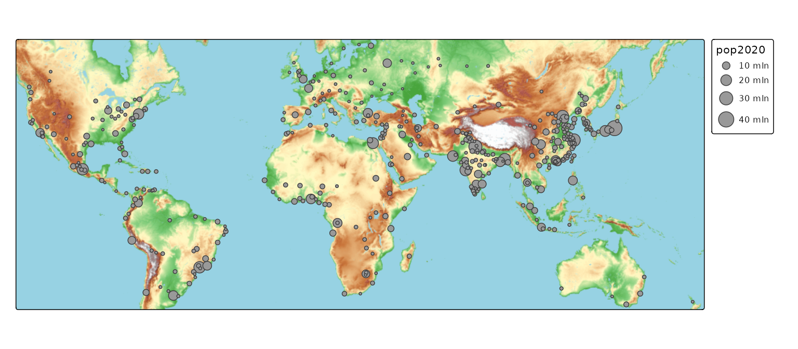

# tmap basics: basemaps

## Basemaps

By default, basemaps are only shown in `"view"` mode, so not in `"plot"`
mode. Basemaps can be enabled or disabled via
[`tm_basemap()`](https://r-tmap.github.io/tmap/reference/tm_basemap.md).

## Plot mode

To enable a basemap in plot mode, the package
[`maptiles`](https://github.com/riatelab/maptiles/) is required. When
specified without arguments, the default basemap is
“Esri.WorldGrayCanvas”. This can be changed, e.g. `"OpenTopoMap"`.

``` r
tm_shape(metro) +
    tm_bubbles(size = "pop2020") +
    tm_basemap("OpenTopoMap")
```



The options are:

``` r
tmap_providers()
```

Show

    #>  [1] "OpenStreetMap"                  "OpenStreetMap.DE"              
    #>  [3] "OpenStreetMap.France"           "OpenStreetMap.HOT"             
    #>  [5] "OpenTopoMap"                    "Stadia.AlidadeSmooth"          
    #>  [7] "Stadia.AlidadeSmoothDark"       "Stadia.OSMBright"              
    #>  [9] "Stadia.Outdoors"                "Stadia.StamenToner"            
    #> [11] "Stadia.StamenTonerBackground"   "Stadia.StamenTonerLines"       
    #> [13] "Stadia.StamenTonerLabels"       "Stadia.StamenTonerLite"        
    #> [15] "Stadia.StamenWatercolor"        "Stadia.StamenTerrain"          
    #> [17] "Stadia.StamenTerrainBackground" "Stadia.StamenTerrainLabels"    
    #> [19] "Esri.WorldStreetMap"            "Esri.WorldTopoMap"             
    #> [21] "Esri.WorldImagery"              "Esri.WorldTerrain"             
    #> [23] "Esri.WorldShadedRelief"         "Esri.OceanBasemap"             
    #> [25] "Esri.NatGeoWorldMap"            "Esri.WorldGrayCanvas"          
    #> [27] "CartoDB.Positron"               "CartoDB.PositronNoLabels"      
    #> [29] "CartoDB.PositronOnlyLabels"     "CartoDB.DarkMatter"            
    #> [31] "CartoDB.DarkMatterNoLabels"     "CartoDB.DarkMatterOnlyLabels"  
    #> [33] "CartoDB.Voyager"                "CartoDB.VoyagerNoLabels"       
    #> [35] "CartoDB.VoyagerOnlyLabels"      "Thunderforest.OpenCycleMap"    
    #> [37] "Thunderforest.Transport"        "Thunderforest.TransportDark"   
    #> [39] "Thunderforest.SpinalMap"        "Thunderforest.Landscape"       
    #> [41] "Thunderforest.Outdoors"         "Thunderforest.Pioneer"         
    #> [43] "Thunderforest.MobileAtlas"      "Thunderforest.Neighbourhood"

Tip: `.tmap_providers` contains the same information, but stored as an
environment, which is convenient with auto-completion (e.g. RStudio);
type `.tmap_providers$` and the list of options will appear.

Note: for Thunderforest and Stadia, a (free for personal use) API key is
required.

See
[previews](https://leaflet-extras.github.io/leaflet-providers/preview/)

``` r
tm_shape(metro) +
    tm_bubbles(size = "pop2020") +
    tm_basemap("CartoDB.PositronNoLabels")
```


## View mode

In view mode, there are even more options. There can be obtained via
`names(leaflet::providers)`.

``` r
tmap_mode("view")
#> ℹ tmap modes "plot" - "view"
#> ℹ toggle with `tmap::ttm()`
tm_shape(metro) +
    tm_bubbles(size = "pop2020") +
    tm_basemap("Esri.OceanBasemap")
```

Disabling basemaps:

``` r
tmap_mode("view")
#> ℹ tmap modes "plot" - "view"
tm_shape(World) +
  tm_polygons(
    fill = "grey80", 
    col = "grey60") +
tm_shape(metro) +
    tm_bubbles(size = "pop2020") +
    tm_basemap(NULL)
#> [tip] Consider a suitable map projection, e.g. by adding `+ tm_crs("auto")`.
#> [view mode] WebGL does not work (yet) with projected map projections, so it has
#> been disabled.
#> This message is displayed once per session.
```

Now it is also possible to use different map projections (see
[vignette](https://r-tmap.github.io/tmap/articles/foundations_crs)):

``` r
tmap_mode("view")
#> ℹ tmap modes "plot" - "view"
tm_shape(World, crs = "+proj=robin") +
  tm_polygons(
    fill = "grey80", 
    col = "grey60") +
tm_shape(metro) +
    tm_bubbles(size = "pop2020") +
    tm_basemap(NULL)
```

## Defaults

(run `tmap_options("basemap.server")` to see this option)
