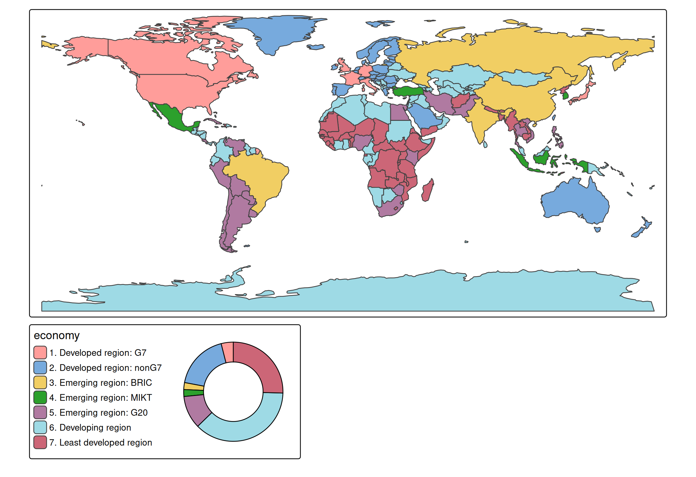

# tmap basics: charts

## Introduction

Each visual variable (e.g. `fill` in
[`tm_polygons()`](https://r-tmap.github.io/tmap/reference/tm_polygons.md))
has an additional `.chart` argument via which charts can be shown:

``` r
tm_shape(World) +
  tm_polygons(
    fill = "press",
    fill.scale = tm_scale_intervals(n=10, values = "scico.hawaii"),
    fill.legend = tm_legend("World Press\nFreedom Index"),
    fill.chart = tm_chart_bar()) +
tm_crs("auto")
```


## Chart types

### Numeric variables

``` r
tm_shape(World) +
  tm_polygons("HPI",
    fill.scale = tm_scale_intervals(),
    fill.chart = tm_chart_donut())
#> [tip] Consider a suitable map projection, e.g. by adding `+ tm_crs("auto")`.
#> This message is displayed once per session.
```


``` r
tm_shape(World) +
  tm_polygons("HPI",
    fill.scale = tm_scale_intervals(),
    fill.chart = tm_chart_box())
```


``` r
tm_shape(World) +
  tm_polygons("HPI",
    fill.scale = tm_scale_intervals(),
    fill.chart = tm_chart_violin())
```


### Categorical variable

``` r
tm_shape(World) +
  tm_polygons("economy",
    fill.scale = tm_scale_categorical(),
    fill.chart = tm_chart_bar())
```


``` r
tm_shape(World) +
  tm_polygons("economy",
    fill.scale = tm_scale_categorical(),
    fill.chart = tm_chart_donut())
```



### Bivariate charts

``` r
tm_shape(World) +
  tm_polygons(tm_vars(c("HPI", "well_being"), multivariate = TRUE),
    fill.chart = tm_chart_heatmap())
#> Labels abbreviated by the first letters, e.g.: "2.0 - 2.9" => "2"
```


## Position

We can update the position of the chart to bottom right (in a separate
frame). See [vignette about
positioning](https://r-tmap.github.io/tmap/articles/adv_positions).

``` r
tm_shape(World) +
  tm_polygons(
    fill = "press",
    fill.scale = tm_scale_intervals(n=10, values = "scico.hawaii"),
    fill.legend = tm_legend("World Press\nFreedom Index"),
    fill.chart = tm_chart_bar(position = tm_pos_out("center", "bottom", pos.h = "right"))) +
tm_crs("auto")
```


Or, in case we would like the chart to be next to the legend, but in a
different frame:

``` r
tm_shape(World) +
  tm_polygons(
    fill = "press",
    fill.scale = tm_scale_intervals(n=10, values = "scico.hawaii"),
    fill.legend = tm_legend("World Press\nFreedom Index", group.frame = FALSE),
    fill.chart = tm_chart_bar(position = tm_pos_out("center", "bottom", align.v = "top"))) +
    tm_layout(component.stack_margin = .5) +
tm_crs("auto")
#> Warning: Component group arguments, such as `group.frame`, are deprecated as of 4.1.
#> Please use `group_id = "ID"` in combination with `tm_components(frame_combine =
#> FALSE)` instead.
```


## Additional ggplot2 code

``` r
require(ggplot2)
#> Loading required package: ggplot2
tm_shape(World) +
  tm_polygons("HPI",
    fill.scale = tm_scale_intervals(),
    fill.chart = tm_chart_bar(
      extra.ggplot2 = theme(
        panel.grid.major.y = element_line(colour = "red")
      ))
    )
```


