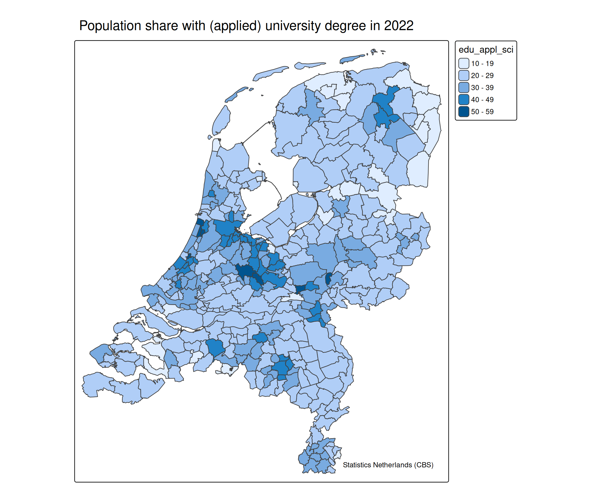
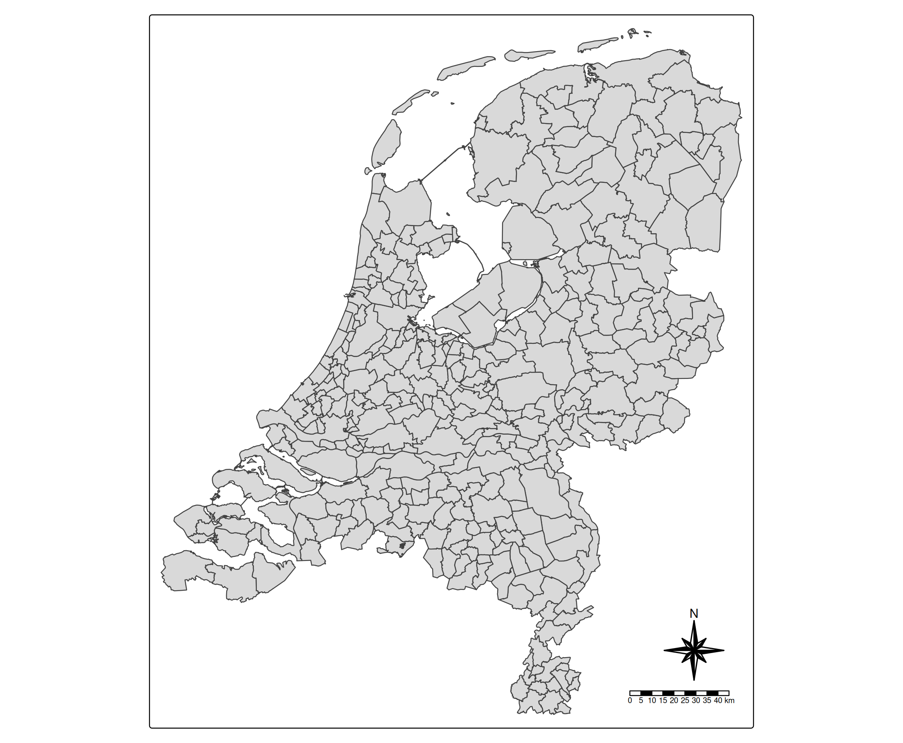
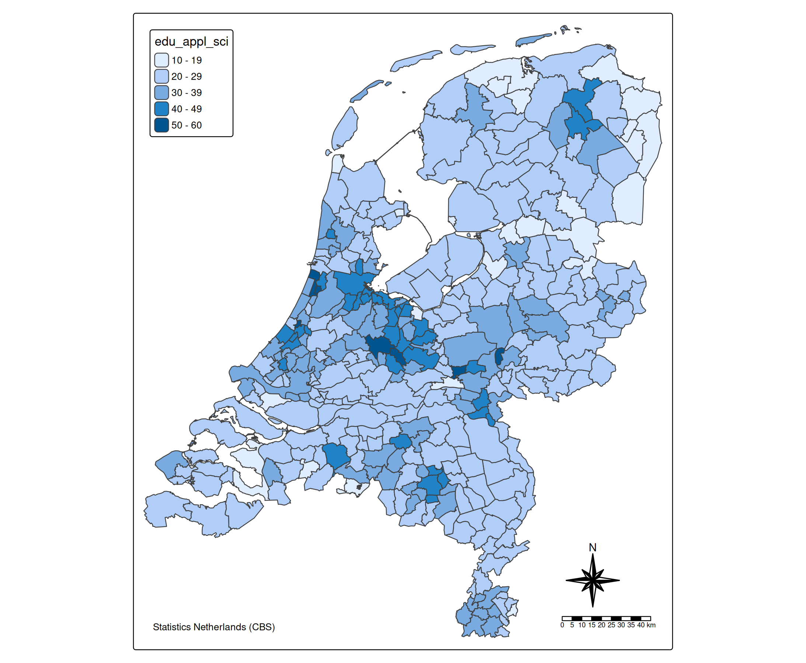
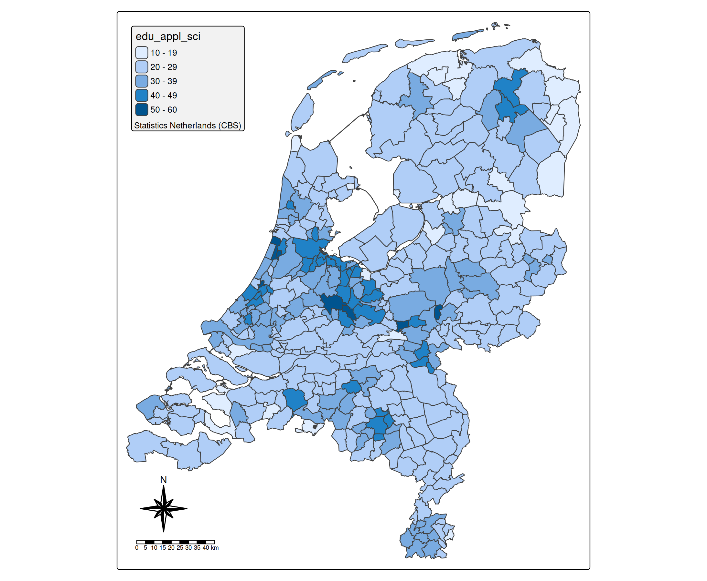

# tmap basics: components

## What are ‘components’ in tmap?

Components are non-spatial parts of the plots:

- titles and credits:
  [`tm_title()`](https://r-tmap.github.io/tmap/reference/tm_title.md)
  and
  [`tm_credits()`](https://r-tmap.github.io/tmap/reference/tm_credits.md)
- scale bars and compasses:
  [`tm_scalebar()`](https://r-tmap.github.io/tmap/reference/tm_scalebar.md)
  and
  [`tm_compass()`](https://r-tmap.github.io/tmap/reference/tm_compass.md)
- legends: specified with the `.legend` compoments in the data layer
  functions
  (e.g. [`tm_polygons()`](https://r-tmap.github.io/tmap/reference/tm_polygons.md)).

## Title and credits

[`tm_title()`](https://r-tmap.github.io/tmap/reference/tm_title.md) and
[`tm_credits()`](https://r-tmap.github.io/tmap/reference/tm_credits.md)
add text to the map in the form a title and a credits/attribution text
respectively. The underlying function and all the options are the same,
but the default values differ: titles are by default larger and placed
above the map (outside the frame), while credits are place inside the
frame at the bottom right.

``` r
tm_shape(NLD_muni) +
  tm_polygons(
    fill = "edu_appl_sci") +
tm_title("Population share with (applied) university degree in 2022") +
tm_credits("Statistics Netherlands (CBS)")
```



## Scale bar and compass

``` r
tm_shape(NLD_muni) +
  tm_polygons() +
    tm_compass(type = "8star") +
    tm_scalebar()
```



## Positioning of components (basics)

The position of a map component can be specified with the general
argument `position`.

It takes a vector of two, the first is the horizontal position
(`"left"`, `"center"`, `"right"`), the second one the vertical position
(`"top"`, `"center"`, `"bottom"`)

``` r
tm_shape(NLD_muni) +
  tm_polygons(
    fill = "edu_appl_sci",
    fill.legend = tm_legend(position = c("left", "top"))) +
tm_credits("Statistics Netherlands (CBS)", position = c("left", "bottom")) +
tm_compass(type = "8star", position = c("right", "bottom")) +
tm_scalebar(position = c("right", "bottom"))
```



If the components should be placed tighter to the frame, use capital
case instead; e.g. `c("LEFT", "BOTTOM") in stead of`c(“left”,
“bottom”)\`.

There are much more options to position map components via
[`tm_pos()`](https://r-tmap.github.io/tmap/reference/tm_pos.md), see the
[vignette about
positions](https://r-tmap.github.io/tmap/articles/adv_positions)

## Grouping of components (basics)

Map components can be grouped via `tm_components`. Its first argument is
the group id, which can either be a user specified name, or, as shown
below, a vector of map component function names.

``` r
tm_shape(NLD_muni) +
  tm_polygons(
    fill = "edu_appl_sci",
    fill.legend = tm_legend(position = c("left", "top"))) +
tm_credits("Statistics Netherlands (CBS)") +
tm_compass(type = "8star") +
tm_scalebar() + 
tm_components(c("tm_legend", "tm_credits"), position = c("left", "top"), bg.color = "grey95") +
tm_components(c("tm_compass", "tm_scalebar"), position = c("left", "bottom"))
```



In this case, all map components that are legends and credits are placed
top left. Furthermore, the map component group frame obtains a light
gray background. The compass and scalebar are positioned left bottom.

More options regarding positioning, stacking, and alignment of
components are explained in detail in the [vignette about grouping of
components](https://r-tmap.github.io/tmap/articles/adv_comp_group)
