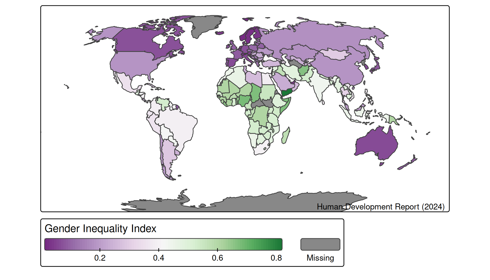
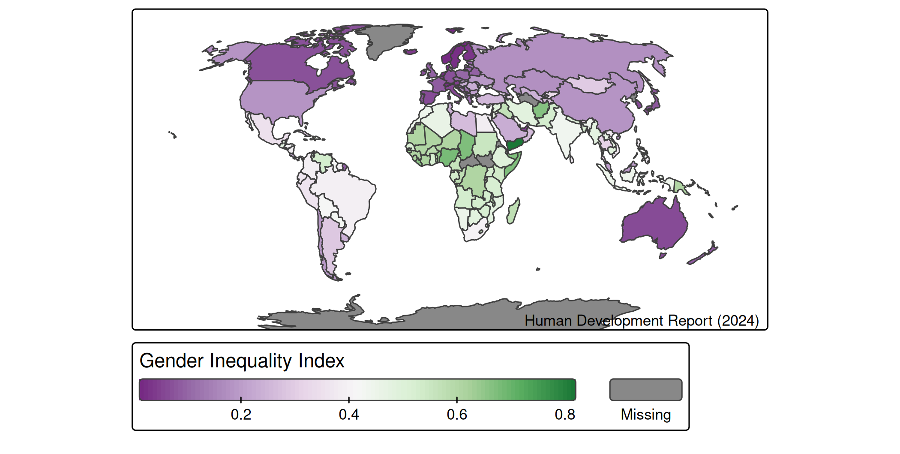
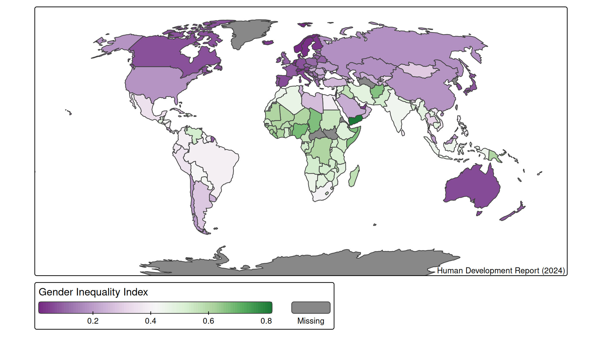
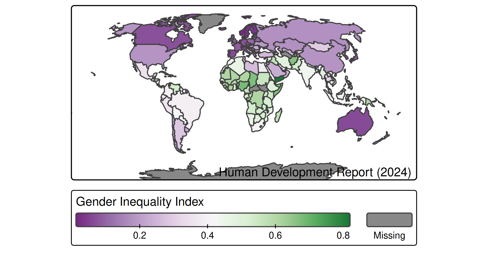

# tmap basics: exporting

## Static maps (plot mode)

Maps in plot mode can be exported in many formats including:

**pixel based** png, jpg, bmp, tiff.

**vectorized** pdf, eps, svg.

The `width` and `height` are specified in either pixels or inches (you
can but don’t need to specify the units).

For the pixel based formats, the relation between pixels and inches are
specified via the argument `dpi` (dots-per-inch).

Let’s create a standard country level choropleth:

``` r
tm = tm_shape(World, crs = "+proj=robin") + 
  tm_polygons(
    fill = "gender", 
    fill.scale = tm_scale_continuous(values = "pu_gn"),
    fill.legend = tm_legend("Gender Inequality Index", orientation = "landscape")) +
    tm_credits("Human Development Report (2024)", position = c("RIGHT", "BOTTOM")) + 
tm_layout(inner.margins = c(0, 0, 0.05, 0.05))
```

### Pixel based format

Exporting maps is done via
[`tmap_save()`](https://r-tmap.github.io/tmap/reference/tmap_save.md).

``` r
tmap_save(tm, filename = "world.png", width = 7, height = 4, dpi = 300)
#> Map saved to world.png
#> Resolution: 2100 by 1200 pixels
#> Size: 7 by 4 inches (300 dpi)
```

Values of `width` and `height` less than 50 are considered to be inches,
whereas those greater than 50 pixels are considered to be pixels:

``` r
tmap_save(tm, filename = "world.png", width = 2100, height = 1200, dpi = 300)
#> Map saved to /home/runner/work/tmap/tmap/vignettes/world.png
#> Resolution: 2100 by 1200 pixels
#> Size: 7 by 4 inches (300 dpi)
```

Therefore, both examples result in exactly the same file:



Vector based formats are preferred over pixel based, because of the
scalability. In case pixel formats are used, please make sure to use a
sufficient number of pixels. For **web publications** at least 144 dpi
is required. This may seem overkill, but is required for *retina* (high
point-per-inch) displays. For **printing** 300 or even 600 dpi is
required.

### Aspect ratio

In case only *one* dimension is provided, the other dimension calculated
using the aspect ratio of the map.

``` r
tmap_save(tm, filename = "world.png", width = 2100, dpi = 300)
#> Map saved to /home/runner/work/tmap/tmap/vignettes/world.png
#> Resolution: 2100 by 1059.87 pixels
#> Size: 7 by 3.5329 inches (300 dpi)
```



### Vector based format

Vector based formats will look (almost) the same.

``` r
tmap_save(tm, filename = "world.pdf", width = 7, height = 4, dpi = 300)
```

Small differences in font sizes, margins, symbol sizes between formats
may occur.

### Scaling

An important argument of
[`tmap_save()`](https://r-tmap.github.io/tmap/reference/tmap_save.md) is
`scale`. It an option for the overall scale over the map, which is
normally set via
[`tm_layout()`](https://r-tmap.github.io/tmap/reference/tm_layout.md).
It determines all font sizes, line widths, and symbol sizes.

Much smaller (0.5):

``` r
tmap_save(tm, filename = "world.png", width = 7, height = 4, dpi = 300, scale = 0.5)
```


A bit smaller (0.8):

``` r
tmap_save(tm, filename = "world.png", width = 7, height = 4, dpi = 300, scale = 0.8)
```



A bit larger (1.2):

``` r
tmap_save(tm, filename = "world.png", width = 7, height = 4, dpi = 300, scale = 1.2)
```


Much larger (1.5):

``` r
tmap_save(tm, filename = "world.png", width = 7, height = 4, dpi = 300, scale = 1.5)
```

    #> [plot mode] fit legend/component: Some legend items or map compoments do not
    #> fit well, and are therefore rescaled.
    #> ℹ Set the tmap option `component.autoscale = FALSE` to disable rescaling.



## View mode

Maps can also be exported as stand-alone HTML files.

``` r
tmap_save(tm, filename = "index.html", selfcontained = FALSE)
```

When `selfcontained = FALSE`, the required JavaScripts and CSS files are
stored in a folder called `index_files`.
