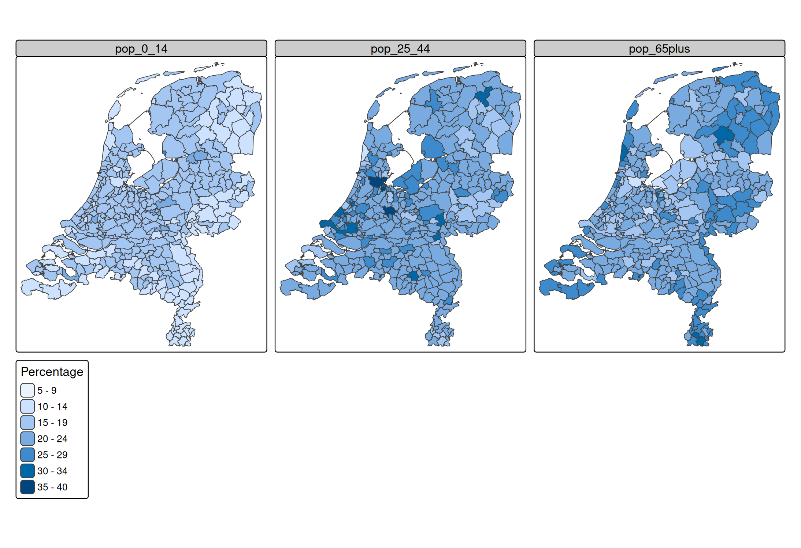
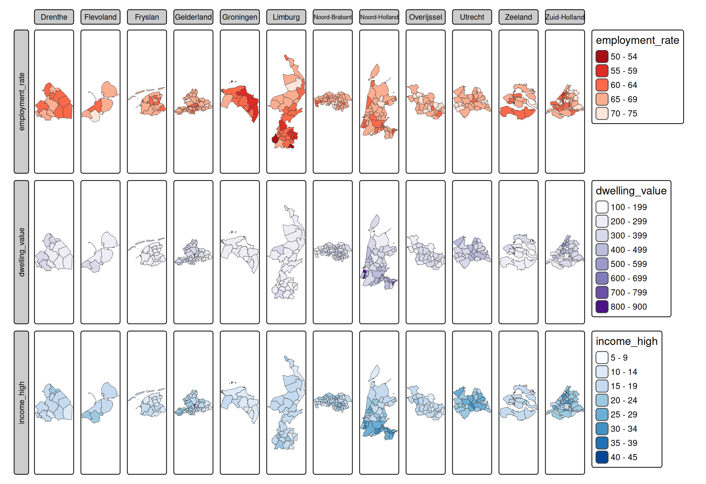

# tmap basics: facets

### About the data

Three spatial data objects of the Netherlands are contained in tmap:
`NLD_prov`, `NLD_muni`, and `NLD_dist`, at respectively province,
municipality and district level. The columns are the following data
variables plus an additional geometry column which contains the
geometries (see sf package):

``` r
names(NLD_muni)
#>  [1] "code"               "name"               "province"          
#>  [4] "area"               "urbanity"           "population"        
#>  [7] "pop_0_14"           "pop_15_24"          "pop_25_44"         
#> [10] "pop_45_64"          "pop_65plus"         "dwelling_total"    
#> [13] "dwelling_value"     "dwelling_ownership" "employment_rate"   
#> [16] "income_low"         "income_high"        "edu_appl_sci"      
#> [19] "geometry"
```

## Facets: one dimensional

Facets or *small multiples* are small visualizations (maps), one for
each group. The groups can be defined using a categorical data variable.
In the following plot, a facet is created for each province (a data
variable in `NLD_muni`):

``` r
tm_shape(NLD_muni) +
  tm_polygons("employment_rate") +
tm_facets("province")
```


In this example, there is *one facet variable*. For these kind of plots,
and the facets are either **wrapped** or **stacked**, with
[`tm_facets_wrap()`](https://r-tmap.github.io/tmap/reference/tm_facets.md)
or
[`tm_facets_stack()`](https://r-tmap.github.io/tmap/reference/tm_facets.md).
The general purpose function
[`tm_facets()`](https://r-tmap.github.io/tmap/reference/tm_facets.md)
determines the faceting type, which is in this example `wrap`.

Groups can also be defined by specifying multiple data variable names
for one visual variable:

``` r
tm_shape(NLD_muni) +
  tm_polygons(
    fill = c("employment_rate", "dwelling_value", "income_high"),
    fill.scale = 
      list(tm_scale_intervals(values = "-brewer.reds"),
         tm_scale_intervals(values = "brewer.purples"),
         tm_scale_intervals(values = "brewer.blues")))
```


Because different data variables are used, tmap uses (by default)
multiple scales, one for each variable. These can be changed by putting
the [`tm_scale()`](https://r-tmap.github.io/tmap/reference/tm_scale.md)
functions in a list, as shown above. In case the same scale should be
used, `fill.free` should be set to `FALSE`:

``` r
tm_shape(NLD_muni) +
  tm_polygons(
    fill = c("pop_0_14", "pop_25_44", "pop_65plus"),
    fill.legend = tm_legend("Percentage"),
    fill.free = FALSE)
```



## Facets: two or three dimensions

Facets can also be defined for two or three dimensions, using
[`tm_facets_grid()`](https://r-tmap.github.io/tmap/reference/tm_facets.md).
These three dimensions correspond to *rows*, *columns*, and *pages*
respectively. The most common use case is two just dimensions, rows and
columns. In that case,
[`tm_facets_grid()`](https://r-tmap.github.io/tmap/reference/tm_facets.md)
is used.

``` r
tm_shape(NLD_muni) +
  tm_polygons(
    fill = c("employment_rate", "dwelling_value", "income_high"),
    fill.scale = 
      list(tm_scale_intervals(values = "-brewer.reds"),
         tm_scale_intervals(values = "brewer.purples"),
         tm_scale_intervals(values = "brewer.blues"))) +
tm_facets_grid(columns = "province")
```



## Facets as ‘pages’ (use case: animations)

``` r
(tm = tm_shape(NLD_muni) +
  tm_polygons(
    fill = c("pop_0_14", "pop_15_24", "pop_25_44", "pop_45_64", "pop_65plus"),
    fill.legend = tm_legend("Percentage"),
    fill.free = FALSE) +
tm_facets_pagewise())
```

will produce 5 plots, one for each age class (defined using the `fill`
argument).

This plot can be exported as animation via `tmap_animation`.

``` r
tmap_animation(tm, filename = "NLD_pop_age_class.gif")
```
