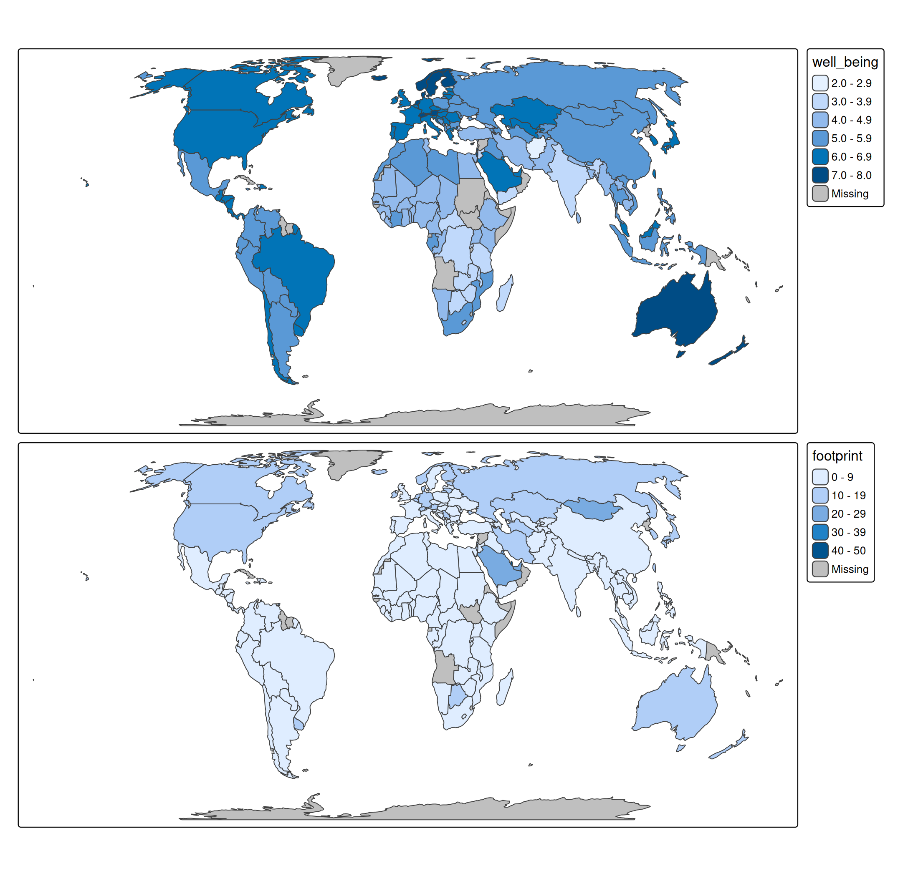
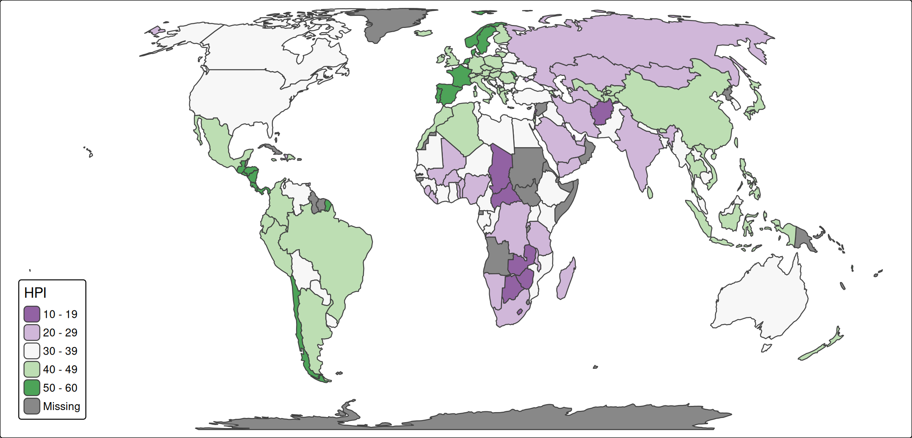

# tmap basics: layout

## What is layout?

With layout we mean all aspects of how the plot looks like, except for

- specifications of data-driven [visual
  variables](https://r-tmap.github.io/tmap/articles/basics_vv).
- the layout of
  [legends](https://r-tmap.github.io/tmap/articles/basics_legends#layout)
- the layout of [map
  components](https://r-tmap.github.io/tmap/articles/basics_components)

What is left? Background colors, frames, panels, fonts, margins, etc.
All these layout options can be changed via
[`tm_layout()`](https://r-tmap.github.io/tmap/reference/tm_layout.md).

In this vignette, we’ll cover the most important layout settings. First,
let’s create a map:

``` r
tm = tm_shape(World, crs = "+proj=eqearth") + tm_polygons("HPI", fill.scale = tm_scale_intervals(values = "pu_gn"))
```

## Background colors

The background colors inside and outside the map frame are specified as
follows:

``` r
tm + tm_layout(
  bg.color = "skyblue",
  outer.bg.color = "gold")
```


The backgrounds can be disabled by setting `bg` and `outer.bg` (inside
and outside the frame respectively) to `FALSE`. Note that this does not
change the layout of the map; this is accomplished via the margins (see
below).

## Frame

The map frame can be disabled by setting `frame = FALSE`:

``` r
tm + tm_layout(
  bg.color = "grey90",
  frame = FALSE)
```


## Earth boundaries

For certain [map
projections](https://r-tmap.github.io/tmap/articles/foundations_crs),
including the used one, we can infer the ‘earth boundaries’. We can
enable them with the option `earth_boundary`. The background color
outside of the earth boundaries (and inside the map frame if specified)
are determined by `space.color`.

For this type of map, it makes sense to disable the map frame, and place
the legend in the corner of the map, perhaps even with a bit of overlap.

``` r
tm_shape(World, crs = "+proj=eqearth") + 
  tm_polygons(
    fill = "HPI", 
    fill.scale = tm_scale_intervals(values = "pu_gn"),
    fill.legend = tm_legend(position = c("left", "bottom"))) +
tm_layout(bg.color = "skyblue",
  earth_boundary = TRUE,
  frame = FALSE,
  space.color = "white")
```


## Panels

To change the appearance of panels the options with the prefix `panel.`
are used:

``` r
tm_shape(World, crs = "+proj=eqearth") +
  tm_polygons(c("well_being", "footprint")) +
tm_layout(panel.label.bg.color = "gold",
          panel.label.size = 2,
          panel.label.height = 3)   
```


Panels can be disabled using `panel.show = FALSE`:

``` r
tm_shape(World, crs = "+proj=eqearth") +
  tm_polygons(c("well_being", "footprint")) +
tm_layout(panel.show = FALSE)   
```



## Margins

Margins can be set with `inner.margins`, `outer.margins`,
`meta.margins`. The inner margins are the margins between map and the
frame

``` r
tm +
  tm_layout(inner.margins = c(0, 0, 0.02, 0.02))    
```


The four numbers are the margins for bottom, left, top, and right
respectively. The units are relative to the map frame, so 0.02 means
(about) 2 percent of the frame height.

The outer margins are the margins between map frame and plotting device:

``` r
tm_shape(World, crs = "+proj=eqearth") + 
    tm_polygons("HPI", 
                fill.scale = tm_scale_intervals(values = "pu_gn"),
                fill.legend = tm_legend(position = c("left", "bottom"))) +
  tm_layout(outer.margins = c(0, 0, 0, 0), asp = 0)
```



In this example we also set `asp = 0` meaning that the map frame should
fit inside the graphics device. That means that the inner margins are
increased if the aspect ratio (width/height) of the graphics device is
different than that of the map. Setting the margins can be quite
difficult and is explained in detail in this
[vignette](https://r-tmap.github.io/tmap/articles/adv_margins).
