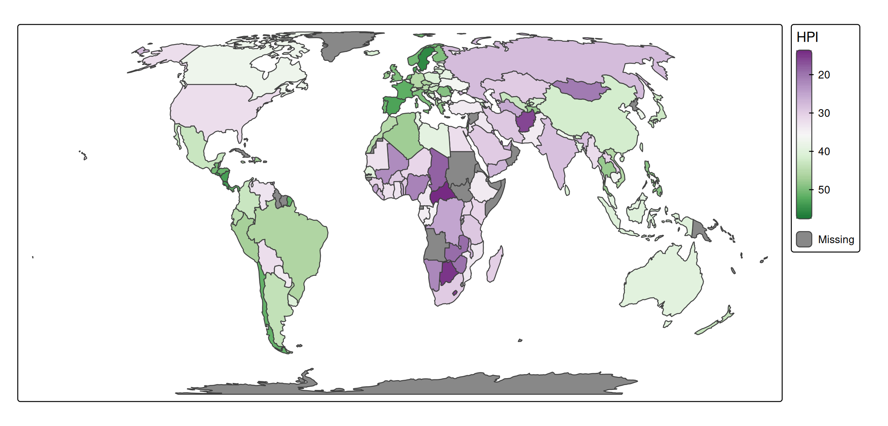

# tmap basics: legends

### About the data

A spatial data object contained in tmap is called `World`. It is a data
frame with a row for each country. The columns are the following data
variables plus an additional geometry column which contains the
geometries (see sf package):

``` r
names(World)
#>  [1] "iso_a3"       "name"         "sovereignt"   "continent"    "area"        
#>  [6] "pop_est"      "pop_est_dens" "economy"      "income_grp"   "gdp_cap_est" 
#> [11] "life_exp"     "well_being"   "footprint"    "HPI"          "inequality"  
#> [16] "gender"       "press"        "geometry"
```

We specify this object with `tm_shape` (see other vignette) and for
convenience assign it to `s`:

``` r
s = tm_shape(World, crs = "+proj=eqearth")
```

## Legend type

Each visual variable, e.g. `fill` in `tm_polygons` will by default
produce a legend. The type of legend depends on used scale (see ). E.g.
`tm_scale_continuous` applied to `fill` will produce a continuous color
gradient:

``` r
s + tm_polygons(
  fill = "HPI",
  fill.scale = tm_scale_continuous(values = "pu_gn"))
```



For `tm_scale_intervals`, there are two styles. A choice can be made via
the argument `label.style`. By default it is set to discrete:

``` r
s + tm_polygons(
  fill = "HPI",
  fill.scale = tm_scale_intervals(values = "pu_gn"))
```


Alternatively, it can be set to `"continuous"`:

``` r
s + tm_polygons(
  fill = "HPI",
  fill.scale = tm_scale_intervals(values = "pu_gn", label.style = "continuous"))
```


## `.legend` arguments

Each visual variable also has a `.legend` argment, such as `fill.legend`
in `tm_polygons`. This can be used to:

- set the title of the legend,
- change the orientation of the legend (portrait or landscape),
- reverse the legend items,
- hide the legend, and
- change the size and position of the legend.

Note that the content of the legend, so breaks, scales, and ticks are
related to the scale and should therefore be specified in the scale
functions.

## Title, orientation and size

The following example illustrates how the title, orientation and size
and specified:

``` r
s + tm_polygons(
  fill = "HPI",
  fill.scale = tm_scale_continuous(values = "pu_gn"),
  fill.legend = 
    tm_legend(
      title = "Happy Planex Index", 
      orientation = "landscape", 
      width = 60))
#> [plot mode] fit legend/component: Some legend items or map compoments do not
#> fit well, and are therefore rescaled.
#> ℹ Set the tmap option `component.autoscale = FALSE` to disable rescaling.
```


The legend width is set in number of text line heights, which
corresponds to the number of characters. In other words, the resulting
width depends on the font size, which can be set in `tm_legend`, but
also via the general `scale` option, which determines the overall
‘scale’ of the map (all line widths, point sizes and font sizes):

``` r
s + tm_polygons(
  fill = "HPI",
  fill.scale = tm_scale_continuous(values = "pu_gn"),
  fill.legend = 
    tm_legend(
      title = "Happy Planex Index", 
      orientation = "landscape", 
      width = 60)) +
tm_layout(scale = 0.25)
```


## Hiding legends

A legend can be suppressed by setting the `.legend` argument to
[`tm_legend_hide()`](https://r-tmap.github.io/tmap/reference/tm_legend.md).

``` r
s + tm_polygons(
  fill = "HPI",
  fill.scale = tm_scale_continuous(values = "pu_gn"),
  fill.legend = tm_legend_hide())
```


See the [advanced
vignette](https://r-tmap.github.io/tmap/articles/adv_legends) for more
options.
