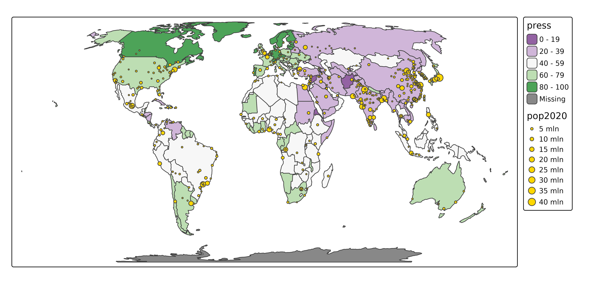

# tmap basics: modes

## Modes

tmap facilitates two output modes:

- `"plot"`, which produces static maps, and
- `"view"` which produces (using the same tmap code) interactive maps
  (using the JavaScript library Leaflet as backend).

Via the extension package, `tmap.mapgl`, two interactive new modes are
available, `"mapbox"` and `"maplibre"`, as demonstrated below.

The default mode is `"plot"`:

``` r
## current mode
tmap_mode()
#> ℹ tmap modes "plot" - "view"
#> ℹ toggle with `tmap::ttm()`
```

### Switching between modes

``` r
## to view mode
tmap_mode("view")
#> ℹ tmap modes "plot" - "view"

## back to plot mode
tmap_mode("plot")
#> ℹ tmap modes "plot" - "view"
```

The handy function
[`ttm()`](https://r-tmap.github.io/tmap/reference/tmap_mode.md) is used
to toggle between the modes:

``` r
## to view mode
ttm()
#> ℹ tmap modes "plot" - "view"

## back to plot mode
ttm()
#> ℹ tmap modes "plot" - "view"
```

When more than two modes are loaded,
[`rtm()`](https://r-tmap.github.io/tmap/reference/tmap_mode.md) can be
used to rotate between modes (see
\[below(<https://r-tmap.github.io/tmap/articles/basics_modes#modes-mapbox-and-maplibre->)\]).

### Mode `"plot"`

We start with creating the plot and assign it to a variable called `tm`.

``` r
tm = tm_shape(World, crs = 8857) +
  tm_polygons(
    fill = "press",
    fill.scale = tm_scale_intervals(values = "pu_gn")) +
tm_shape(metro) +
  tm_bubbles(
    size = "pop2020",
    fill = "gold",
    size.scale = tm_scale_continuous(values.scale = 0.8, n = 8))
```

We are in `"plot"` mode. Now we can plot the map by printing the `tm`
object:

``` r
tm
```



### Mode `"view"`

The same map in view mode:

``` r
ttm()
#> ℹ tmap modes "plot" - "view"
tm
```

Note that there is a big difference: in `"view"` mode there are
basemaps, and in `"plot"` mode none. This is caused by different default
options.

Basemaps can be enabled or disabled via
[`tm_basemap()`](https://r-tmap.github.io/tmap/reference/tm_basemap.md):

``` r
tm + tm_basemap(NULL)
#> [view mode] WebGL does not work (yet) with projected map projections, so it has
#> been disabled.
#> This message is displayed once per session.
```

See [vignette about
basemaps](https://r-tmap.github.io/tmap/articles/basics_basemaps).

### Mode specific options

Mode specific layout options can be set via
[`tm_plot()`](https://r-tmap.github.io/tmap/reference/tm_plot.md) and
[`tm_view()`](https://r-tmap.github.io/tmap/reference/tm_view.md). The
number of options in
[`tm_plot()`](https://r-tmap.github.io/tmap/reference/tm_plot.md) is
limited to just two, because it uses all general purpose options. In
contrast,
[`tm_view()`](https://r-tmap.github.io/tmap/reference/tm_view.md)
contains more options, e.g. the position of the control box and the
default zoom level:

``` r
tm +
    tm_view(control.position = c("left", "bottom"),
            set_view = 2)
```

For a more detailed description of the available options, see the
[vignette about
options](https://r-tmap.github.io/tmap/articles/adv_options).

## New modes

The new package `tmap.mapgl` offers two new modes, `"mapbox"` and
`"maplibre"`:

``` r
library(tmap.mapgl)
```

### Rotate bewteen modes

When more than two modes are loaded (now four),
[`rtm()`](https://r-tmap.github.io/tmap/reference/tmap_mode.md) can be
used to rotate between modes:

``` r
rtm()
#> ℹ tmap modes "plot" -> "view" -> "mapbox" -> "maplibre"
#> ℹ rotate with `tmap::rtm()`switch to "view" with `tmap::ttm()`
rtm()
#> ℹ tmap modes "plot" -> "view" ->
#> "mapbox" -> "maplibre"
```

This (and
[`ttm()`](https://r-tmap.github.io/tmap/reference/tmap_mode.md)) is
especially useful in interactive sessinos. For scripts, it is recommend
to use
[`tmap_mode()`](https://r-tmap.github.io/tmap/reference/tmap_mode.md)
explicitly.

### Modes `"mapbox"` and `"maplibre"`.

For the mode `"mapbox"` an API key is required, which is free for
personal use. The mode `maplibre` is a fork of `mapbox` before it sent
from open to closed source. No API key is required for `maplibre`.

These modes are not as feature rich (yet) as the `"view"` mode, but they
do offer a lot of new features: globe view and 3d polygons. This is
possible because of the support of WebGL, a fast rendering technique.
Therefore, these modes, and especially `maplibre` for its open open
source, are [considered the way forward in web
mapping](https://tim-salabim.codeberg.page/sotwm/sotwm.html).

``` r
tmap_mode("maplibre")
#> ℹ tmap modes "plot" -> "view" ->
#> "mapbox" -> "maplibre"
tm
```
