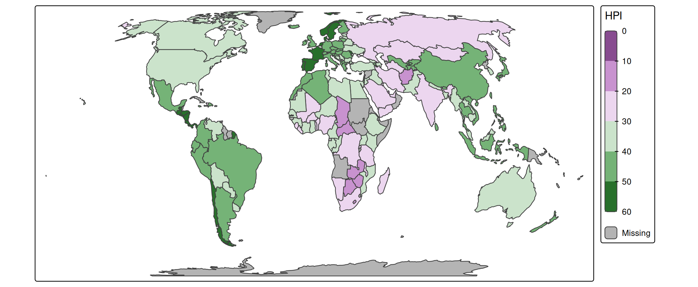
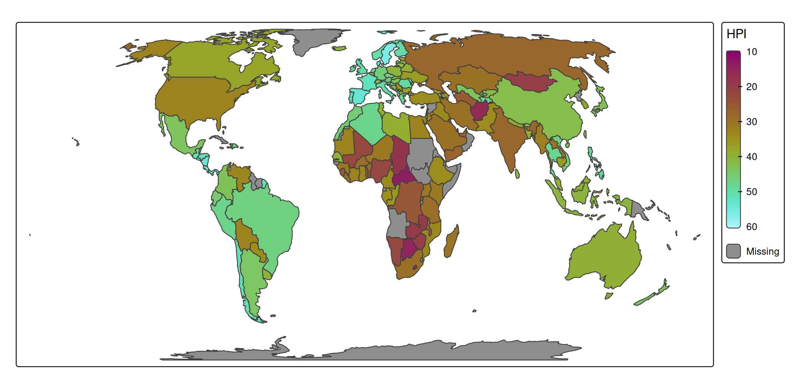
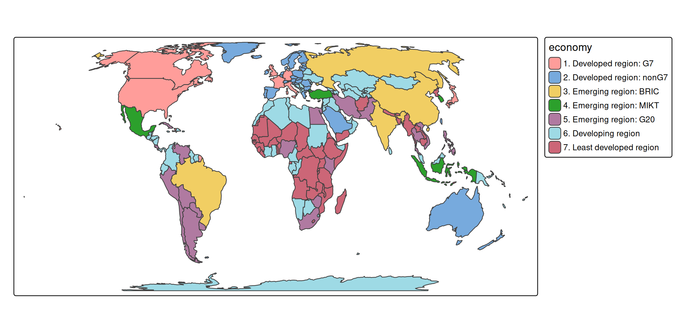

# tmap basics: scales

### About the data

A spatial data object contained in tmap is called `World`. It is a data
frame with a row for each country. The columns are the following data
variables plus an additional geometry column which contains the
geometries (see sf package):

``` r
names(World)
#>  [1] "iso_a3"       "name"         "sovereignt"   "continent"    "area"        
#>  [6] "pop_est"      "pop_est_dens" "economy"      "income_grp"   "gdp_cap_est" 
#> [11] "life_exp"     "well_being"   "footprint"    "HPI"          "inequality"  
#> [16] "gender"       "press"        "geometry"
```

We specify this object with `tm_shape` (see other vignette) and for
convenience assign it to `s`:

``` r
s = tm_shape(World, crs = "+proj=eqearth")
```

## Scales: numeric data (intervals)

Each visual variable, e.g. `fill` in `tm_polygons` can represent a data
variable:

``` r
s + tm_polygons(fill = "HPI")
```


A *scale* defines how to map the data values to visual values. Numeric
data variables (e.g. `"HPI"` which stands for Happy Planet Index) are by
default mapped with a class interval scale to the polygon fill. This can
be set explicitly with `tm_scale_intervals`, via which the intervals can
be specified, as well as the visual values (in this case polygon fill
colors):

``` r
s + tm_polygons(
  fill = "HPI",
  fill.scale = tm_scale_intervals(
    style = "fisher",      # a method to specify the classes
    n = 7,                 # number of classes
    midpoint = 38,         # data value mapped to the middle palette color
    values = "pu_gn_div"   # color palette; 
                           # run cols4all::c4a_gui() to explore color palettes
  ))
```


The `style` parameter within `tm_scale_intervals` has a variety of
options, including:

- `fixed`
- `sd`
- `equal`
- `pretty`
- `quantile`
- `fisher`
- `jenks`

To specify the classification breaks manually, use `style = "fixed"` and
specify the breaks using `breaks = c(0,10,20,30,40,50,60)`:

``` r
s + tm_polygons(
  fill = "HPI",
  fill.scale = tm_scale_intervals(
    n = 6, # for n classes 
    style = "fixed",    
    breaks = c(0,10,20,30,40,50,60), # you need n+1 number of breaks
    values = "pu_gn_div"
  ))
```


By default the legend will show bins. Alternatively, the breaks can be
printed between the colors:

``` r
s + tm_polygons(
  fill = "HPI",
  fill.scale = tm_scale_intervals(
    n = 6,
    style = "fixed",    
    breaks = c(0,10,20,30,40,50,60),
    values = "pu_gn_div",
    label.style = "continuous"
  ))
```



## Scales: numeric data (continuous)

An alternative for numeric data variables is the continuous scale:

``` r
s + 
  tm_polygons(
    fill = "HPI",
    fill.scale = tm_scale_continuous(
      limits = c(10, 60),
      values = "scico.hawaii"))
```



By default, the limit (so the value range that is mapped to a color
gradient) is taken from the actual data value range
`range(World$HPI, na.rm = T)`), which is 13.6980838, 57.8611615. In this
example rounded numbers 10 and 60 are specified here. If needed, the
position of ticks can be specified via the argument `ticks`.

## Scales: categorical data

``` r
s + 
  tm_polygons(
    fill = "economy",
    fill.scale = tm_scale_categorical())
```



``` r
s + 
  tm_polygons(
    fill = "income_grp",
    fill.scale = tm_scale_ordinal(values = "matplotlib.summer"))
```


