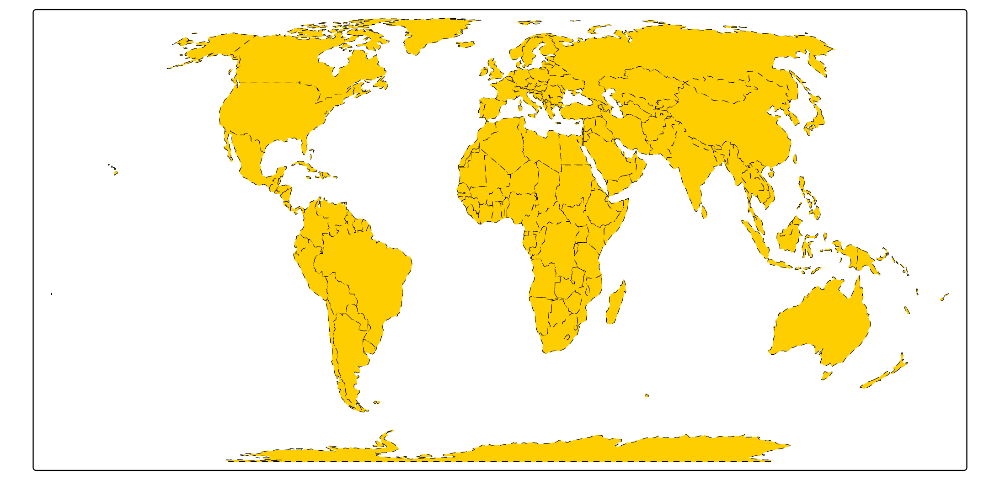
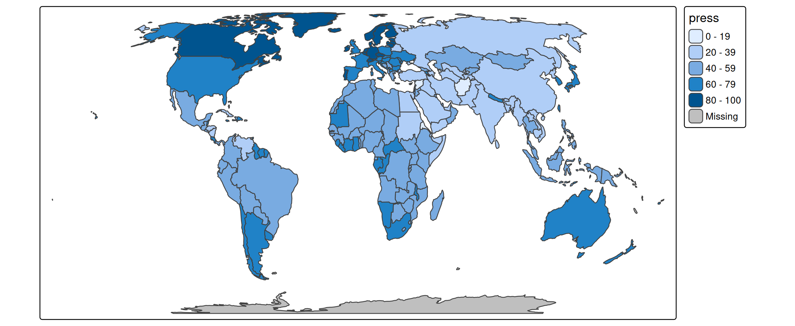
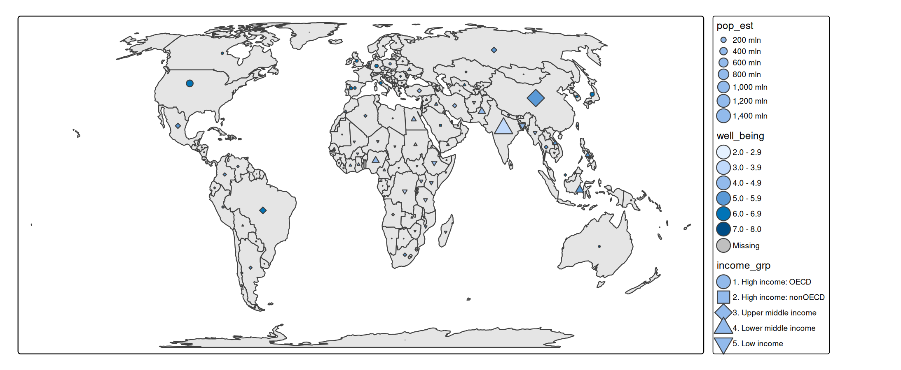
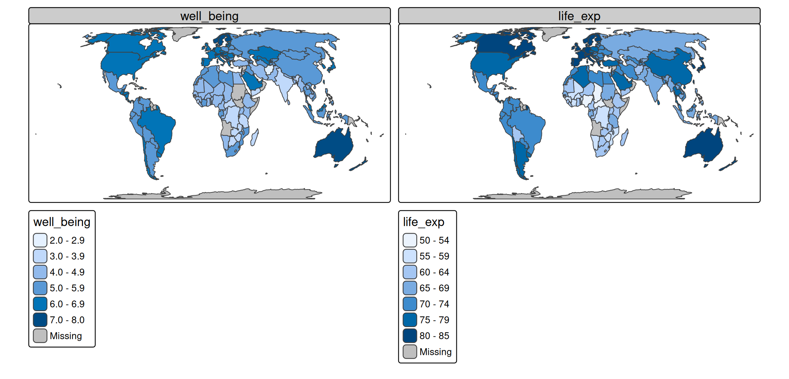

# tmap basics: visual variables

## Introduction

**tmap** is an R package for spatial data visualization.

### Map layers

A (thematic) map consists of one or more map layers. Each map layer has
a specific set of variables that determine how the objects of that layer
are drawn. A **visual variable** changes the appearance of a spatial
object, e.g. fill color or line width.

The following table shows which visual variables are used in standard
map layers.

[TABLE]

## About the example data

A spatial data object contained in **tmap** is called `World`. It is a
data frame with a row for each country. The columns are the following
data variables plus an additional geometry column which contains the
geometries (see sf package):

``` r
names(World)
#>  [1] "iso_a3"       "name"         "sovereignt"   "continent"    "area"        
#>  [6] "pop_est"      "pop_est_dens" "economy"      "income_grp"   "gdp_cap_est" 
#> [11] "life_exp"     "well_being"   "footprint"    "HPI"          "inequality"  
#> [16] "gender"       "press"        "geometry"
```

We specify this object with `tm_shape` and for convenience assign it to
`s`:

``` r
s <- tm_shape(World, crs = "+proj=eqearth")
```

## Constant visual values

Each visual variable can be assigned a constant value. E.g.
`fill = "red"` or `size = 2`.

An example where several visual variables are specified with constant
values:

``` r
s + 
  tm_polygons(
    fill = "#ffce00", # fill color
    col = "black",    # line color
    lwd = 0.5,        # line width
    lty = "dashed")   # line type
```



For advanced users: the default constant values are specified for
combinations of visual variables and layer type. See
`tmap_options("value.const")`

## Data-driven visual variables

Each visual variable argument can also be specified with a data variable
(e.g., a column name):

``` r
s + tm_polygons(fill = "press")    # a column in World
```



Another example, where a data-driven symbol layer is drawn on top of a
polygon layer

``` r
s + 
  tm_polygons(fill = "grey90") +   # constant fill color 
  tm_symbols(size = "pop_est",     # data variable, mapped to symbol size
             fill = "well_being",  # data variable, mapped to symbol fill color
             shape = "income_grp") # data variable, mapped to symbol shape
#> [plot mode] legend/component: Some components or legends are too "high" and are
#> therefore rescaled.
#> ℹ Set the tmap option `component.autoscale = FALSE` to disable rescaling.
```



In the following example a data-driven text layer is plotted.

``` r
s + 
  tm_polygons(fill = "economy") +
  tm_text(text = "name", size = "area")
```


### Scales and legend

For each data-driven visual variable, a scale and legend can be
specified. See other vignettes.

## Facets

A facet map is created by specifying two data variables (columns in
`World`) to the visual variable `fill`:

``` r
s + tm_polygons(fill = c("well_being", "life_exp")) 
```



Improve the titles and remove (duplicate) legend titles

``` r
s + 
  tm_polygons(
    fill = c("well_being", "life_exp"),
    fill.legend = tm_legend("")) +
tm_layout(panel.labels = c("Well Being", "Life Expectancy"))
```


