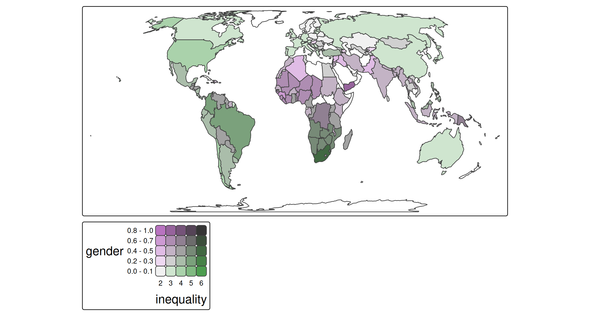
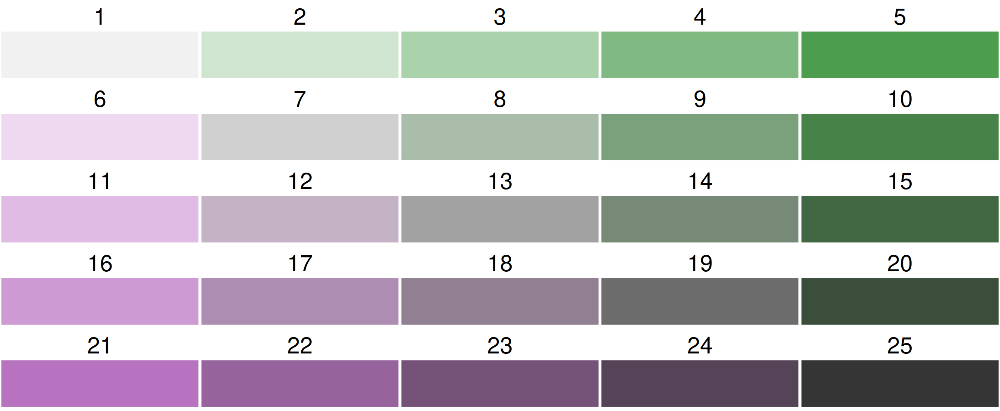
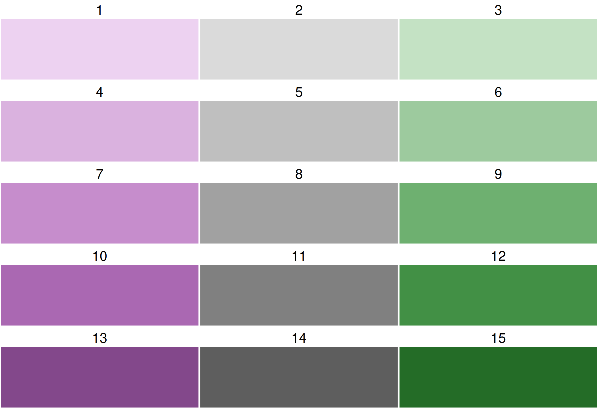
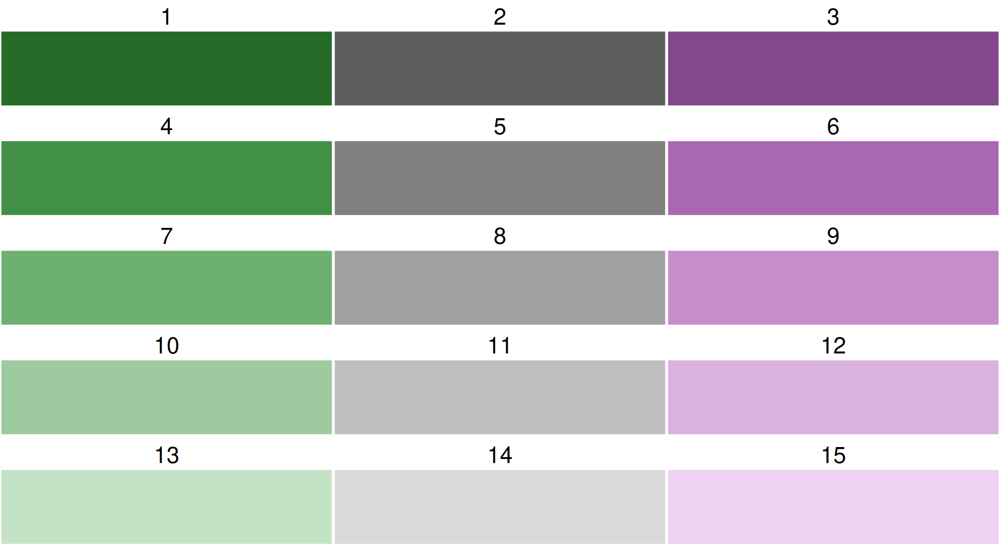
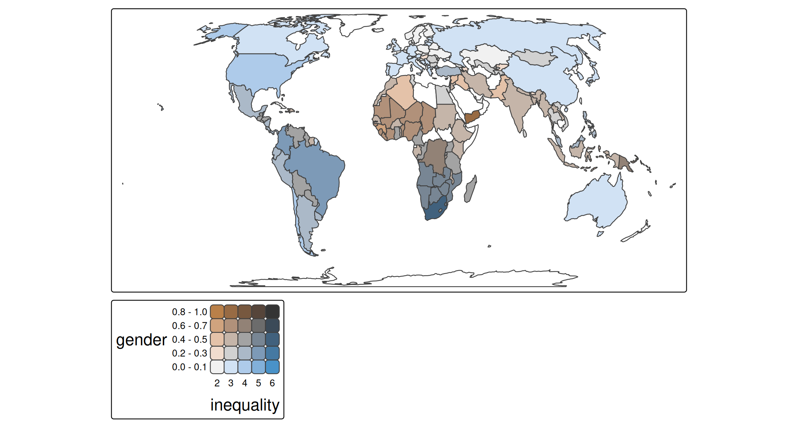
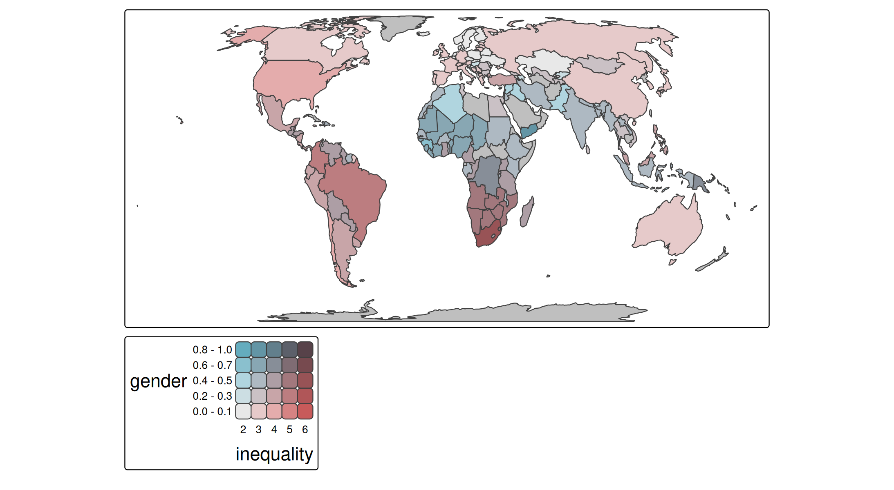

# tmap example: bivariate choropleth

## About the data

A spatial data object contained in tmap is called `World`. It is a data
frame with a row for each country. The columns are the following data
variables plus an additional geometry column which contains the
geometries (see sf package):

``` r
names(World)
#>  [1] "iso_a3"       "name"         "sovereignt"   "continent"    "area"        
#>  [6] "pop_est"      "pop_est_dens" "economy"      "income_grp"   "gdp_cap_est" 
#> [11] "life_exp"     "well_being"   "footprint"    "HPI"          "inequality"  
#> [16] "gender"       "press"        "geometry"
```

A bivariate choropleth is a choropleth where the polygon fill color is
used to visualize two data variables. In this example we’ll analyse the
economic and gender inequality.

## Step 1: minimal working example

``` r
tm_shape(World) +
    tm_polygons(fill = tm_vars(c("gender", "inequality"), multivariate = TRUE)) +
tm_crs("auto")
#> Labels abbreviated by the first letters, e.g.: "20 - 29" => "2"
```



The use of
[`tm_vars()`](https://r-tmap.github.io/tmap/reference/tm_vars.md) is
required in order to specify a multivariate mapping. See
[vignette](https://r-tmap.github.io/tmap/articles/adv_multivariate) for
more information and other use cases. For now, we specify a vector of
two variables, and set `multivariate` to `TRUE`. Recall that
`fill = c("gender", "inequality")` will create two facets, one for each
map (see
[vignette](https://r-tmap.github.io/tmap/articles/basics_facets#facets-one-dimensional)).

## Step 2: color palette

By default, a purple-green bivariate palette is used, more specifically,
`"pu_gn_bivs"` from the package
[**cols4all**](https://cols4all.github.io/cols4all-R/index.html).
**Note:** please use the development version of cols4all (see
[instructions](https://github.com/cols4all/cols4all-R?tab=readme-ov-file#installation)).

### Bivariate color palettes in cols4all

By default, a purple-green bivariate palette is used, more specifically,
`"pu_gn_bivs"` from the package
[**cols4all**](https://cols4all.github.io/cols4all-R/index.html). The
`"bivs"` suffix stands for sequential x sequential. There are four of
these bivariate palette types.

``` r
library(cols4all)
c4a_plot("pu_gn_bivs", n = 5)
c4a_plot("brewer.qualseq", n = 3)
```



Sequential x sequential

Sequential x categorical

``` r
library(cols4all)
c4a_plot("cols4all.bu_br_bivd", n = 5)
c4a_plot("cols4all.yl_rd_bivg", n = 5)
```


Sequential x diverging

Sequential x desaturation

### Flipping

All bivariate palettes can be flipped. For this, the development version
of cols4all is required. We use the bivariate sequential x diverging
palette with 3 columns and 5 rows.

``` r
c4a_plot("cols4all.pu_gn_bivd", n = 3, m = 5)
c4a_plot("-cols4all.pu_gn_bivd", n = 3, m = 5)
```



Normal order

"-" flip columns

``` r
c4a_plot("|cols4all.pu_gn_bivd", n = 3, m = 5)
c4a_plot("+cols4all.pu_gn_bivd", n = 3, m = 5)
```



"\|" Flip rows

"+" Flip rows and columns

``` r
c4a_plot("//cols4all.pu_gn_bivd", n = 3, m = 5)
c4a_plot("\\cols4all.pu_gn_bivd", n = 3, m = 5)
```


"//" Flip diagonally

"\\” Flip other diagonal

``` r
c4a_plot("-//cols4all.pu_gn_bivd", n = 3, m = 5)
c4a_plot("-\\cols4all.pu_gn_bivd", n = 3, m = 5)
```


"-//” Flip diagonally and columns

"-\\” Flip other-diagonally and columns

### Using cols4all palettes in tmap

A bivariate color palette can be specified in tmap via
`tm_scale_bivariate`:

``` r
tm_shape(World) +
  tm_polygons(
    fill = tm_vars(c("gender", "inequality"), multivariate = TRUE),
    fill.scale = 
      tm_scale_bivariate(values = "//bu_br_bivs")) +
tm_crs("auto")
#> Labels abbreviated by the first letters, e.g.: "20 - 29" => "2"
```



One inconvenience is that the origin of the palettes plotted above (with
[`c4a_plot()`](https://cols4all.github.io/reference/c4a_plot.html)) is
top left, but the origin of a bivariate color legend in tmap is bottom
right. Therefore, the diagonal prefixes need to be the other way round.

### Using custom bivariate palettes in tmap

``` r
tm_shape(World) +
  tm_polygons(
    fill = tm_vars(c("gender", "inequality"), multivariate = TRUE),
    fill.scale = 
      tm_scale_bivariate(values = 
        matrix(c("#E8E8E8", "#E4ACAC", "#C85A5A",
                 "#B0D5DF", "#AD9EA5", "#985356",
                 "#64ACBE", "#627F8C", "#574249"),
                 byrow = TRUE, ncol = 3))) +
tm_crs("auto")
#> Labels abbreviated by the first letters, e.g.: "20 - 29" => "2"
```



This palette is also known as `"stevens.bluered"`. Note that this is not
the most color blind friendly one. Check out
[`c4a_gui()`](https://cols4all.github.io/reference/c4a_gui.html) to
analyse color blind friendliness, also for custom palettes.

## Step 3: changing the individual scales

Let’s create three levels for each variable, and assign the intuitive
labels, e.g. L, M, and H, standing for low, medium and high inequality.

``` r
tm_shape(World) +
  tm_polygons(
    fill = tm_vars(c("gender", "inequality"), multivariate = TRUE),
    fill.scale = 
      tm_scale_bivariate(
        scale1 = tm_scale_intervals(style = "kmeans", n = 3, labels = c("L", "M", "H")),
        scale2 = tm_scale_intervals(style = "kmeans", n = 3, labels = c("L", "M", "H")),
        values = "bu_br_bivs")) +
tm_crs("auto") 
#> Labels abbreviated by the first letters, e.g.: "L" => "L"
```


## Step 4: changing the legend

``` r
tm_shape(World) +
  tm_polygons(
    fill = tm_vars(c("gender", "inequality"), multivariate = TRUE),
    fill.scale = 
      tm_scale_bivariate(
        scale1 = tm_scale_intervals(style = "kmeans", n = 3, labels = c("L", "M", "H")),
        scale2 = tm_scale_intervals(style = "kmeans", n = 3, labels = c("L", "M", "H")),
        values = "bu_br_bivs"),
    fill.legend = tm_legend_bivariate(
      xlab = "Gender",
      ylab = "Economic",
      xlab.size = 1,
      ylab.size = 1,
      item.r = 0,
      item.width = 2,
      item.height = 2,
      text.size = 1)) +
tm_title("Inequality per country", z = 0) +
tm_crs("auto") +
tm_layout(inner.margins = c(0, 0.15, 0.02, 0.02)) +
tm_components(position = c("left", "bottom"), frame = FALSE)
#> Labels abbreviated by the first letters, e.g.: "L" => "L"
```


