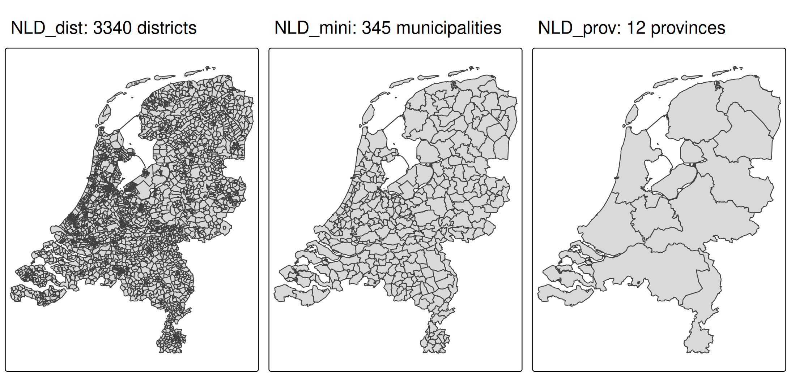
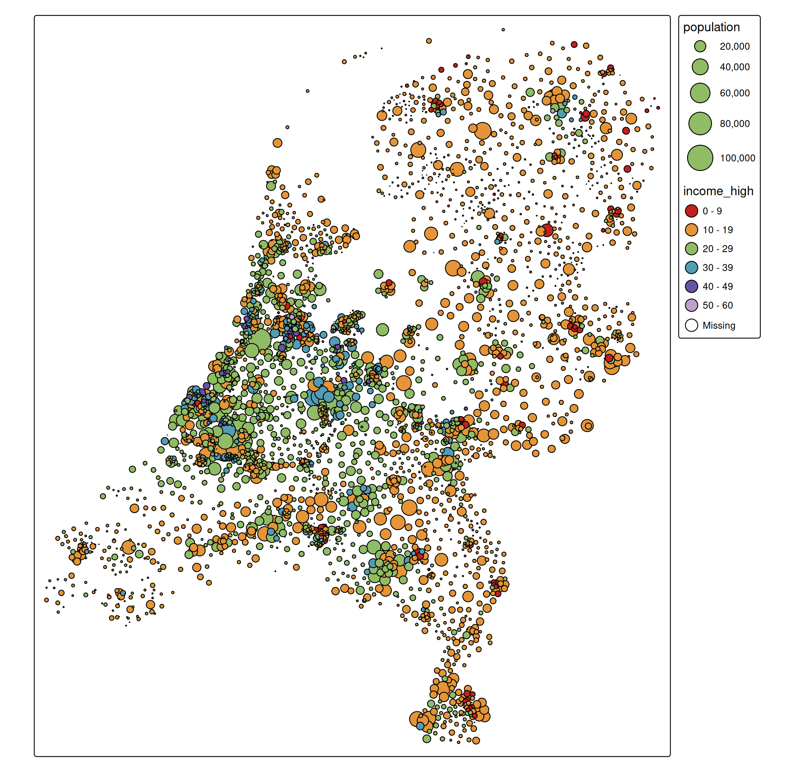

# tmap example: bubble map

``` r
library(tmap)
library(dplyr)
library(sf)
tmap_options(scale = 0.75)
```

## About the data

In tmap, there are two example data sets of the Netherlands:

- one for districts, `NLD_dist` (3340 in total),
- one for municipalities: `NLD_muni` (345 in total), and
- one for provinces: `NLD_prov` (12 in total).

The first two datasets contain demographic data of the Netherlands as of
2022. The third dataset only contains metadata (names and codes) and
will only be used to plot province borders.

``` r
tmap_arrange(
    qtm(NLD_dist, title = "NLD_dist: 3340 districts"),
    qtm(NLD_muni, title = "NLD_mini: 345 municipalities"),
    qtm(NLD_prov, title = "NLD_prov: 12 provinces"),
    ncol = 3
)
```



The variables in the `NLD_dist` and `NLD_muni` are the same:

``` r
names(NLD_dist)
#>  [1] "code"               "name"               "province"          
#>  [4] "area"               "urbanity"           "population"        
#>  [7] "pop_0_14"           "pop_15_24"          "pop_25_44"         
#> [10] "pop_45_64"          "pop_65plus"         "dwelling_total"    
#> [13] "dwelling_value"     "dwelling_ownership" "employment_rate"   
#> [16] "income_low"         "income_high"        "edu_appl_sci"      
#> [19] "geometry"
```

We will create a choropleth about the variable `"edu_appl_sci"`, which
contains the percentage of 15-75 year old people who have a university
degree (Dutch: WO) or applied sciences degree (Dutch: HBO), per district
as of 1st October 2022.

## Population of Dutch municipalities

The following code creates a bubble map of population per

``` r
tm_shape(NLD_muni) +
  tm_polygons(fill = "grey95", col = "grey60") +
  tm_symbols(
    size = "population",
    fill = "steelblue",
    col = "black",
    lwd = 1,
    size.scale = tm_scale(values.scale = 2)
  )
```


Note the scale function
[`tm_scale()`](https://r-tmap.github.io/tmap/reference/tm_scale.md) is
general purpose. Because the data is categorical, it will forward its
arguments to
[`tm_scale_categorical()`](https://r-tmap.github.io/tmap/reference/tm_scale_categorical.md).

## Higher income class in Dutch districts

The following map shows the percentage of people with a higher income
per Dutch district. This is encoded via a interval ‘rainbow’ color
scale. Bubble sizes are proportional to the population size.

``` r
tm_shape(NLD_dist) +
  tm_symbols(
    size = "population",
    fill = "income_high",
    col = "black",
    size.scale = tm_scale_continuous(values.scale = 2),
    fill.scale = tm_scale_intervals(n = 5, values = "-tol.rainbow_wh_br"))
```



In order to find a suitable color palette for this example, we used

``` r
cols4all::c4a_gui()
```

and selected a sequential ‘rainbow’ like color scale which is color
blind friendly, and where the colors are not too bright and not too
dark, because we would like to have sufficient contrast with both the
black borders and the white background (see the [working paper of
cols4all](https://mtennekes.github.io/cols4all/articles/01_paper.html)).
The `-` symbol indicates that we reverse the palette.

Note that we set `n` the number of class intervals to 5. However, for
the standard interval method, which is called `pretty`, the parameter
`n` is the preferred number of classes. In this case the resulting
number of classes is 5 (just like `pretty(c(0,60), 5)`).
