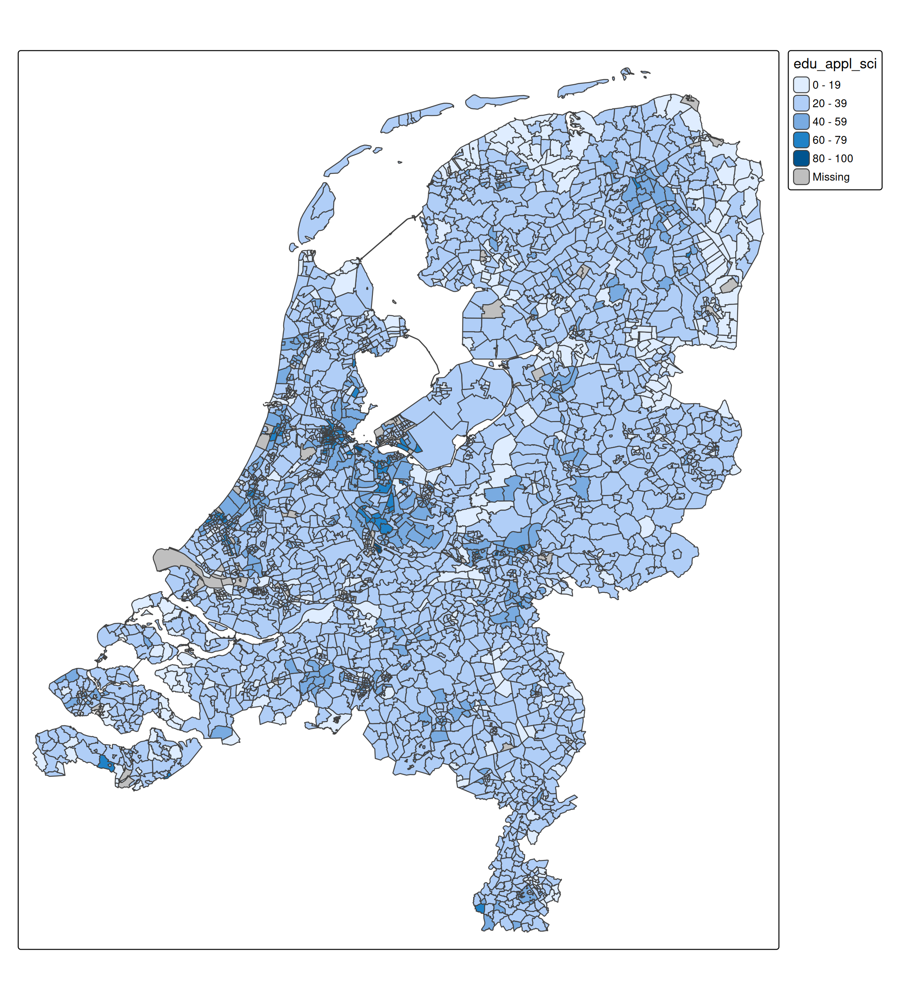
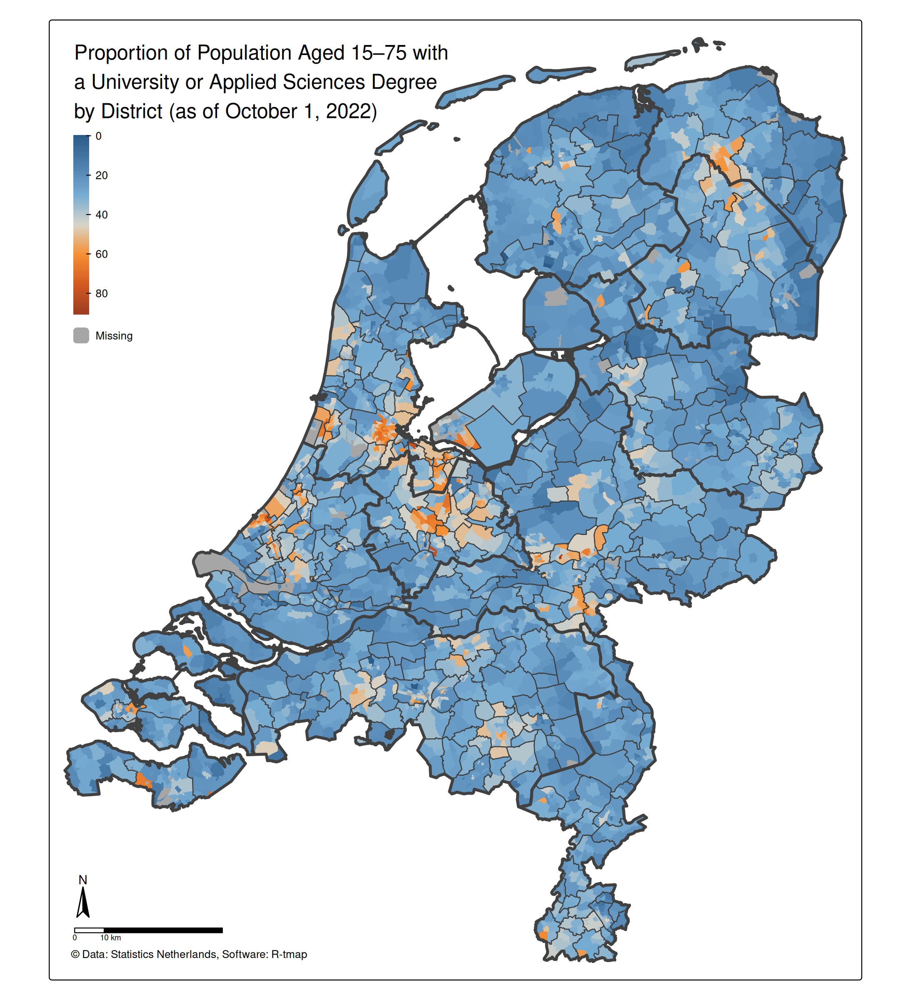

# tmap example: choropleth (Netherlands)

``` r
library(tmap)
tmap_options(scale = 0.75)
```

## About the data

In tmap, there are two example data sets of the Netherlands:

- one for districts, `NLD_dist` (3340 in total),
- one for municipalities: `NLD_muni` (345 in total), and
- one for provinces: `NLD_prov` (12 in total).

The first two datasets contain demographic data of the Netherlands as of
2022. The third dataset only contains metadata (names and codes) and
will only be used to plot province borders.

``` r
tmap_arrange(
    qtm(NLD_dist, title = "NLD_dist: 3340 districts"),
    qtm(NLD_muni, title = "NLD_mini: 345 municipalities"),
    qtm(NLD_prov, title = "NLD_prov: 12 provinces"),
    ncol = 3
)
```


The variables in the `NLD_dist` and `NLD_muni` are the same:

``` r
names(NLD_dist)
#>  [1] "code"               "name"               "province"          
#>  [4] "area"               "urbanity"           "population"        
#>  [7] "pop_0_14"           "pop_15_24"          "pop_25_44"         
#> [10] "pop_45_64"          "pop_65plus"         "dwelling_total"    
#> [13] "dwelling_value"     "dwelling_ownership" "employment_rate"   
#> [16] "income_low"         "income_high"        "edu_appl_sci"      
#> [19] "geometry"
```

We will create a choropleth about the variable `"edu_appl_sci"`, which
contains the percentage of 15-75 year old people who have a university
degree (Dutch: WO) or applied sciences degree (Dutch: HBO), per district
as of 1st October 2022.

## Choropleth: step 1

``` r
tm_shape(NLD_dist) +
    tm_polygons(fill = "edu_appl_sci") # data variable -> fill color
```



## Choropleth: step 2

We remove the district borders, because they are too dense in urban
areas. Instead, we add borders of municipalities and provinces op top:

``` r
tm_shape(NLD_dist) +
    tm_polygons(
        fill = "edu_appl_sci",
        col = NULL) +           # disable border lines
tm_shape(NLD_muni) +
    tm_borders(lwd = 1) +       # municipality border line width 1
tm_shape(NLD_prov) +
    tm_borders(lwd = 3)         # province border line width 3
```


## Choropleth: step 3

A few improvements and embellishments:

- A different color scheme. Run
  [`cols4all::c4a_gui()`](https://cols4all.github.io/reference/c4a_gui.html)
  to explore them. For this application, we were looking for: a
  diverging, color-blind friendly palette with sufficient contrast with
  black (to see the border lines)
- Legend: position top left, title removed (because we will use tm_title
  instead)
- Title added with tm_title. Note that `z = 0` makes sure the title is
  on top
- Map components added: compass, scalebar, and credits text

``` r
tm_shape(NLD_dist) +
    tm_polygons(
        fill = "edu_appl_sci",
        fill.scale = tm_scale_continuous(values = "-orange_blue_diverging"),
        fill.legend = tm_legend("", group_id = "top"),
        col = NULL
    ) + 
tm_shape(NLD_muni) +
    tm_borders(lwd = 1) +
tm_shape(NLD_prov) +
    tm_borders(lwd = 3) + 
tm_title("Proportion of Population Aged 15–75 with a University or Applied Sciences Degree by District (as of October 1, 2022)", 
    width = 15, 
    group_id = "top",
    z = 0) +
tm_compass(group_id = "bottom") +
tm_scalebar(group_id = "bottom", breaks = c(0, 10, 50)) +
tm_credits("© Data: Statistics Netherlands, Software: R-tmap", group_id = "bottom") +
tm_components("top", position = tm_pos_in("left", "top"), frame = FALSE, bg = FALSE) +
tm_components("bottom", position = tm_pos_in("left", "bottom", align.h = "left"))
```


