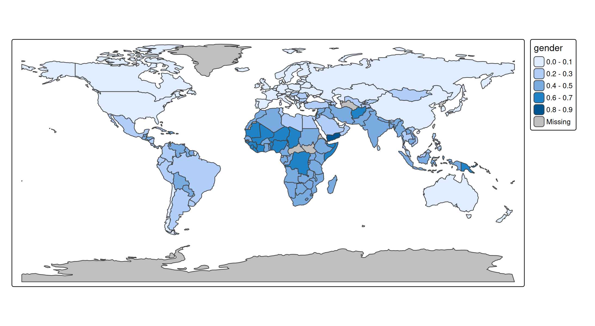
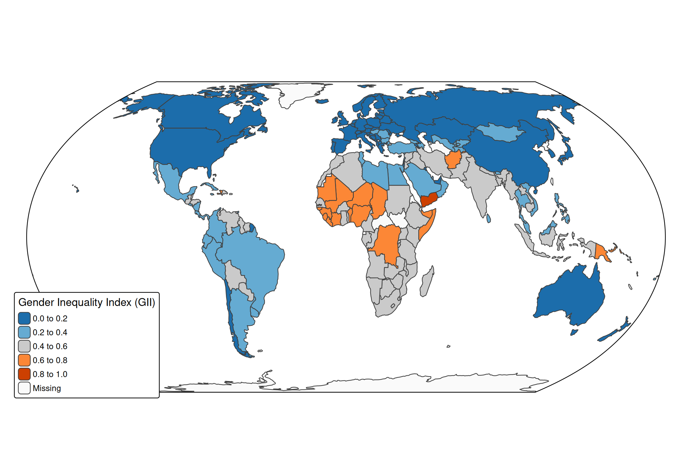

# tmap example: choropleth (World)

``` r
library(tmap)
library(dplyr)
library(sf)
tmap_options(scale = 0.75)
```

## About the data

A spatial data object contained in tmap is called `World`. It is a data
frame with a row for each country. The columns are the following data
variables plus an additional geometry column which contains the
geometries (see sf package):

``` r
names(World)
#>  [1] "iso_a3"       "name"         "sovereignt"   "continent"    "area"        
#>  [6] "pop_est"      "pop_est_dens" "economy"      "income_grp"   "gdp_cap_est" 
#> [11] "life_exp"     "well_being"   "footprint"    "HPI"          "inequality"  
#> [16] "gender"       "press"        "geometry"
```

We will create a choropleth of the Gender Inequality Index (GII) per
country.

## The choropleth: step 1

``` r
tm_shape(World) +
    tm_polygons(fill = "gender")
#> [tip] Consider a suitable map projection, e.g. by adding `+ tm_crs("auto")`.
#> This message is displayed once per session.
```



## The choropleth: step 2

A few improvements:

- A suitable map projection. This one ‘Equal Earth’ is equal-area,
  i.e. the polygon area sizes are proportianal to the real-world country
  area sizes.
- A different color scheme. Run
  [`cols4all::c4a_gui()`](https://cols4all.github.io/reference/c4a_gui.html)
  to explore them. For this application, we were looking for: a
  diverging, color-blind friendly palette with sufficient contrast with
  black (to see the border lines)
- A custom legend title
- The option `earth_boundary` is enabled, which shows the earth
  boundaries. Note that this feature is only available for certain map
  projections (for advanced users: families of pseudo-cylindrical and
  orthographic projections).
- The legend box is placed on top of the map, on the left bottom.

``` r
tm_shape(World, crs = "+proj=eqearth") +
  tm_polygons(
    fill = "gender",
    fill.scale = tm_scale_intervals(values = "-tableau.classic_orange_blue"),
    fill.legend = tm_legend(
     "Gender Inequality Index (GII)", 
    position = tm_pos_on_top(pos.h = "left", pos.v = "bottom"), 
    bg.color = "white")) +
tm_options(earth_boundary = TRUE, frame = FALSE)
```


