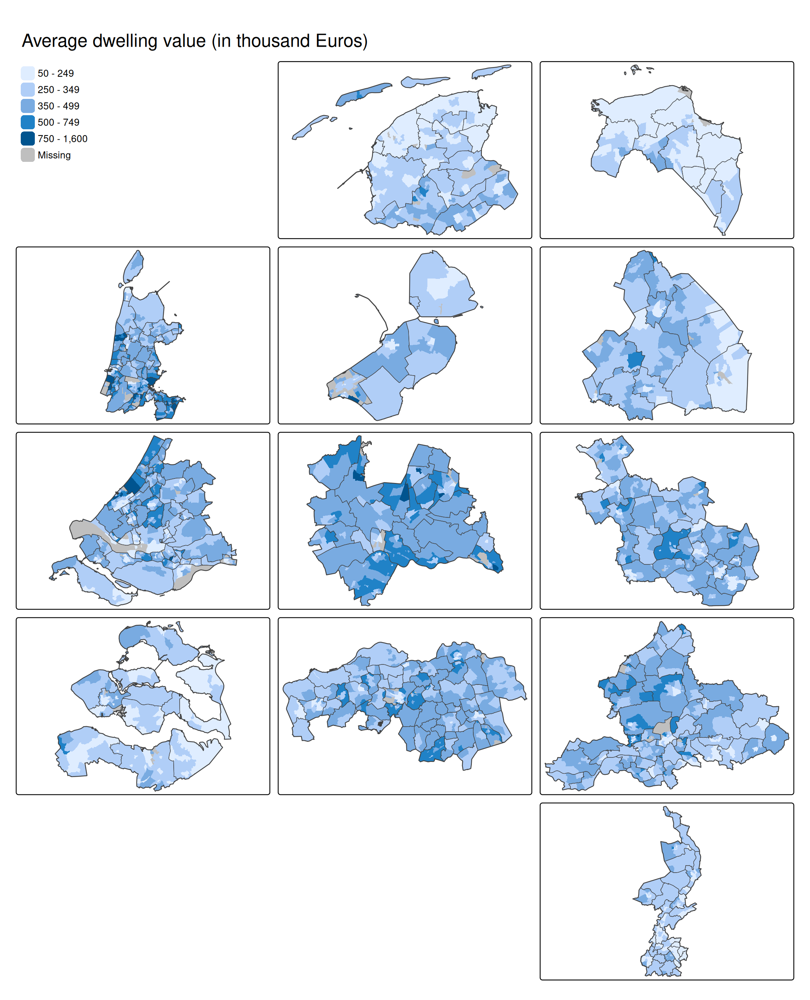

# tmap example: gridmaps

``` r
library(tmap)
library(geofacet)
library(dplyr)
library(sf)
tmap_options(scale = 0.75)
```

## Get grid layout of Dutch provinces

``` r
nl_prov_grid1 = geofacet::nl_prov_grid1
class(nl_prov_grid1) = "data.frame"

nl_prov_grid1 = nl_prov_grid1 |>
    mutate(name = ifelse(name == "Friesland", "Fryslan", name)) |>
    select(-code)
```

## Join with NLD datasets in tmap

``` r
NLD_prov2 = NLD_prov |>
    left_join(nl_prov_grid1,
              by = "name")

NLD_muni2 = NLD_muni |>
    left_join(NLD_prov2 |>
                st_drop_geometry() |>
                select(name, row, col), by = c("province" = "name"))

NLD_dist2 = NLD_dist |>
    left_join(NLD_prov2 |>
                st_drop_geometry() |>
                select(name, row, col), by = c("province" = "name"))
```

## The map

``` r
tm_shape(NLD_dist2) +
    tm_fill("dwelling_value", 
            fill.scale = tm_scale_intervals(breaks = c(50, 250, 350, 500, 750, 1600), as.count = FALSE),
            fill.legend = tm_legend("", position = tm_pos_on_top("left", "top"), frame = FALSE)) +
    tm_facets_grid(rows = "row", columns = "col") +
tm_shape(NLD_muni2) +
    tm_borders(lwd = 1) +
    tm_facets_grid(rows = "row", columns = "col") +
tm_shape(NLD_prov2) +
    tm_borders(lwd = 2) +
    tm_facets_grid(rows = "row", columns = "col") +
tm_layout(panel.show = FALSE) +
    tm_title("Average dwelling value (in thousand Euros)")
```


