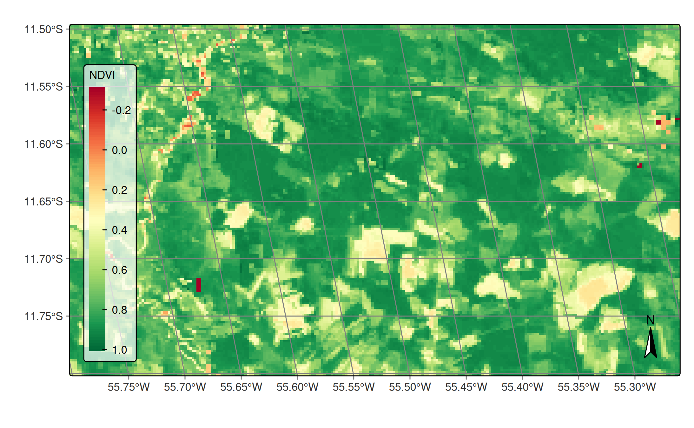
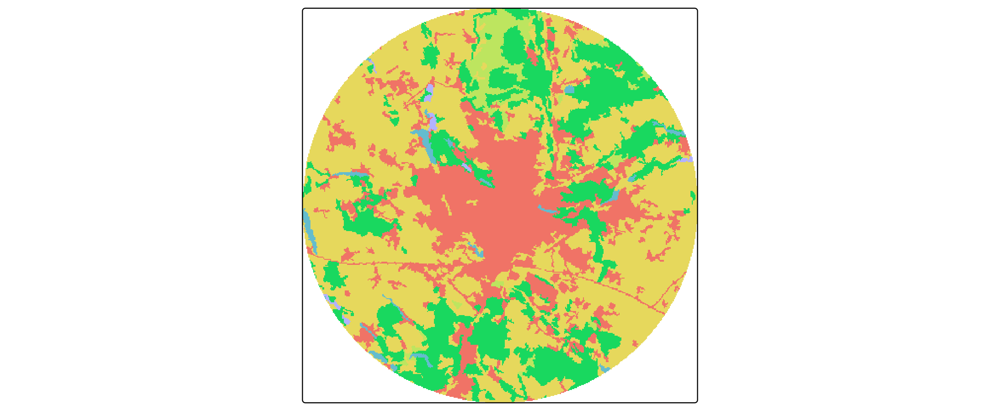
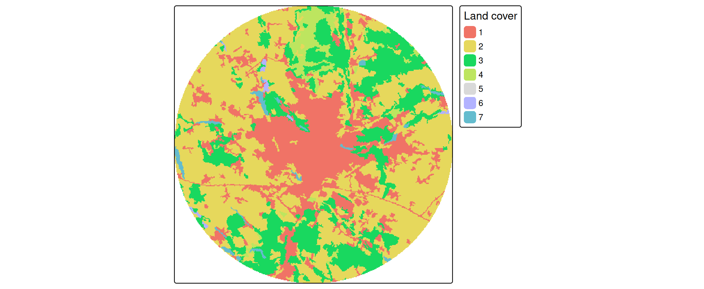

# tmap example: rasters

``` r
library(tmap)
library(dplyr)
library(sf)
library(stars)
library(terra)
library(sits)
tmap_options(scale = 0.75)
```

## About the data

``` r
ndvi_image = system.file("extdata/raster/mod13q1/TERRA_MODIS_012010_NDVI_2014-01-17.jp2", package = "sits")
```

Reading with the `terra` package

``` r
(ndvi_terra = terra::rast(ndvi_image))
#> class       : SpatRaster 
#> size        : 147, 255, 1  (nrow, ncol, nlyr)
#> resolution  : 231.6564, 231.6564  (x, y)
#> extent      : -6073798, -6014726, -1312333, -1278280  (xmin, xmax, ymin, ymax)
#> coord. ref. : +proj=sinu +lon_0=0 +x_0=0 +y_0=0 +R=6371007.181 +units=m +no_defs 
#> source      : TERRA_MODIS_012010_NDVI_2014-01-17.jp2 
#> name        : TERRA_MODIS_012010_NDVI_2014-01-17
```

Reading with the `stars` package

``` r
(ndvi_stars = stars::read_stars(ndvi_image))
#> stars object with 2 dimensions and 1 attribute
#> attribute(s):
#>                                  Min. 1st Qu. Median    Mean 3rd Qu.  Max.
#> TERRA_MODIS_012010_NDVI_201...  -3056    6937   8174 7601.51    8823 10076
#> dimension(s):
#>   from  to   offset  delta  refsys x/y
#> x    1 255 -6073798  231.7 unnamed [x]
#> y    1 147 -1278280 -231.7 unnamed [y]
```

## Example 1

first plot - a NDVI image in false color with a brewer pallete

``` r
ndvi = ndvi_terra # or ndivi_stars

# scale the data to get image in [-1..1] range
ndvi = ndvi * 0.0001

# plot using brewer "RdYlGn" pallete
tmap::tm_shape(ndvi) +
    tmap::tm_raster(
        col.scale = tmap::tm_scale_continuous(
            values = "brewer.rd_yl_gn",
            midpoint = NA),
        col.legend = tmap::tm_legend(
            title = "NDVI",
            title.size = 0.7,
            text.size = 0.7,
            bg.color = "white",
            bg.alpha = 0.7,
            position = tmap::tm_pos_in("left", "bottom"),
            frame = TRUE
        )
    ) +
    tmap::tm_graticules(
        labels.size = 0.7
    ) +
    tmap::tm_compass() +
    tmap::tm_layout(
        scale = 1.0
    )
```



## Example 2

``` r
sent_image = system.file("extdata/raster/classif/SENTINEL2_MSI_20LNR_2020-06-04_2021-08-26_class_v1.tif", package = "sits")
```

``` r
sent = terra::rast(sent_image)
```

``` r
tm_shape(sent) + tm_raster(col.scale = tm_scale_discrete())
```


## Example 3 (categorical raster)

``` r
clc2018_poznan = rast("https://github.com/Nowosad/comparing-spatial-patterns-2024/raw/refs/heads/main/data/clc2018_poznan.tif")
```

``` r
tm_shape(clc2018_poznan) + 
    tm_raster()
```



``` r
tm_shape(clc2018_poznan) + 
    tm_raster(col.legend = tm_legend(title = "Land cover"))
```


