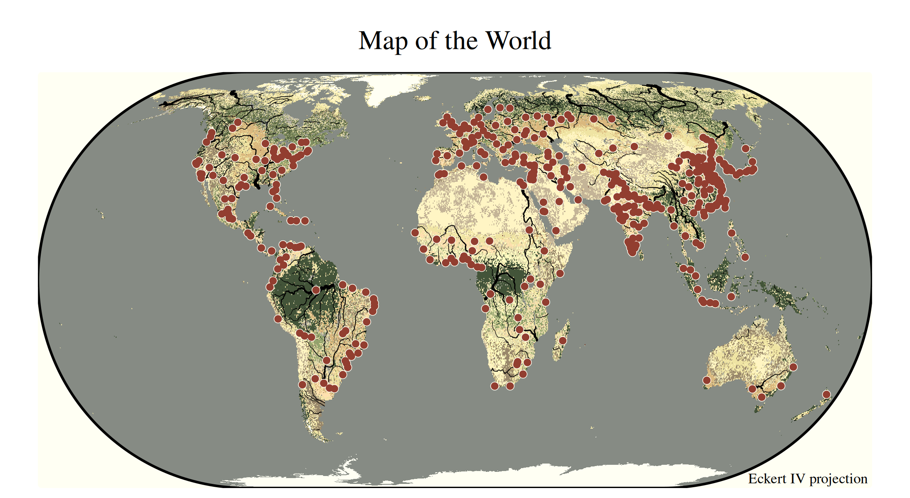

# tmap example: terrain map

``` r
library(tmap)
library(dplyr)
library(sf)
tmap_options(scale = 0.75)
```

## About the data

We use a couple of spatial data objects contained in tmap:
`World_rivers`, `land` and `metro`.

## Terrain map

``` r
tm_shape(land) +
    tm_raster(col = "cover") +
#tm_shape(World) +
#   tm_borders() +
tm_shape(World_rivers) +
    tm_lines(lwd = "strokelwd", 
             lwd.scale = tm_scale_asis(values.scale = 0.2)) +
tm_shape(metro) +
    tm_symbols(shape = 20, size = 0.6, fill = "white") +
    tm_symbols(shape = 20, size = 0.5, fill = "red") +
tm_crs("+proj=eck4") + 
tm_layout(earth_boundary = TRUE,
          earth_boundary.lwd = 2,
          legend.show = FALSE,     # option to disable all legends
          frame = FALSE,
          space.color = "white") +
tm_title("Map of the World", 
  position = tm_pos_out(cell.h = "center", cell.v = "top", pos.h = "center")) +
tm_credits("Eckert IV projection", position = c("RIGHT", "BOTTOM"))
#> Warning: ! Unable to warp stars. Stars will be transformed now (which will take some
#>   time).
```


Note: upper case position spefications (last line) means tight to the
right bottom corner

## Classic style

``` r
tmap_style("classic")
#> style set to "classic"
#> other available styles are: "white" (tmap default), "gray", "natural", "cobalt", "albatross", "beaver", "bw", "watercolor"
#> tmap v3 styles: "v3" (tmap v3 default), "gray_v3", "natural_v3", "cobalt_v3", "albatross_v3", "beaver_v3", "bw_v3", "classic_v3", "watercolor_v3"
tmap_last()
#> Warning: ! Unable to warp stars. Stars will be transformed now (which will take some
#>   time).
```


