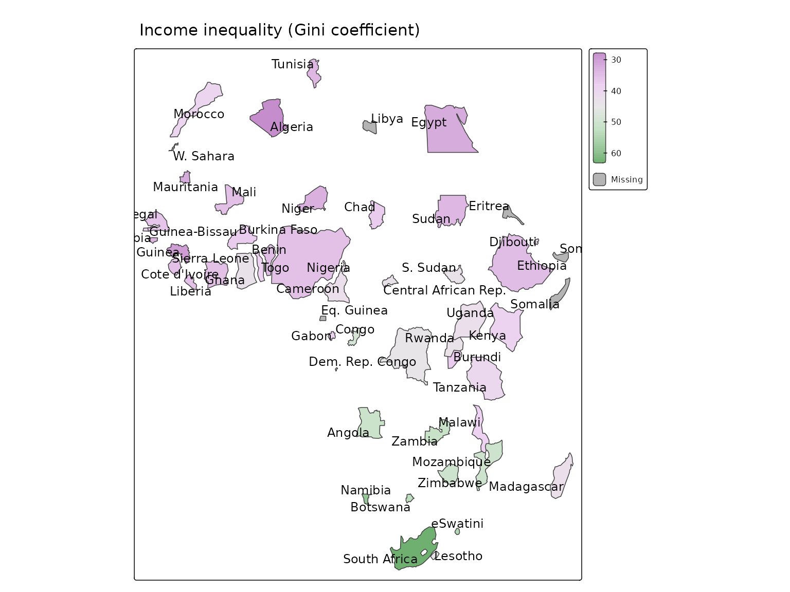
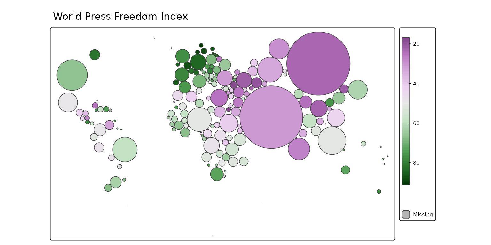

# tmap extensions: tmap.cartogram

## Cartograms

In cartograms, areal regions are distorted such that the obtained area
sizes are proportional to a quantitative variable. There are three
types: contiguous, non-contiguous and dorling cartogram.

The extension package
[**tmap.cartogram**](https://r-tmap.github.io/tmap.cartogram/) provides
new layer functions for tmap to create various types of cartograms.

It is strongly recommended to use an equal area crs (see
[instructions](https://r-tmap.github.io/tmap.cartogram/articles/intro#map-projection)).

## Contiguous cartogram

The shapes of the polygons are distorted, where the neighborhood
relationships between them are preserved as much as possible.

``` r
Africa = World[World$continent == "Africa", ]

tm_shape(Africa, crs = "+proj=robin") +
  tm_cartogram(
    size = "*pop_est", 
    fill = "life_exp",
    fill.scale = tm_scale_intervals(values = "-cols4all.bu_br_div"),
    fill.legend = tm_legend("Age"),
    options = opt_tm_cartogram(itermax = 15)) +
tm_title("Life Expectancy") +
tm_animate_fast(play = "pingpong")
#> Cartogram in progress...
```


## Non-contiguous cartograms

Here, the polygons are only resized while they keep their shape.

``` r
tm_shape(Africa, crs = "+proj=robin") +
  tm_cartogram_ncont(
    size = "pop_est", 
    fill = "inequality",
    fill.scale = tm_scale_continuous(values = "cols4all.pu_gn_div", values.range = c(0, 0.5)),
    fill.legend = tm_legend(""),
    options = opt_tm_cartogram_ncont()) +
  tm_text("name", options = opt_tm_text(point.label = TRUE)) +
tm_title("Income inequality (Gini coefficient)")
#> Cartogram in progress...
```



## Dorling cartogram

Polygons are replaced by non-overlapping bubbles.

``` r
tm_shape(World, crs = "+proj=robin") +
  tm_cartogram_dorling(
    size = "pop_est", 
    fill = "press",
    fill.scale = tm_scale_continuous(values = "cols4all.pu_gn_div", midpoint = 50),
    fill.legend = tm_legend("", height = 30)) +
tm_title("World Press Freedom Index")
#> Cartogram in progress...
```


