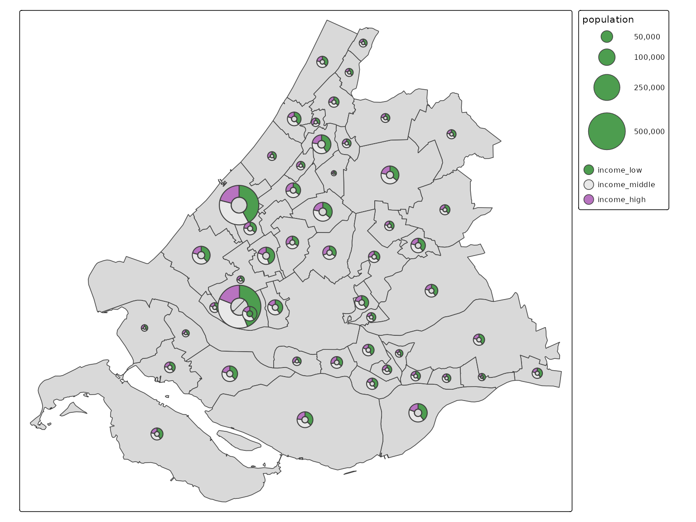

# tmap extensions: tmap.glyphs

Glyphs in spatial data visualization are graphical symbols that
represent data values at specific geographic locations. Each glyph can
encode multiple data variables.

With the extension package
[**tmap.glyphs**](https://github.com/r-tmap/tmap.glyphs/) (in
development) glyphs can be created. Currently only the donut and flower
glyphs are implemented.

## Donut maps

``` r

ZH_muni = NLD_muni[NLD_muni$province == "Zuid-Holland", ]

ZH_muni$income_middle = 100 - ZH_muni$income_high - ZH_muni$income_low

tm_shape(ZH_muni) +
  tm_polygons() +
  tm_donuts(parts = tm_vars(c("income_low", "income_middle", "income_high"), multivariate = TRUE),
    fill.scale = tm_scale_categorical(values = "-pu_gn_div"),             
    size = "population",
    lwd = 1,
    size.scale = tm_scale_continuous(ticks = c(50000, 100000, 250000, 500000)),
    options = opt_tm_donuts(fill_hole = FALSE))
```



## Flower maps

``` r

library(tmap.mapgl)
tmap_mode("maplibre")
#> ℹ tmap modes "plot" -> "view" -> "mapbox" -> "maplibre"
#> ℹ rotate with `tmap::rtm()`switch to "plot" with `tmap::ttm()`

q = function(x) {
    r = rank(x)
    r[is.na(x)] = NA
    r = r / max(r, na.rm = TRUE)
    r
}

World$rank_well_being = q((World$well_being / 8))
World$rank_footprint = q(((50 - World$footprint) / 50))
World$rank_inequality = q(((65 - World$inequality) / 65))
World$rank_press = q(1 - ((100 - World$press) / 100))
World$rank_gender = q(1 - World$gender)

tm_shape(World) +
  tm_polygons(fill = "white", popup = FALSE) +
tm_shape(World) +   
  tm_flowers(
    parts = 
      tm_vars(c("rank_gender", "rank_press", "rank_footprint", 
              "rank_well_being", "rank_inequality"), multivariate = TRUE),
    fill.scale = tm_scale(values = "friendly5", labels = c("Gender", "Press freedom", "Footprint", "Well being", "Economic inequality")),
    size = 1.5, 
    popup = tm_popup(
      vars = c("Gender" = "rank_gender", 
             "Press freedom" = "rank_press", 
             "Footprint" = "rank_footprint", 
             "Well being" = "rank_well_being", 
             "Economic inequality" =  "rank_inequality"),
      title = "name")) + 
tm_basemap(NULL) +
tm_layout(bg.color = "grey90")
#> [tip] Consider a suitable map projection, e.g. by adding `+ tm_crs("auto")`.
#> This message is displayed once per session.
```
