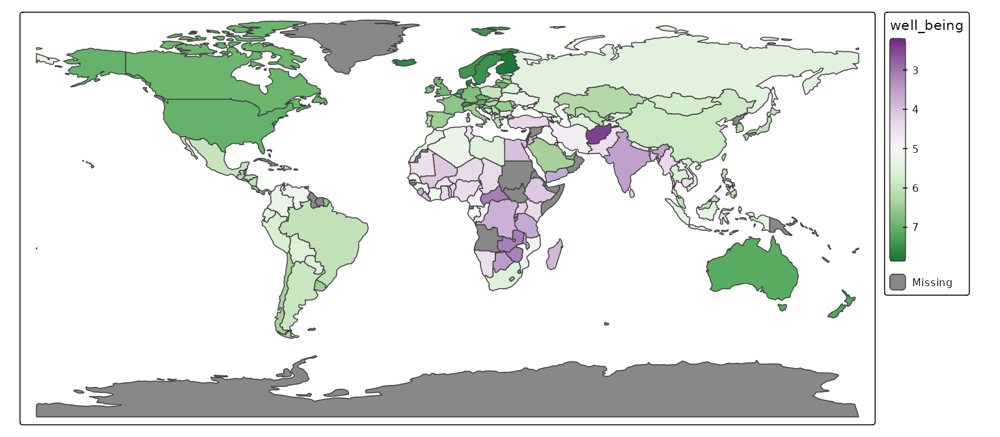

# tmap extensions: tmap.mapgl

There are two modes included in **tmap**: `"plot"` for static mapping
and `"view"` for interactive mapping. See
[introduction](https://r-tmap.github.io/tmap/articles/basics_modes). The
`"view"` mode uses the JavaScript library Leaflet as backend.

The extension package
[**tmap.mapgl**](https://r-tmap.github.io/tmap.mapgl/) offers two new
modes which are also interactive: `"mapbox"` and `"maplibre"` which use
the JavaScript libraries Mapbox GL and Maplibre GL respectively. The
latter is a open source fork of the former before it went from open to
closed source.

An API key is required to use `"mapbox"` (free for personal use, see
[instructions](https://r-tmap.github.io/tmap.mapgl/articles/mapbox#getting-and-using-the-api-key)),
but `"maplibre"` is (as the name suggests) free for any use.

Note that *tmap.mapgl* is a bridge between the R packages *mapgl* and
*tmap*. It makes the functionality of *mapgl* (making the JavaScript
libraries available to R) also available via the *tmap* user interface.

For this example we’ll create a choropleth of well being per country. We
assign the map to `map` without showing it.

``` r
map = tm_shape(World) + 
  tm_polygons("well_being",
    fill.scale = tm_scale_continuous(values = "pu_gn"))
```

``` r
tmap_mode("plot")
#> ℹ tmap modes "plot" -> "view" -> "mapbox" -> "maplibre"
#> ℹ rotate with `tmap::rtm()`switch to "plot" with `tmap::ttm()`
map
#> [tip] Consider a suitable map projection, e.g. by adding `+ tm_crs("auto")`.
#> This message is displayed once per session.
```



## maplibre

``` r
library(tmap.mapgl)
tmap_mode("maplibre")
#> ℹ tmap modes "plot" -> "view" ->
#> "mapbox" -> "maplibre"
map
```

## mapbox

For `"mapbox"` an API key is required, which is free for personal use.
See
[instructions](https://r-tmap.github.io/tmap.mapgl/articles/mapbox#getting-and-using-the-api-key).

``` r
tmap_mode("mapbox")
map
```


tmap mapbox mode

## 3d polygons

**tmap.mapgl** also features a new layer type, `tm_polygons_3d`, which
is only available for `"mapbox"` and `"maplibre"`.

This map layer is the same as `tm_polygons`, but one addition: polygons
can be extruded in 3d shape. The visual variable to control this is
called `height`.

Below an example of population density per country:

``` r
tmap_mode("maplibre")
#> ℹ tmap modes "plot" -> "view" ->
#> "mapbox" -> "maplibre"
tm_shape(World) +
    tm_polygons_3d(height = "pop_est_dens", fill = "continent")
#> Warning: Fill-extrusion layers may have rendering artifacts in globe
#> projection. Consider using projection = "mercator" in maplibre() for better
#> performance. See https://github.com/maplibre/maplibre-gl-js/issues/5025
```

Note that this is a toy simple example that does not take high
population density of urban areas in otherwise sparse populated
countries into account.

A more useful example of population density mapping is the following map
of the Netherlands in which height is the population density per
neighborhood (and therefore its volume represents population). Color is
used to show the variable of interest, in this case education level.

``` r
tmap_mode("maplibre")
#> ℹ tmap modes "plot" -> "view" ->
#> "mapbox" -> "maplibre"

NLD_dist$pop_dens = NLD_dist$population / NLD_dist$area

tm_shape(NLD_dist) +
  tm_polygons_3d(height = "pop_dens",
    fill = "edu_appl_sci",
    fill.scale = tm_scale_intervals(style = "kmeans", values = "-pu_gn"),
    fill.legend = tm_legend("Univeristy degree")) +
tm_maplibre(pitch = 45)
#> Warning: Fill-extrusion layers may have rendering artifacts in globe
#> projection. Consider using projection = "mercator" in maplibre() for better
#> performance. See https://github.com/maplibre/maplibre-gl-js/issues/5025
```
