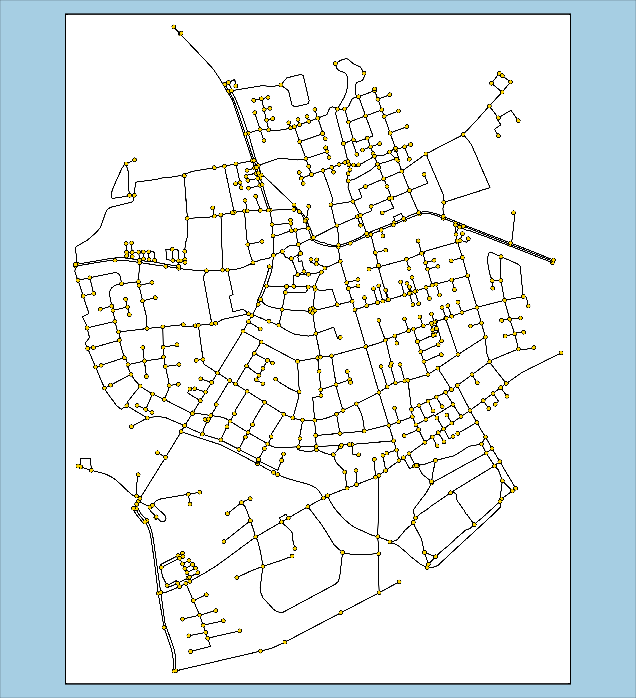
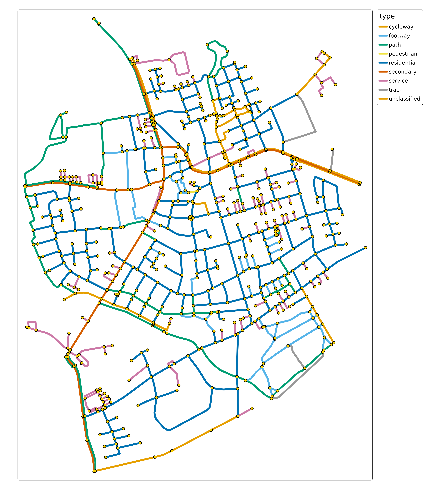

# tmap extensions: tmap.networks

With [**tmap.networks**](https://r-tmap.github.io/tmap.networks/)
network visualizations can be made. It will handle `sfnetwork` objects
(from the package
[sfnetworks](https://luukvdmeer.github.io/sfnetworks/index.html))
natively.

``` r
library(sfnetworks)
library(tmap.networks)

sfn = as_sfnetwork(roxel)
```

Besides this new spatial data class `"sfnetwork"`, this package also
features new map layers, albeit very basic so far:

``` r
tm_shape(sfn) +
    tm_network()
#> <====================  crs_step4 ===============>
#> List of 2
#>  $ input: chr "EPSG:4326"
#>  $ wkt  : chr "GEOGCRS[\"WGS 84\",\n    DATUM[\"World Geodetic System 1984\",\n        ELLIPSOID[\"WGS 84\",6378137,298.257223"| __truncated__
#>  - attr(*, "class")= chr "crs"
#> <====================  crs_step3 ===============>
#> List of 2
#>  $ input: chr "EPSG:4326"
#>  $ wkt  : chr "GEOGCRS[\"WGS 84\",\n    DATUM[\"World Geodetic System 1984\",\n        ELLIPSOID[\"WGS 84\",6378137,298.257223"| __truncated__
#>  - attr(*, "class")= chr "crs"
#> <====================  crs_leaflet ===============>
#> List of 5
#>  $ crsClass       : chr "L.CRS.Simple"
#>  $ code           : NULL
#>  $ proj4def       : NULL
#>  $ projectedBounds: NULL
#>  $ options        : Named list()
#>  - attr(*, "class")= chr "leaflet_crs"
#> </============================================>
```



``` r
tm_shape(sfn) +
    tm_edges(col = "type", lwd = 4) +
    tm_nodes()
#> <====================  crs_step4 ===============>
#> List of 2
#>  $ input: chr "EPSG:4326"
#>  $ wkt  : chr "GEOGCRS[\"WGS 84\",\n    DATUM[\"World Geodetic System 1984\",\n        ELLIPSOID[\"WGS 84\",6378137,298.257223"| __truncated__
#>  - attr(*, "class")= chr "crs"
#> <====================  crs_step3 ===============>
#> List of 2
#>  $ input: chr "EPSG:4326"
#>  $ wkt  : chr "GEOGCRS[\"WGS 84\",\n    DATUM[\"World Geodetic System 1984\",\n        ELLIPSOID[\"WGS 84\",6378137,298.257223"| __truncated__
#>  - attr(*, "class")= chr "crs"
#> <====================  crs_leaflet ===============>
#> List of 5
#>  $ crsClass       : chr "L.CRS.Simple"
#>  $ code           : NULL
#>  $ proj4def       : NULL
#>  $ projectedBounds: NULL
#>  $ options        : Named list()
#>  - attr(*, "class")= chr "leaflet_crs"
#> </============================================>
```


