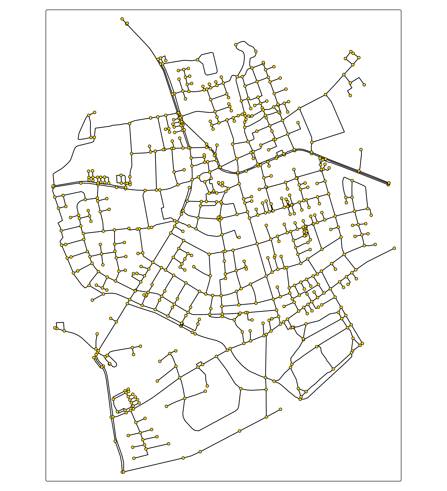

# tmap extensions: tmap.networks

With [**tmap.networks**](https://r-tmap.github.io/tmap.networks/)
network visualizations can be made. It will handle `sfnetwork` objects
(from the package
[sfnetworks](https://luukvdmeer.github.io/sfnetworks/index.html))
natively.

``` r
library(sfnetworks)
library(tmap.networks)

sfn = as_sfnetwork(roxel)
```

Besides this new spatial data class `"sfnetwork"`, this package also
features new map layers, albeit very basic so far:

``` r
tm_shape(sfn) +
    tm_network()
```



``` r
tm_shape(sfn) +
    tm_edges(col = "type", lwd = 4) +
    tm_nodes()
```


