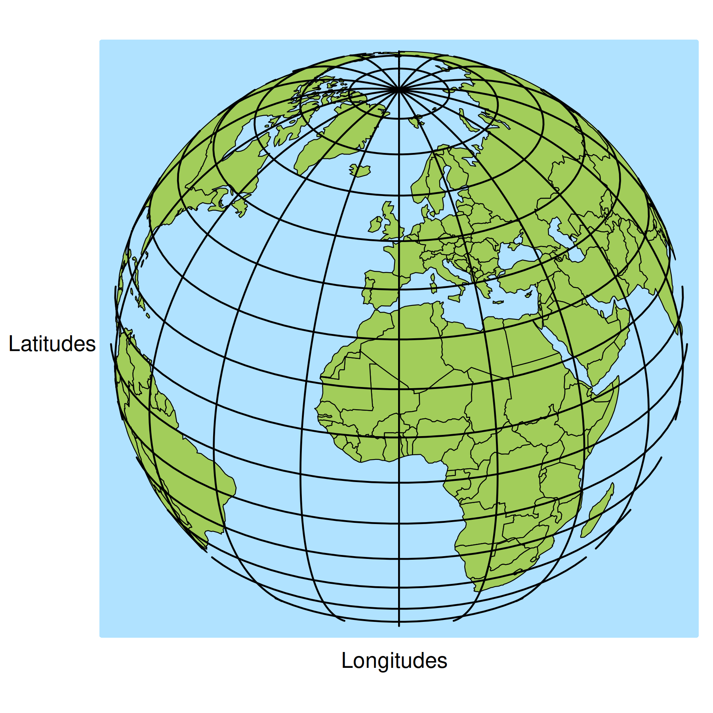
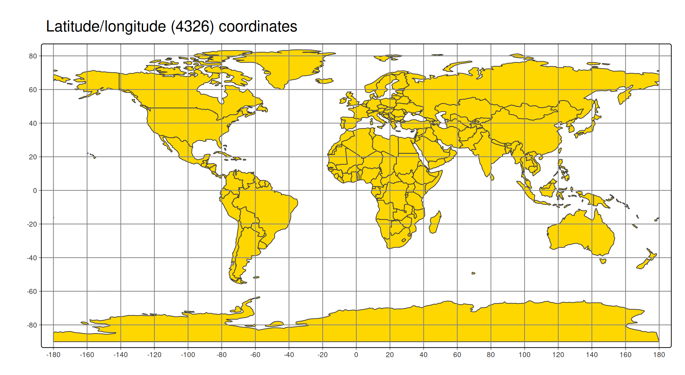
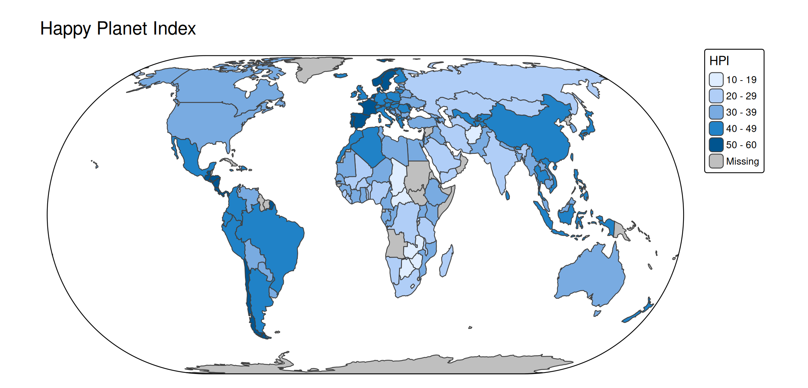
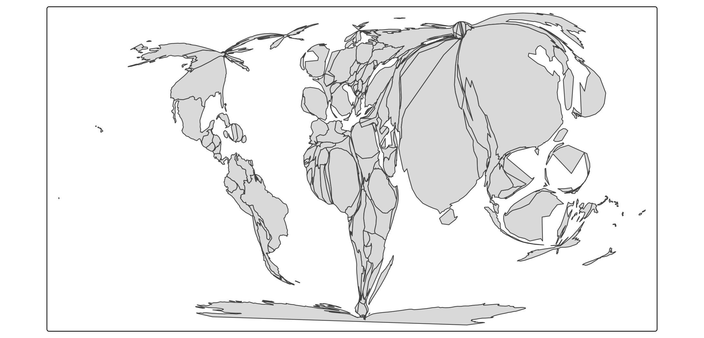
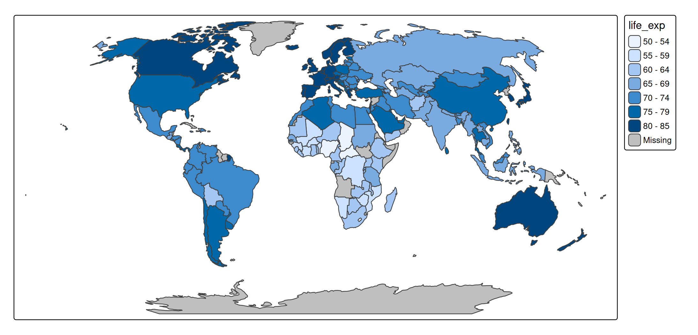

# tmap foundations: map projections (CRS)

## Latitude longitude coordinates

A spatial data object contained in tmap is called `World`. It is an `sf`
data frame with a row for each country. The geometry column contains
multipolygons:

``` r
World$geometry
#> Geometry set for 177 features 
#> Geometry type: MULTIPOLYGON
#> Dimension:     XY
#> Bounding box:  xmin: -180 ymin: -90 xmax: 180 ymax: 83.645
#> Geodetic CRS:  WGS 84
#> First 5 geometries:
#> MULTIPOLYGON (((66.217 37.394, 66.519 37.363, 6...
#> MULTIPOLYGON (((20.605 41.086, 21.02 40.843, 21...
#> MULTIPOLYGON (((-4.923 24.975, -8.684 27.396, -...
#> MULTIPOLYGON (((12.322 -6.1, 12.735 -5.966, 13....
#> MULTIPOLYGON (((-61.883 -80.393, -61.139 -79.98...
```

The used coordinates are latitudes and longitudes. Latitudes define
north/south (so perpendicular to the equator), whereas longitudes define
east/west.

``` r
tm_shape(World, 
    bbox = "FULL",
    crs = "+proj=ortho +lat_0=30 +lon_0=0") +
  tm_polygons() +
tm_style("natural") + 
tm_graticules(n.x = 20, n.y = 10, col = "black", lwd = 2, labels.show = FALSE) +
tm_xlab("Longitudes", size = 1.1) +tm_ylab("Latitudes", size = 1.1)
```



The latitude and longitude coordinates are specified using the WGS84
geodetic datum, an ellipsoid model of the earth. There are other
standards, but WGS84 is by far the most popular and also used by GPS.

Besides using latitude longitude coordinates as references for real
locations on earth, they can obviously also be used to draw maps:

``` r
tm_shape(World) +
  tm_polygons("gold") +
tm_crs(4326) +
tm_grid(n.x = 16, n.y = 8) +
tm_title("Latitude/longitude (4326) coordinates")
#> [tip] Consider a suitable map projection, e.g. by adding `+ tm_crs("auto")`.
#> This message is displayed once per session.
```



However, this is not a good map because areas near the poles are too
large (and therefore overemphasized).

``` r
library(tmap.cartogram)

# split multi-polygon countries (otherwise Alaska is still too large)
World_polygons = sf::st_cast(World, "POLYGON")
#> Warning in st_cast.sf(World, "POLYGON"): repeating attributes for all
#> sub-geometries for which they may not be constant
World_polygons$area = sf::st_area(World_polygons)

tm_shape(World_polygons) +
  tm_cartogram_ncont(size = "area", fill = "gold", options = opt_tm_cartogram_ncont(expansion = 0.4)) +
tm_title("Polygons shrinked to real area sizes")
#> Warning: tm_cartogram requires projected coordinates, not longlat degrees. A
#> projected CRS can be specified in tm_shape (argument crs)
#> Cartogram in progress...
```


Therefore, mathematicians thought about other ways how to ‘flatten down
the earth’. Bring in CRS…

## CRS (map projection)

The abbreviation CRS stands for **Coordinate Reference System**. It
defines how real locations on earth are projected on a two-dimensional
surface (the plotting device or paper).

Latitudes longitudes (WGS84) can also be seen as a CRS, but an
*unprojected* one.

In `tmap` and most other spatial data packages in R (`sf`, `stars`,
`terra`) the CRS is named in many functions and function arguments `crs`
(so small case). The most important function is
[`sf::st_crs()`](https://r-spatial.github.io/sf/reference/st_crs.html),
via which the CRS can be set and retrieved. Even though the definition
of a CRS is complex, most common CRSs can be created with shortcuts.
EPSG is a library projections indexed with numbers. For instance, the
WGS84 latitude longitude coordinate system is EPSG 4326. The
corresponding CRS can be obtained via `sf::st_crs(4326)`.

Several map projections are useful for world maps. Useful in the sense
that plotted areas are (almost) proportional to the real areas, while
the polygon shapes are not distorted too much. These projections, belong
to the family of “pseudo-cylindrical” projections (see
<https://r-tmap.github.io/tmap-book/geodata.html#crs> ). Some of these
have been widely used in cartography for decades, e.g. in The Times
Atlas of The World.

``` r
# vector of world map projections
world_projs = c("wintri", "robin", paste0("eck", 1:6), 
  "moll", paste0("wag", 1:7), "eqearth")

# create a tmap for each of them
tms = lapply(world_projs, function(p) {
  tm_shape(World, crs = paste0("+proj=", p)) + tm_polygons() + tm_style("natural") + tm_layout(panel.labels = p)
})

# use tmap_arrange
tmap_arrange(tms, ncol= 3)
```


The panel names are abbreviations for: Winkel Tripel, Robinson, Eckert I
to VI, Mollweide, Wagner I to VII and Equal Earth. The can be used as
follows:

``` r
tm_shape(World) +
  tm_polygons("HPI") +
tm_crs("+proj=eck4") +
tm_title("Happy Planet Index") +
tm_layout(earth_boundary = TRUE, frame = FALSE)
```



## Use

### Geometric transformations: use `tm_shape`

The `crs` can be defined in
[`tm_shape()`](https://r-tmap.github.io/tmap/reference/tm_shape.md).
This is useful for thematic maps where the geometry is changed. For
instance cartograms:

``` r
tm_shape(World, crs = "+proj=robin") +
  tm_cartogram(size = "pop_est")
#> Cartogram in progress...
```



### Otherwise: use `tm_crs`

In the majority of use cases, e.g. regular choropleths, it is
recommended to define the CRS with the function
[`tm_crs()`](https://r-tmap.github.io/tmap/reference/tm_crs.md):

``` r
tm_shape(World) +
  tm_polygons(fill = "life_exp") +
tm_crs(crs = "+proj=robin")
```


