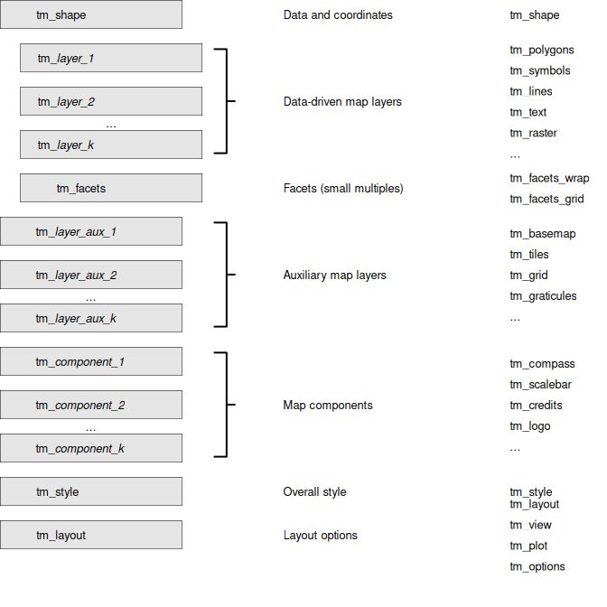

# tmap foundations: Grammar of Graphics

The Grammar of Graphics \[1\] is a framework for building statistical
graphics by combining key components like data, aesthetic mappings,
geometric objects, scales, transformations, and statistical summaries.
It provides a systematic, modular approach to creating flexible and
consistent visualizations.

### Components:

- **Data**: The dataset being visualized.
- **Aesthetic Mappings**: How data maps to visual properties (e.g.,
  position, color, size).
- **Geometric Objects**: Shapes representing the data (e.g., points,
  lines, bars).
- **Scales**: Rules linking data values to aesthetic values.
- **Transformations**: Adjustments to data or coordinates (e.g., log
  scales).
- **Statistical Summaries**: Computed data representations (e.g., means,
  trends).
- **Facets**: Layouts for splitting data into subsets for comparison.

It is applied in **ggplot2** \[2\] and also in **tmap**, but slightly
differently. What the Grammar of Graphics and **ggplot2** call
*aesthetics*, **tmap** calls **map variables**. Both refer to the visual
properties (such as fill color, size, and line width) to which data
values are mapped.

## tmap

## ggplot2

- In **ggplot2**, aesthetics are defined on the plot level (by default),
  but in **tmap** map variables are defined on the layer level. This
  makes sense, since in non-spatial visualizations the x and y
  aesthetics, the most important ones, are shared among the plot layers.
  However, in spatial visualizations the x and y coordinates are not
  considered data-driven but rather geometry-driven. The remaining map
  variables, such as fill and border color, line width, and symbol
  shape, naturally belong to individual layers.
- This also applies to scales: e.g. in **ggplot2**,
  [`scale_fill_continuous()`](https://ggplot2.tidyverse.org/reference/scale_colour_continuous.html)
  applies to the fill aesthetic for the whole plot. In **tmap**, scale
  functions are specified per map variable per layer:
  `tm_polygons(fill = "my_var", fill.scale = tm_scale_continuous())`

See other vignette (to do: link) that compares tmap with ggplot2 by a
series of examples

\[1\]

Leland. Wilkinson and G. Wills, *The grammar of graphics*, 2nd ed. in
Statistics and computing. New York: Springer, 2005.

\[2\]

H. Wickham, *ggplot2: Elegant graphics for data analysis*.
Springer-Verlag New York, 2016. Available:
<https://ggplot2.tidyverse.org>
