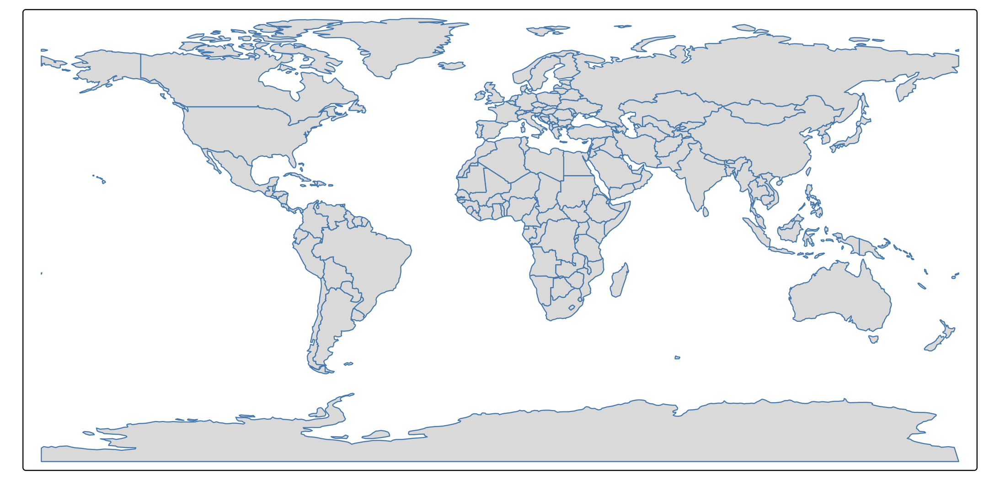
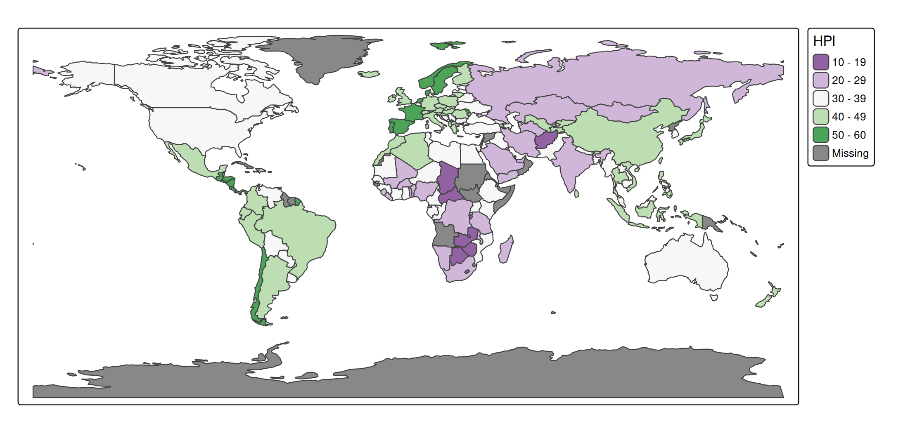
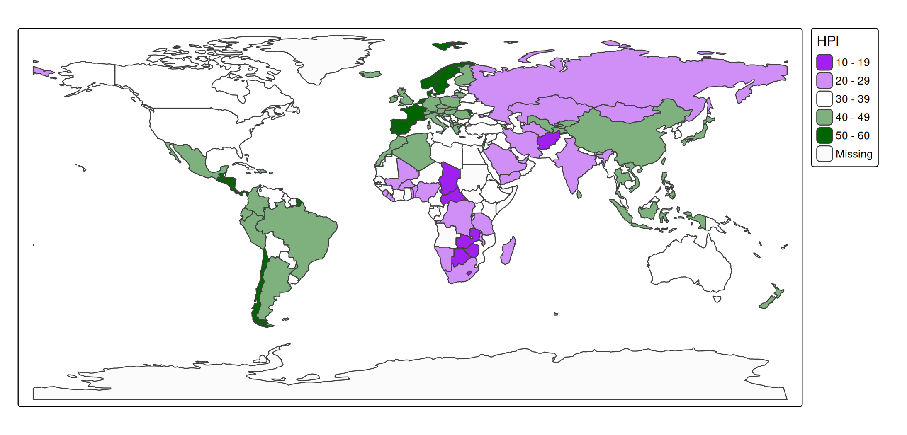
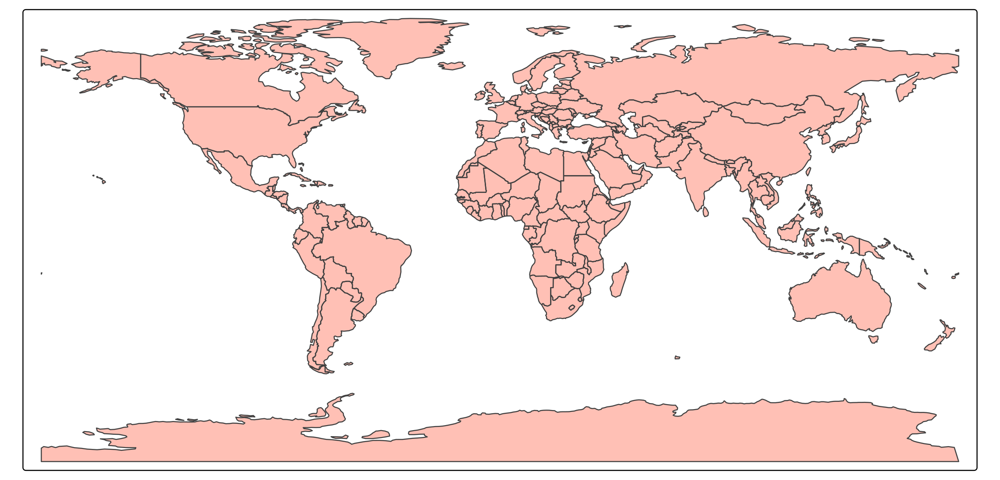
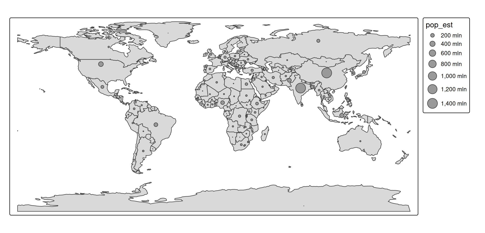
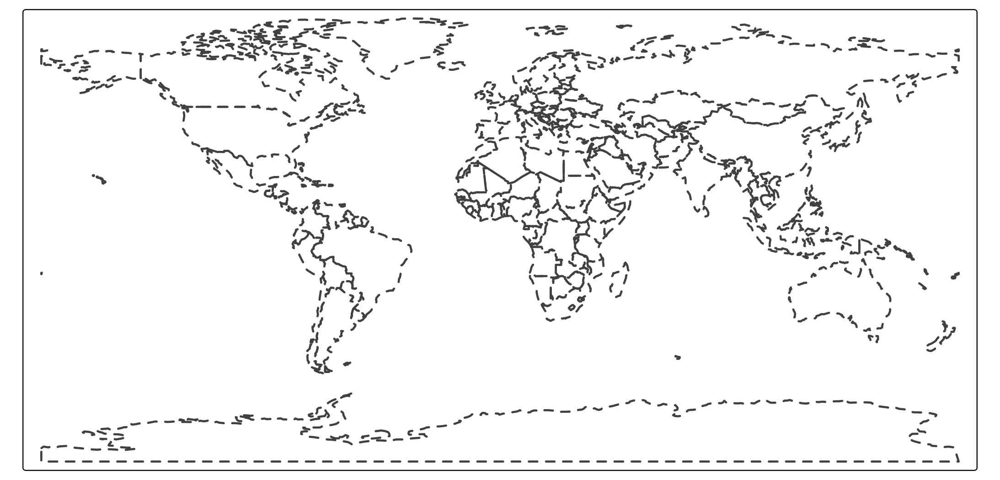
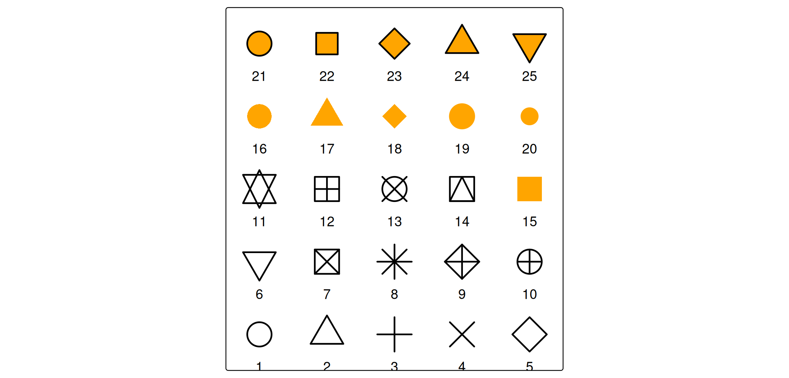
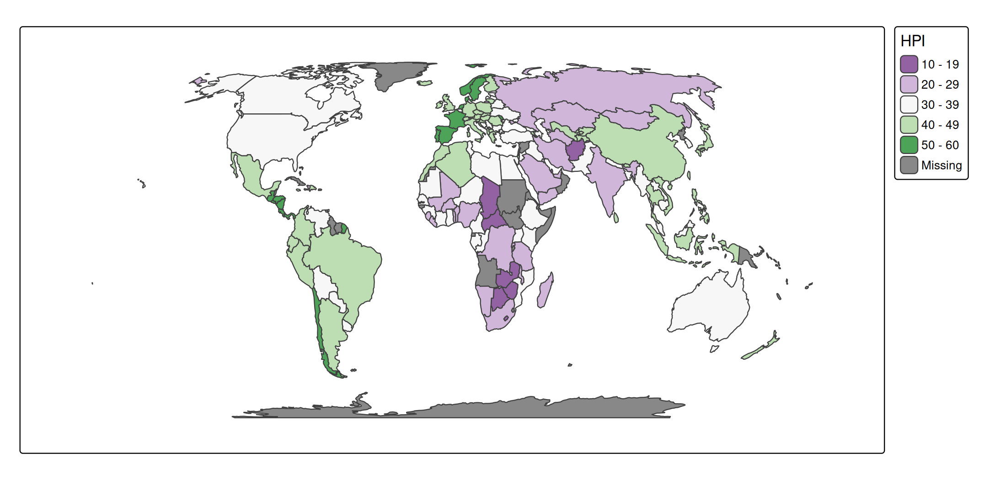
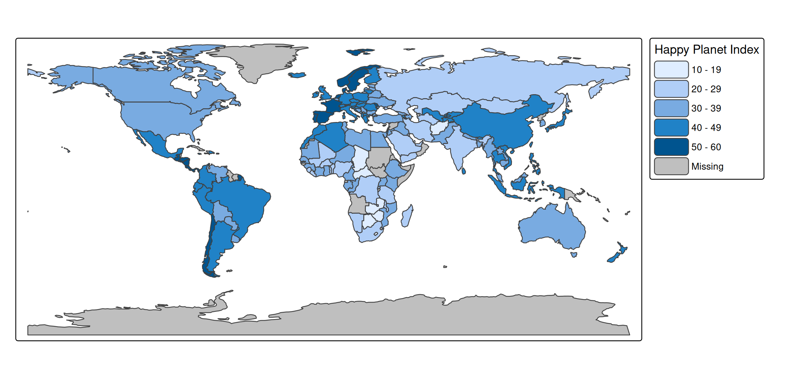
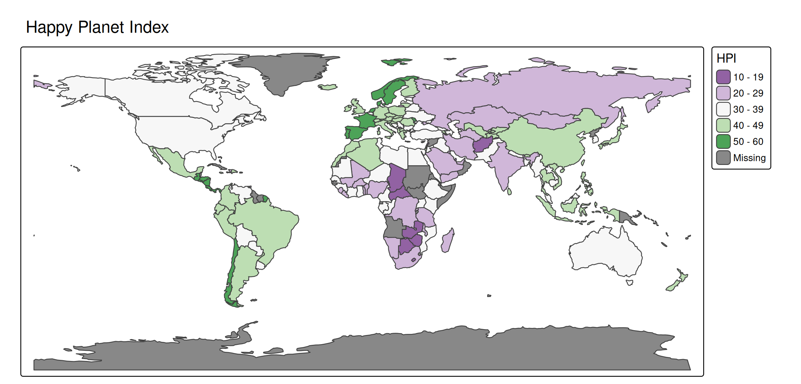

# tmap foundations: units

## Why units matter

Most of the time tmap chooses sensible values automatically, so the
units behind them stay invisible. They become relevant the moment you
set a value by hand, for example:

- a constant visual value via
  [`tm_const()`](https://r-tmap.github.io/tmap/reference/tm_const.md)
  (e.g. `tm_polygons(lwd = 2)`),
- an output range via `values.range` or `values.scale` in a scale
  function,
- a margin, a component size, or a font size in
  [`tm_layout()`](https://r-tmap.github.io/tmap/reference/tm_layout.md)
  or a component function.

This vignette collects the units used throughout the package. There are
two groups: the **map variable units** that data values are mapped to,
and the **layout units** used for margins, component sizes, and fonts.

## Map variable units

A map variable (`fill`, `size`, `lwd`, …) maps a data variable to an
output value with a specific unit. The same units apply when you supply
a constant instead of a data variable.

| Variable | Unit | Notes |
|----|----|----|
| `fill`, `col`, `bgcol` | color | a color name, hex string, or palette |
| `fill_alpha`, `col_alpha`, `bgcol_alpha` | proportion 0–1 | 0 = transparent, 1 = opaque |
| `size` (symbols, bubbles, squares, dots) | typographic lines | 1 line ≈ 1/6 inch; scaled by `values.scale` |
| `size` (circles) | meters | plain numeric, or a `units` object |
| `size` (text, labels) | multiplier | 1 = the base font size |
| `lwd` | lwd | base R line-width units (≈ 0.75 pt at 96 dpi) |
| `lty` | — | integer 1–6, or a name (`"solid"`, `"dashed"`, …) |
| `shape` | — | integer `pch` 1–25, or a single character |
| `angle` | degrees | 0–360, clockwise from north |
| `fontface` | — | `"plain"`, `"bold"`, `"italic"`, `"bold.italic"` |

### Color

A color is any R color name or hex string, so `"red"`, `"#FF0000"`, and
`"#FF000080"` (with alpha) are all valid:

``` r

tm_shape(World) +
  tm_polygons(fill = "grey85", col = "#4477AA", lwd = 1)
#> [tip] Consider a suitable map projection, e.g. by adding `+ tm_crs("auto")`.
#> This message is displayed once per session.
```



### Color palettes

Wherever a single color is expected, a *palette* defines the colors used
by a scale. A palette is either a vector of colors or the name of a
[cols4all](https://cols4all.github.io/cols4all-R/) palette:

``` r

# a named cols4all palette
tm_shape(World) +
  tm_polygons("HPI", fill.scale = tm_scale_intervals(values = "pu_gn"))
```



``` r

# an explicit vector of colors
tm_shape(World) +
  tm_polygons("HPI", fill.scale = tm_scale_intervals(values = c("purple", "white", "darkgreen")))
```



A leading `"-"` reverses a named palette (e.g. `"-pu_gn"`). The full set
of palette names is available via
[`cols4all::c4a_gui()`](https://cols4all.github.io/reference/c4a_gui.html).

### Transparency

Alpha (`fill_alpha`, `col_alpha`, `bgcol_alpha`) is a proportion between
0 (fully transparent) and 1 (fully opaque):

``` r

tm_shape(World) +
  tm_polygons(fill = "tomato", fill_alpha = 0.4)
```



### Size

`size` is the one map variable whose unit depends on the layer, because
three different things are sized in three natural units:

- In
  [`tm_symbols()`](https://r-tmap.github.io/tmap/reference/tm_symbols.md),
  [`tm_bubbles()`](https://r-tmap.github.io/tmap/reference/tm_symbols.md),
  [`tm_squares()`](https://r-tmap.github.io/tmap/reference/tm_symbols.md),
  and
  [`tm_dots()`](https://r-tmap.github.io/tmap/reference/tm_symbols.md),
  `size` is measured in **typographic lines** (one line ≈ 1/6 inch).
  These symbols keep a fixed *screen* size, so they do not grow when you
  zoom in view mode. The global multiplier
  `tmap_options(values.scale = list(...))` rescales all symbols without
  changing the data mapping.

- In
  [`tm_circles()`](https://r-tmap.github.io/tmap/reference/tm_circles.md),
  `size` is a **geographic radius in meters**. A plain number is read as
  meters; a `units` object is converted automatically, so
  `units::as_units(50, "km")` is a 50 km radius. Because the radius is
  geographic, circles *do* scale with zoom in view mode.

- In [`tm_text()`](https://r-tmap.github.io/tmap/reference/tm_text.md)
  and
  [`tm_labels()`](https://r-tmap.github.io/tmap/reference/tm_text.md),
  `size` is a **multiplier of the base font size** (see fonts below), so
  `size = 1.5` is 1.5× the default text size.

``` r

tm_shape(World) +
  tm_polygons() +
  tm_bubbles(size = "pop_est")
```



### Line width and line type

`lwd` uses base R’s line-width units (the same `lwd` you pass to
[`par()`](https://rdrr.io/r/graphics/par.html) or
[`lines()`](https://rspatial.github.io/terra/reference/lines.html)); it
is not measured in pixels, though at 96 dpi one unit is roughly 0.75
pt. `lty` is an integer 1–6 or a name such as `"dashed"`:

``` r

tm_shape(World) +
  tm_borders(lwd = 2, lty = "dashed")
```



### Shape

`shape` is an integer `pch` code between 1 and 25, the same plotting
symbols base R uses. The map below plots all 25:

``` r

atlantic_grid = cbind(expand.grid(x = -51:-47, y = 20:24), id = seq_len(25))
x = sf::st_as_sf(atlantic_grid, coords = c("x", "y"), crs = 4326)

tm_shape(x, bbox = tmaptools::bb(x, ext = 1.2)) +
  tm_symbols(
    shape = "id",
    size = 2,
    lwd = 2,
    fill = "orange",
    col = "black",
    shape.scale = tm_scale_asis()) +
  tm_text("id", ymod = -2)
```



Codes 21–25 have both a fill (`fill`) and a border (`col`); the lower
codes use `col` only.

### Angle and fontface

`angle` (e.g. for
[`tm_symbols()`](https://r-tmap.github.io/tmap/reference/tm_symbols.md)
or [`tm_text()`](https://r-tmap.github.io/tmap/reference/tm_text.md)) is
in degrees, clockwise from north. `fontface` is one of `"plain"`,
`"bold"`, `"italic"`, or `"bold.italic"`.

## Layout units

The second group of units controls the *frame*, the *margins*, and the
*components* (legends, titles, scale bars, …). These are independent of
the data.

### Margins

There are three margin sets, each a vector of four numbers in the order
**bottom, left, top, right**:

- `inner.margins` — between the spatial data and the map frame, relative
  to the **map frame** (so `0.25` is a quarter of the frame width or
  height).
- `meta.margins` — the band reserved for components outside the map,
  relative to the **device**.
- `outer.margins` — between the plot and the device border, relative to
  the **device**.

In every case `1` means the full width (for left/right) or full height
(for top/bottom).

``` r

tm_shape(World, crs = "+proj=eqearth") +
  tm_polygons("HPI", fill.scale = tm_scale_intervals(values = "pu_gn")) +
  tm_layout(inner.margins = c(0.1, 0.1, 0.1, 0.1))
```



Margins are covered in detail in the [margins
vignette](https://r-tmap.github.io/tmap/articles/adv_margins).

### Component sizes, paddings, and spacing

The width and height of components, and the paddings, offsets, and
spacing between and inside them, are expressed in **text line heights**:
the height of one line of text at the current font size. This makes the
layout scale naturally with the font size. It applies to, among others,
the `width`/`height` of
[`tm_legend()`](https://r-tmap.github.io/tmap/reference/tm_legend.md),
[`tm_scalebar()`](https://r-tmap.github.io/tmap/reference/tm_scalebar.md),
[`tm_title()`](https://r-tmap.github.io/tmap/reference/tm_title.md), and
[`tm_inset()`](https://r-tmap.github.io/tmap/reference/tm_inset.md), the
`bg.padding` and halo widths of
[`tm_text()`](https://r-tmap.github.io/tmap/reference/tm_text.md), the
`space` of
[`tm_xlab()`](https://r-tmap.github.io/tmap/reference/tm_xlab.md)/[`tm_ylab()`](https://r-tmap.github.io/tmap/reference/tm_xlab.md),
and the `xmod`/`ymod` offsets of
[`tm_text()`](https://r-tmap.github.io/tmap/reference/tm_text.md).

``` r

tm_shape(World) +
  tm_polygons(
    fill = "HPI",
    fill.legend = tm_legend(
      title = "Happy Planet Index",
      item.height = 1.5,
      item.width = 3))
```



For
[`tm_legend()`](https://r-tmap.github.io/tmap/reference/tm_legend.md)
specifically, a **negative** `width` or `height` switches the unit to
approximate **pixels**; the relation between line heights and pixels is
governed by the `absolute_fontsize` option.

### Font sizes

Font sizes for components (`text.size`, `title.size`, the `size` of
panel labels, scale-bar text, etc.) are **multipliers of the base font
size**, the same convention as `cex` in base R and as text `size` in
[`tm_text()`](https://r-tmap.github.io/tmap/reference/tm_text.md). For
example, the default legend text size is `0.7` and the default legend
title size is `0.9`.

``` r

tm_shape(World) +
  tm_polygons("HPI", fill.scale = tm_scale_intervals(values = "pu_gn")) +
  tm_title("Happy Planet Index", size = 1.2)
```



### Global scaling

The single option `scale` (set via `tmap_options(scale = ...)` or
`tm_layout(scale = ...)`) multiplies *all* sizes at once: symbol sizes,
line widths, and font sizes. It is the quickest way to scale a whole map
up or down, for instance when exporting at a different size. The
vignettes in this site use `tmap_options(scale = 0.75)`.

### Positions

Component positions are not a numeric unit but a small grammar of their
own: a `tm_pos` object created with
[`tm_pos_in()`](https://r-tmap.github.io/tmap/reference/tm_pos.md) or
[`tm_pos_out()`](https://r-tmap.github.io/tmap/reference/tm_pos.md), or
a shortcut of two keywords (horizontal: `"left"`, `"center"`, `"right"`;
vertical: `"top"`, `"center"`, `"bottom"`). See the [positions
vignette](https://r-tmap.github.io/tmap/articles/adv_positions) for
details.

## Summary

| Quantity | Unit |
|----|----|
| Colors (`fill`, `col`, `bgcol`) | color name or hex string |
| Color palettes (`values`) | vector of colors, or a cols4all palette name |
| Transparency (`*_alpha`) | proportion 0–1 |
| Symbol size (symbols, bubbles, squares, dots) | typographic lines (≈ 1/6 inch) |
| Circle size (`tm_circles`) | meters (numeric or `units` object) |
| Text size (`tm_text`, `tm_labels`) | multiplier of the base font size |
| `lwd` | base R line-width units |
| `lty` | integer 1–6 or name |
| `shape` | `pch` integer 1–25 or single character |
| `angle` | degrees, clockwise from north |
| `inner.margins` | relative to the map frame (0–1) |
| `outer.margins`, `meta.margins`, paddings | relative to the device (0–1) |
| Component widths/heights, spacing, `xmod`/`ymod` | text line heights (legend: negative ⇒ pixels) |
| Font sizes (`text.size`, `title.size`, …) | multiplier of the base font size |
| `scale` | global multiplier for sizes, line widths, fonts |
| Positions | `tm_pos` object or two keywords |
