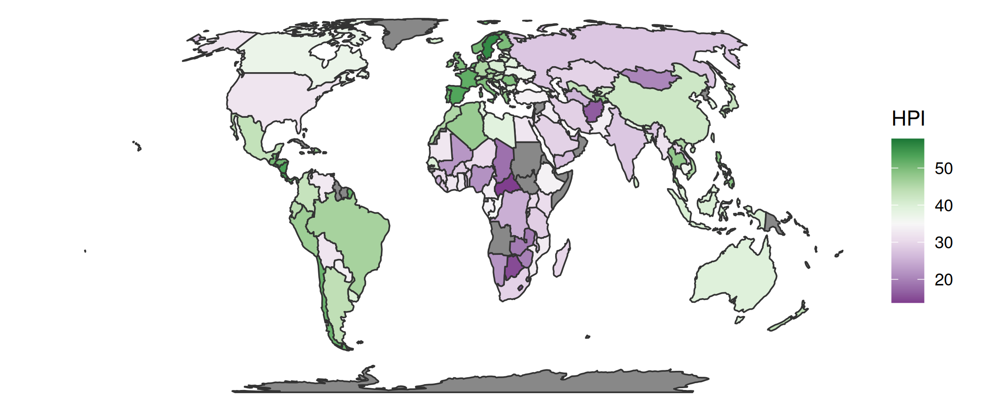
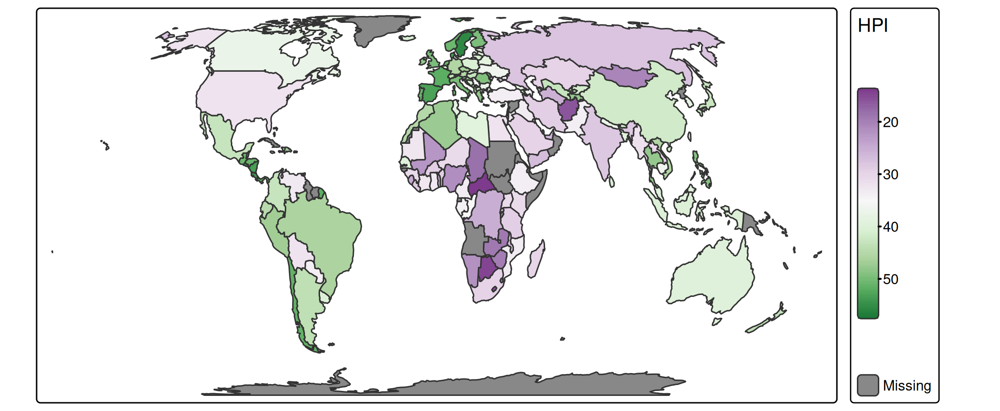
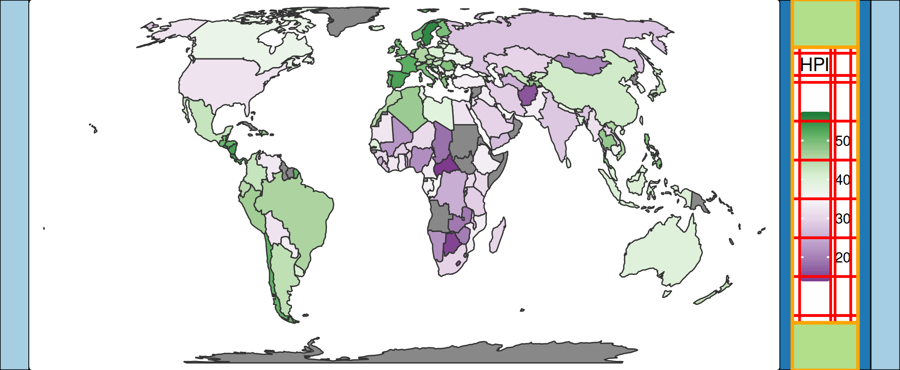

# tmap versus: ggplot2

## Choropleth Map comparision

An example of how the default output of `tmap` compares with `ggplot2`.

This is the default output of `ggplot2`:

``` r
library(ggplot2)
library(cols4all)

ggplot(World) +
    geom_sf(aes(fill = HPI), color = "grey20", linewidth = .4) +
    scale_fill_continuous_c4a_div("pu_gn", mid = 35) +
    coord_sf(crs = "+proj=eqearth") +
    theme_void()
```



This is the default output of `tmap`:

``` r
tm_shape(World, crs = "+proj=eqearth") +
    tm_polygons(fill = "HPI",
                col = "grey20",
                lwd = 1,
                fill.scale = tm_scale_continuous(values = "pu_gn", midpoint = 35))
```



Note the different line width values:

- `linewidth = .4` in `ggplot2`
- `lwd = 1` in `tmap`

The unit of a line width is different. `tmap` follows the `lwd`
parameter (see
[`graphics::par`](https://www.rdocumentation.org/packages/graphics/versions/3.6.2/topics/par))
whereas in `ggplot2` `linewidth = 1` equals roughly 0.75 [due to a
historical
error](https://ggplot2.tidyverse.org/articles/ggplot2-specs.html#linewidth).

## Mimicking ggplot2 layout

We can use `tmap` to match the style of `ggplot2`:

``` r
tm_shape(World, crs = "+proj=eqearth") +
  tm_polygons(
    fill = "HPI",
    col = "grey20",
    lwd = 1,
    fill.scale = tm_scale_continuous(values = "pu_gn", midpoint = 35),
    fill.legend = tm_legend(reverse = TRUE, 
      frame = FALSE, 
      item.height = 2.25, 
      item.width = 1.8, 
      position = tm_pos_out(pos.v = "center"), 
      na.show = FALSE, 
      ticks = list(c(0, 0.1), c(0.9, 1)), 
      ticks.col = "white", 
      col = "white")) +
tm_layout(frame = FALSE, outer.margins = 0)
```


