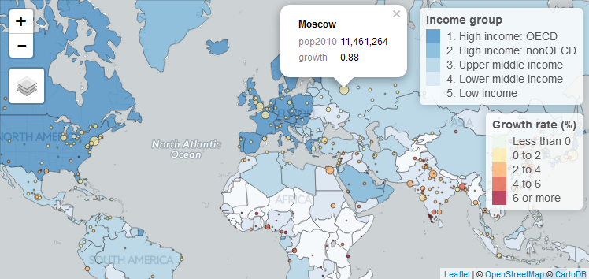

```{r, echo = FALSE, message = FALSE}
knitr::opts_chunk$set(collapse = T, fig.width=8, fig.height=4)
library(tmap)
library(leaflet)
```


The tmap package provides two drawing modes: `"plot"` for static plotting, and `"view"` for interactive viewing. The default and most extensive mode is `"plot"`. See [`vignette("tmap-nutshell")`](../doc/tmap-nutshell.html) for a getting started tutorial and [`pkg`](../html/pkg.html) for an overview of functions. The `"view"` mode lacks some of the features offered by the `"plot"` mode, but is fully interactive.

First, let's create a thematic world map.

```{r}
data(World, metro)
metro$growth <- (metro$pop2020 - metro$pop2010) / (metro$pop2010 * 10) * 100

mapWorld <- tm_shape(World) +
	tm_polygons("income_grp", palette="-Blues", contrast=.7, id="name", title="Income group") +
	tm_shape(metro) +
	tm_bubbles("pop2010", col = "growth", 
			   border.col = "black", border.alpha = .5, 
			   style="fixed", breaks=c(-Inf, seq(0, 6, by=2), Inf),
			   palette="-RdYlBu", contrast=1, 
			   title.size="Metro population", 
			   title.col="Growth rate (%)", id="name") + 
	tm_style_gray() + tm_format_World()
```

To plot, just print the declared variable `mapWorld`:

```{r}
mapWorld
```

The current mode can be obtained and set with the function tmap_mode:

```{r, eval=F}
# set mode to view:
tmap_mode("view")
```

Now the mode is set to view, we can interactively view it by printing it again:

```{r, eval=F, echo=T, warning=F, message=F}
mapWorld
```




In interactive mode, a leaflet widget is created and shown. If you want to change or extend the widget, you can use the function [`tmap_leaflet`](../html/tmap_leaflet.html) to obtain the leaflet widget object, and use leaflet's own functions to adjust it.

```{r, include=FALSE}
tmap_mode("plot")
```


In order to toggle fast between the drawing  modes, there are two handy functions. With [`ttm`](../html/ttm.html) the other mode is activated. The function [`last_map`](../html/last_map.html) can be used to redraw the last map. So whatever map is shown, with the following code, the same map is redrawn in the other mode.

```{r,eval=F, echo=T, warning=F, message=F}
ttm()
last_map()
```
