# Extensive geo test


## Load data


```r
data(Europe)
data(rivers)
```

## geo_fill tests


### constant

```r
geo_shape(Europe) +
	geo_fill()
```

 

### color variable

```r
Europe$color <- ifelse(Europe$iso_a3=="NLD", "orange", "steelblue")
geo_shape(Europe) +
	geo_fill("color")
```

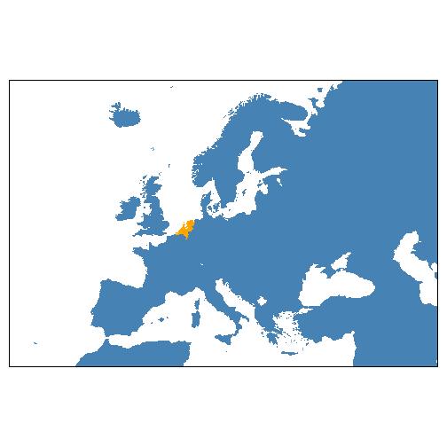 

### numeric variables

```r
geo_shape(Europe) +
	geo_fill("gdp_cap_est")
```

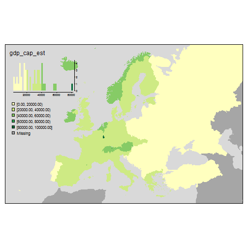 


```r
geo_shape(Europe) +
	geo_fill(c("gdp_cap_est", "pop_est_dens"))
```

```
## Warning: the condition has length > 1 and only the first element will be used
## Warning: the condition has length > 1 and only the first element will be used
```

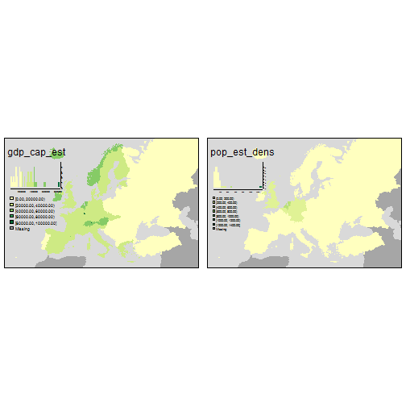 


```r
geo_shape(Europe) +
	geo_fill(c("gdp_cap_est", "pop_est_dens")) +
	geo_facets(free.scales.fill=FALSE)
```

```
## Warning: the condition has length > 1 and only the first element will be used
## Warning: the condition has length > 1 and only the first element will be used
```

 

### categorical variables

```r
geo_shape(Europe) +
	geo_fill("continent")
```

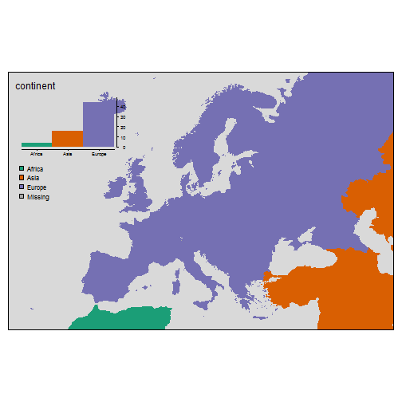 


```r
geo_shape(Europe) +
	geo_fill(c("continent", "economy"))
```

```
## Warning: the condition has length > 1 and only the first element will be used
## Warning: the condition has length > 1 and only the first element will be used
```

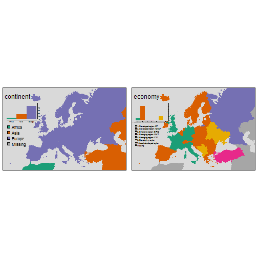 


```r
geo_shape(Europe) +
	geo_fill(c("continent", "economy")) +
	geo_facets(free.scales=FALSE)
```

```
## Warning: the condition has length > 1 and only the first element will be used
## Warning: the condition has length > 1 and only the first element will be used
```

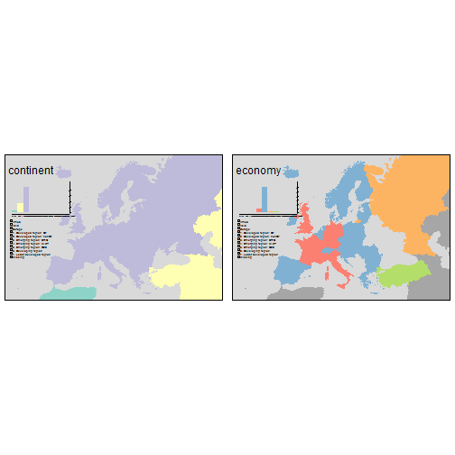 

### mixed variables

```r
geo_shape(Europe) +
	geo_fill(c("gdp_cap_est", "economy"))
```

```
## Warning: the condition has length > 1 and only the first element will be used
## Warning: the condition has length > 1 and only the first element will be used
```

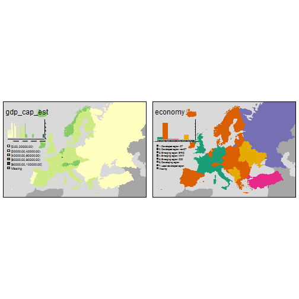 


```r
geo_shape(Europe) +
	geo_fill(c("gdp_cap_est", "economy")) +
	geo_facets(free.scales.fill=FALSE)
```

```
## Warning: the condition has length > 1 and only the first element will be used
## Warning: the condition has length > 1 and only the first element will be used
```

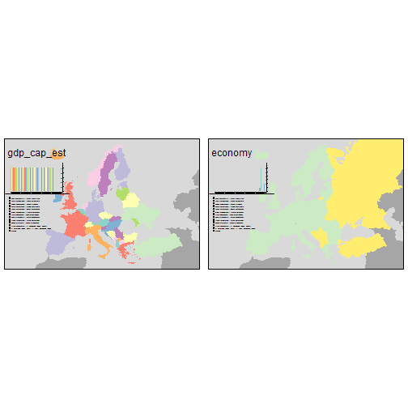 

### group by

```r
geo_shape(Europe) +
	geo_fill("red") +
	geo_facets(by="part")
```

```
## Warning: the condition has length > 1 and only the first element will be used
## Warning: the condition has length > 1 and only the first element will be used
## Warning: the condition has length > 1 and only the first element will be used
## Warning: the condition has length > 1 and only the first element will be used
```

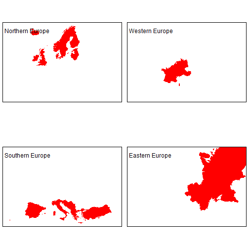 


```r
geo_shape(Europe) +
	geo_fill("color") +
	geo_facets(by="part")
```

```
## Warning: the condition has length > 1 and only the first element will be used
## Warning: the condition has length > 1 and only the first element will be used
## Warning: the condition has length > 1 and only the first element will be used
## Warning: the condition has length > 1 and only the first element will be used
```

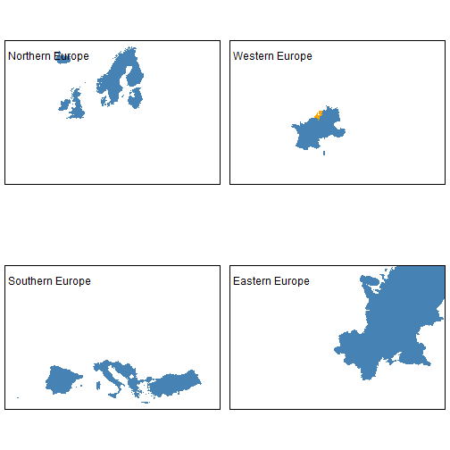 


```r
geo_shape(Europe) +
	geo_fill("pop_est_dens") +
	geo_facets(by="part")
```

 


```r
geo_shape(Europe) +
	geo_fill(c("pop_est_dens", "gdp_cap_est")) +
	geo_facets(by="part")
```

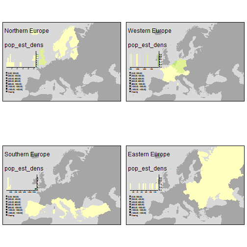 


```r
geo_shape(Europe) +
	geo_fill("pop_est_dens") +
	geo_facets(by="part", free.scales=TRUE)
```

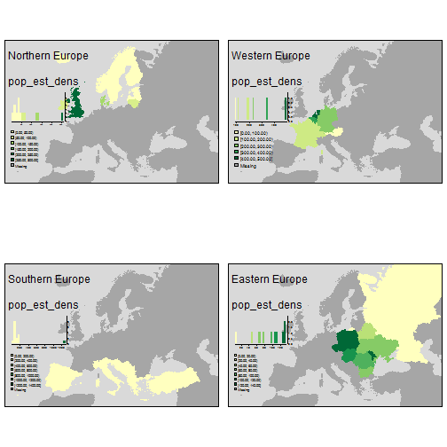 


```r
geo_shape(Europe) +
	geo_fill("economy") +
	geo_facets(by="part")
```

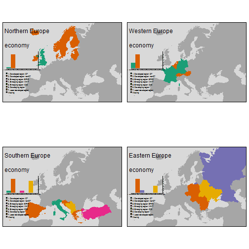 


```r
geo_shape(Europe) +
	geo_fill("economy") +
	geo_facets(by="part", free.scales=FALSE)
```

 


```r
geo_shape(Europe) +
	geo_fill("economy") +
	geo_facets(by="part", free.scales=TRUE)
```

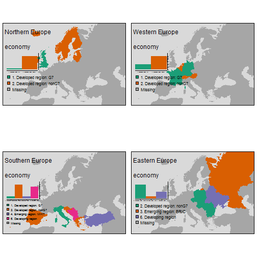 


## bubble tests

### constant

```r
geo_shape(Europe) + geo_borders() +
	geo_bubbles()
```

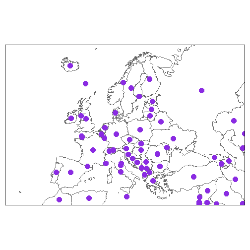 


```r
geo_shape(Europe) + geo_borders() +
	geo_bubbles(size=1, col="red")
```

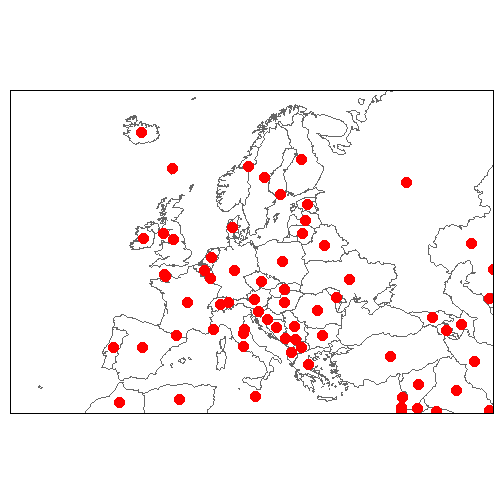 


```r
geo_shape(Europe) + geo_borders() +
	geo_bubbles(size=c(.5, 1), col=c("red", "purple"), scale=1)
```

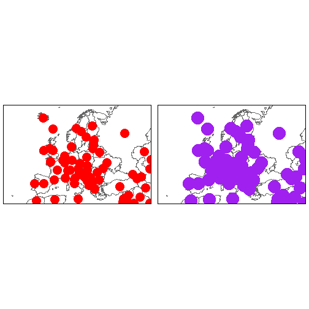 


```r
geo_shape(Europe) + geo_borders() +
	geo_bubbles(size=c(.5, 1, 2), col=c("red", "purple"), scale=1)
```

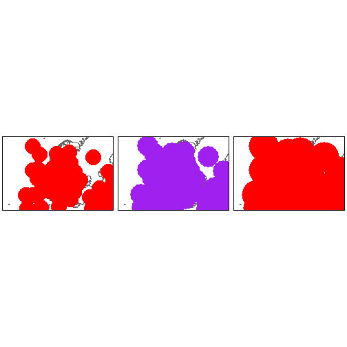 

### size

```r
geo_shape(Europe) + geo_borders() +
	geo_bubbles("pop_est", scale=2)
```

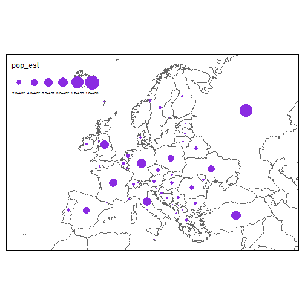 


```r
geo_shape(Europe) + geo_borders() +
	geo_bubbles("pop_est", col=c("red", "purple"), scale=2)
```

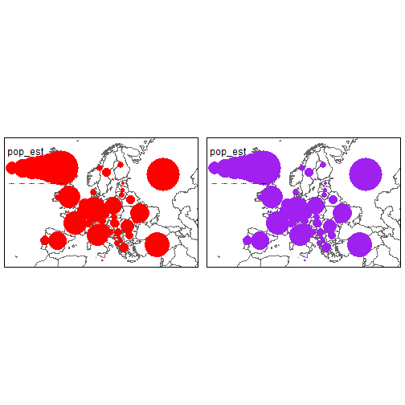 


```r
geo_shape(Europe) + geo_borders() +
	geo_bubbles(c("pop_est", "gdp_md_est"), scale=2)
```

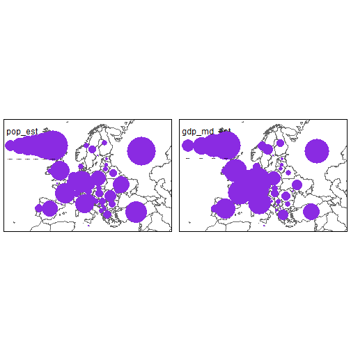 


```r
geo_shape(Europe) + geo_borders() +
	geo_bubbles(c("pop_est", "gdp_md_est"), scale=2) +
	geo_facets(free.scales=FALSE)
```

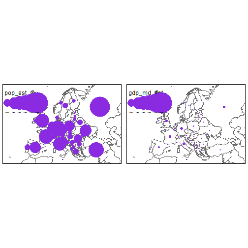 

### color

```r
geo_shape(Europe) + geo_borders() +
	geo_bubbles(col="income_grp", scale=1)
```

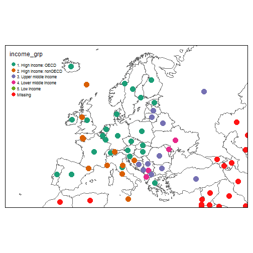 


```r
geo_shape(Europe) + geo_borders() +
	geo_bubbles(col=c("income_grp", "economy"), scale=1)
```

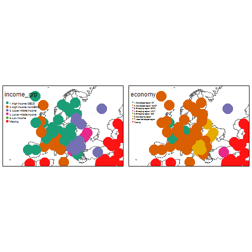 


```r
geo_shape(Europe) + geo_borders() +
	geo_bubbles(col=c("income_grp", "economy"), scale=1) +
	geo_facets(free.scales=FALSE)
```

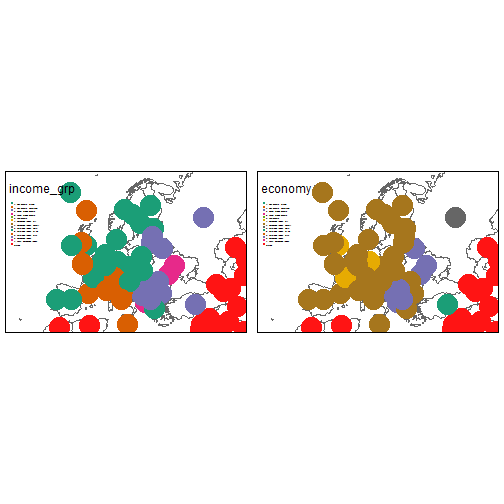 

### size and color

```r
geo_shape(Europe) + geo_borders() +
	geo_bubbles(c("pop_est", "gdp_md_est"), col="income_grp", scale=2)
```

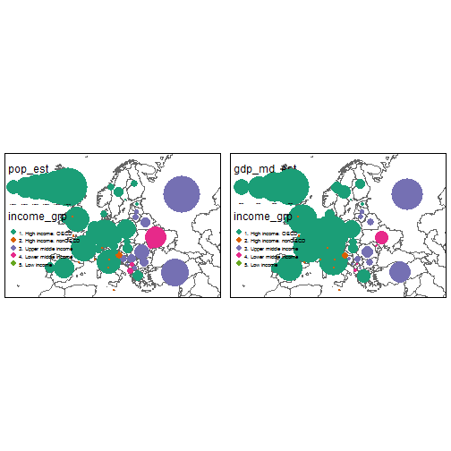 


```r
geo_shape(Europe) + geo_borders() +
	geo_bubbles("pop_est", col=c("income_grp", "economy"), scale=2)
```

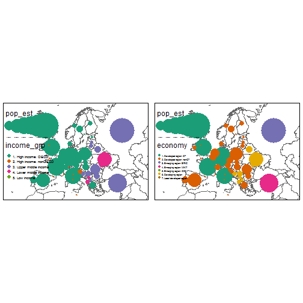 


```r
geo_shape(Europe) + geo_borders() +
	geo_bubbles("pop_est", col=c("income_grp", "economy"), scale=2) +
	geo_facets(free.scales=FALSE)
```

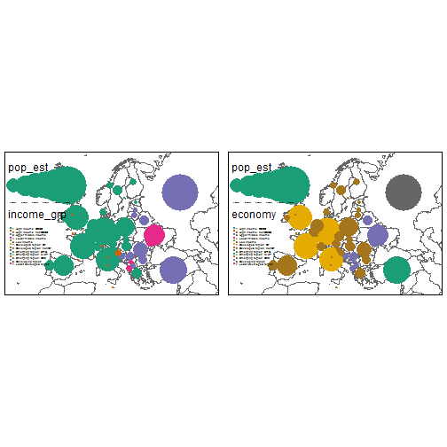 

### by

```r
geo_shape(Europe) + geo_borders() +
	geo_bubbles() +
	geo_facets("part")
```

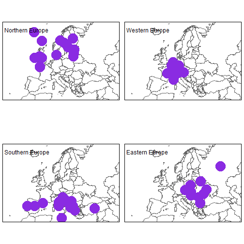 


```r
geo_shape(Europe) + geo_borders() +
	geo_bubbles("pop_est", scale=2) +
	geo_facets("part")
```

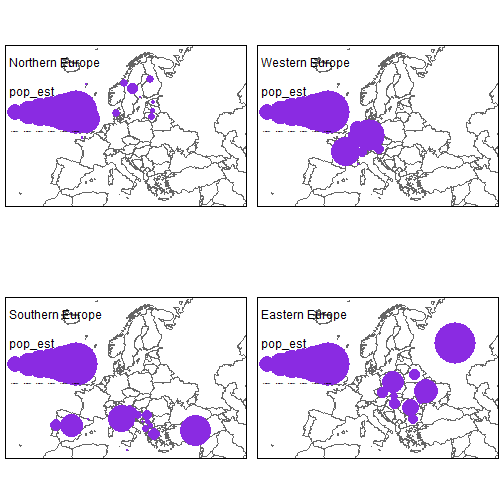 


```r
geo_shape(Europe) + geo_borders() +
	geo_bubbles("pop_est", col="economy", scale=2) +
	geo_facets("part")
```

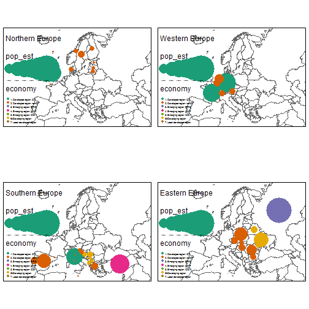 


```r
geo_shape(Europe) + geo_borders() +
	geo_bubbles("pop_est", col="economy", scale=2) +
	geo_facets("part", free.scales.bubble.size=TRUE)
```

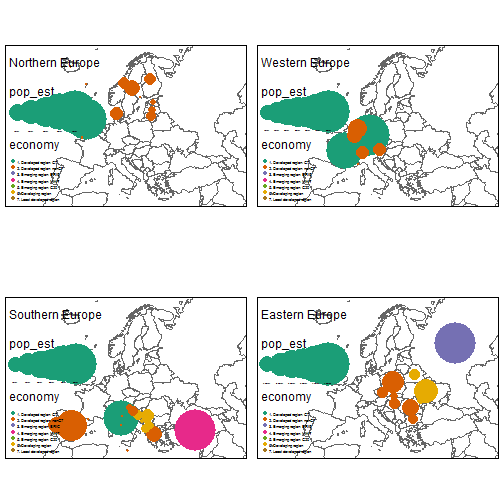 


```r
geo_shape(Europe) + geo_borders() +
	geo_bubbles("pop_est", col="economy", scale=2) +
	geo_facets("part", free.scales.bubble.col=TRUE)
```

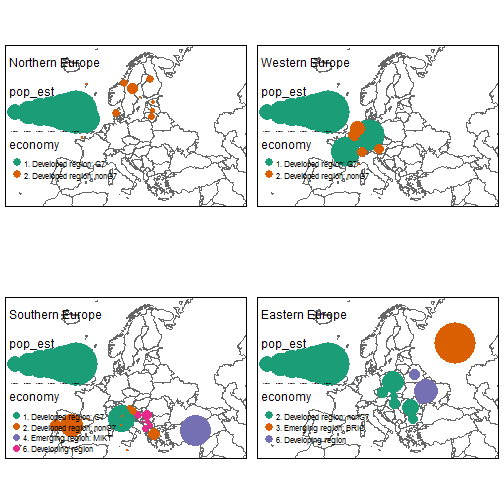 

## line tests


### default

```r
geo_shape(Europe) + geo_borders() + geo_shape(rivers) +
	geo_lines()
```

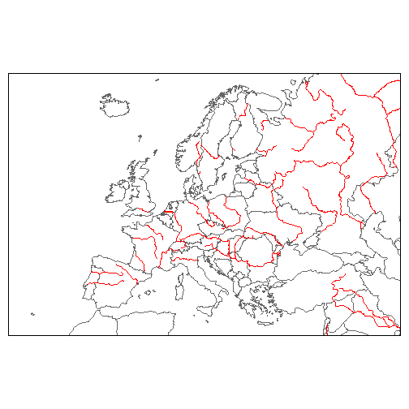 

### constant color

```r
geo_shape(Europe) + geo_borders() + geo_shape(rivers) +
	geo_lines("blue")
```

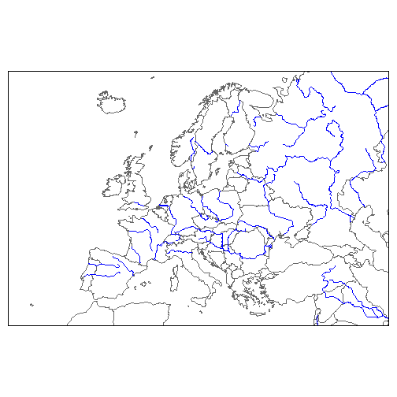 

### constant color and lwd

```r
geo_shape(Europe) + geo_borders() + geo_shape(rivers) +
	geo_lines("blue", lwd=2)
```

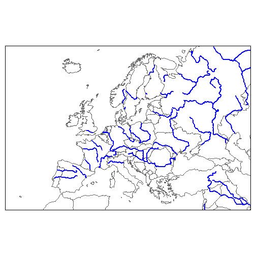 

### constant color and lwd multiples

```r
geo_shape(Europe) + geo_borders() + geo_shape(rivers) +
	geo_lines("blue", lwd=c(2,1))
```

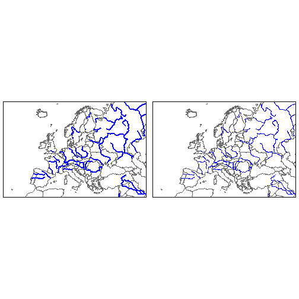 


```r
geo_shape(Europe) + geo_borders() + geo_shape(rivers) +
	geo_lines(c("blue", "gold", "red"), lwd=c(2,1))
```

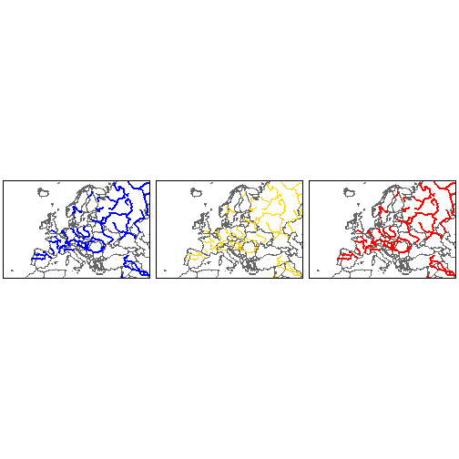 

### variable line color (categorical)

```r
geo_shape(Europe) + geo_borders() + geo_shape(rivers) +
	geo_lines("type")
```

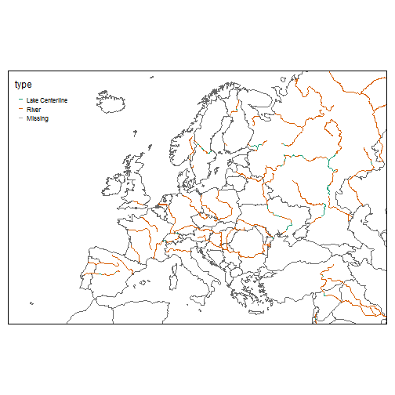 

### variable line color (numeric)

```r
geo_shape(Europe) + geo_borders() + geo_shape(rivers) +
	geo_lines("scalerank", lwd=3)
```

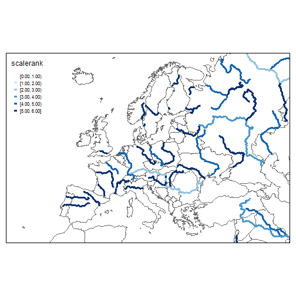 


```r
geo_shape(Europe) + geo_borders() + geo_shape(rivers) +
	geo_lines(lwd="scalerank", scale=4)
```

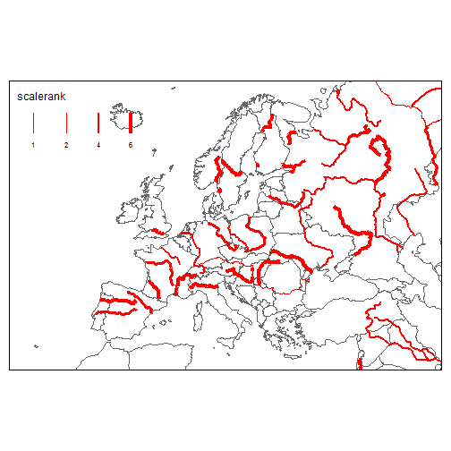 

### variable line color (numeric) and lwd

```r
geo_shape(Europe) + geo_borders() + geo_shape(rivers) +
	geo_lines("type", "scalerank", scale=4)
```

 


```r
geo_shape(Europe) + geo_borders() + geo_shape(rivers) +
	geo_lines("type", c("scalerank", "strokelwd"), scale=4)
```

 

### by

```r
geo_shape(Europe) + geo_borders() + geo_shape(rivers) +
	geo_lines("type", c("strokelwd"), scale=4) +
	geo_facets("type")
```

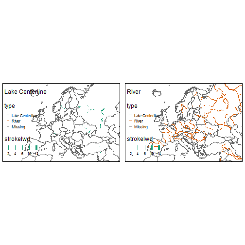 
