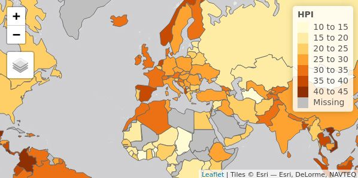
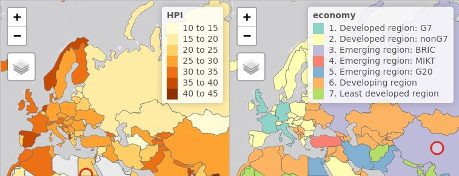
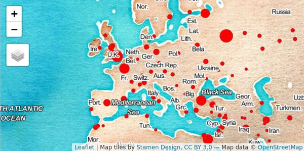

```{r, echo = FALSE, message = FALSE}
knitr::opts_chunk$set(collapse = T, fig.width=6, fig.height=3)
# devtools::install_github("mtennekes/tmaptools")
```

With the tmap package, thematic maps can be generated with great flexibility.
The syntax for creating plots is similar to that of `ggplot2`, but tailored to maps.
This vignette is for those who want to get started with tmap within a couple of minutes.
A more detailed description of tmap can be found in an [article](https://www.jstatsoft.org/article/view/v084i06) published in the Journal of Statistical Software ([JSS](https://www.jstatsoft.org/index)), which describes tmap version 1.11-2.
The changes in version 2.0 are described in [`vignette("tmap-changes-v2")`](../doc/tmap-changes-v2.html).

For more context on R's geographic capabilities there are a number of online resources including the vignettes of the [`sf` package](https://CRAN.R-project.org/package=sf/vignettes/sf1.html), the website [rspatial.org](http://www.rspatial.org/) and the online version of the book [Geocomputation with R](http://geocompr.robinlovelace.net/).
The [Making maps with R](http://geocompr.robinlovelace.net/adv-map.html) chapter of the book provides many more context and abundant code examples of map making with `tmap` and other packages.

### Hello World!

A good place to start is to create a map of the world.
After [installing](https://github.com/mtennekes/tmap#installation) tmap, the following lines of code should create the map shown below:

```{r}
library(tmap)
data("World")

tm_shape(World) +
    tm_polygons("HPI")
```

The object `World` is a spatial object of class `sf` from the [sf package](https://CRAN.R-project.org/package=sf); it is a `data.frame` with a special column that contains a geometry for each row, in this case polygons. 
In order to plot it in tmap, you first need to specify it with `tm_shape`.
Plotting layers can be added with the `+` operator, in this case `tm_polygons`.
There are many layer functions in tmap, which can easily be found in the documentation by their `tm_` prefix.
See also `?'tmap-element'`.

### Interactive maps

Each map can be plotted as a static image or viewed interactively using `"plot"` and `"view"` modes, respectively.
The mode can be set with the function `tmap_mode`, and toggling between the modes can be done with the 'switch' `ttm()`.

```{r, eval = FALSE}
tmap_mode("view")

tm_shape(World) +
    tm_polygons("HPI")
```



### Multiple shapes and layers

A shape is a spatial object (with a class from `sf`, `sp` or `raster`).
Multiple shapes and also multiple layers per shape can be plotted:

```{r}
data(World, metro, rivers, land)

tmap_mode("plot")
tm_shape(land) +
    tm_raster("elevation", palette = terrain.colors(10)) +
tm_shape(World) +
    tm_borders("white", lwd = .5) +
    tm_text("iso_a3", size = "AREA") +
tm_shape(metro) +
    tm_symbols(col = "red", size = "pop2020", scale = .5) +
tm_legend(show = FALSE)
```

### Facets

Facets can be created in three ways:

1. By assigning multiple variable names to one aesthetic:

```{r, eval = FALSE}
tmap_mode("view")
tm_shape(World) +
    tm_polygons(c("HPI", "economy")) +
    tm_facets(sync = TRUE, ncol = 2)
```



2. By splitting the spatial data with the `by` argument of `tm_facets`: 

```{r}
tmap_mode("plot")

data(NLD_muni)

NLD_muni$perc_men <- NLD_muni$pop_men / NLD_muni$population * 100

tm_shape(NLD_muni) +
    tm_polygons("perc_men", palette = "RdYlBu") +
    tm_facets(by = "province")
```

3. By using the `tmap_arrange` function:

```{r}
tmap_mode("plot")

data(NLD_muni)
tm1 <- tm_shape(NLD_muni) + tm_polygons("population", convert2density = TRUE)
tm2 <- tm_shape(NLD_muni) + tm_bubbles(size = "population")

tmap_arrange(tm1, tm2)
```

### Basemaps and overlay tile maps

Tiled basemaps can be added with the layer function `tm_basemap`.
Semi-transparent overlay maps (for example annotation labels) can be added with `tm_tiles`.

```{r, eval = FALSE}
tmap_mode("view")
tm_basemap("Stamen.Watercolor") +
tm_shape(metro) + tm_bubbles(size = "pop2020", col = "red") +
tm_tiles("Stamen.TonerLabels")
```



See a [preview of the available tilemaps](http://leaflet-extras.github.io/leaflet-providers/preview/). 
This list is also accessible in R: `leaflet::providers`.

### Options and styles

The functions `tm_layout` and `tm_view` are used to specify the map layout and the interactive aspects respectively.
These functions can be used in the same way as the layer functions, e.g.

```{r}
tmap_mode("plot")

tm_shape(World) +
    tm_polygons("HPI") +
tm_layout(bg.color = "skyblue", inner.margins = c(0, .02, .02, .02))
```

These options, as well as a couple of others, can also be set within with `tmap_options`, which works in the same way as the base R function `options`.
The main advantage is that these options are set globally, so they do not have to be specified in each map, for the duration of the session.

```{r}
tmap_options(bg.color = "black", legend.text.color = "white")

tm_shape(World) +
    tm_polygons("HPI", legend.title = "Happy Planet Index")
```

A style is a certain configuration of the tmap options. 

```{r}
tmap_style("classic")

tm_shape(World) +
    tm_polygons("HPI", legend.title = "Happy Planet Index")
```

```{r}
# see what options have been changed
tmap_options_diff()

# reset the options to the default values
tmap_options_reset()
```

New styles can be created; see `?tmap_options`.

### Exporting maps

```{r, eval = FALSE}
tm <- tm_shape(World) +
    tm_polygons("HPI", legend.title = "Happy Planet Index")

## save an image ("plot" mode)
tmap_save(tm, filename = "world_map.png")

## save as stand-alone HTML file ("view" mode)
tmap_save(tm, filename = "world_map.html")
```

### leaflet and shiny integration

Maps made with tmap can be exported to leaflet with the function `tmap_leaflet`. 
Hence, it is possible to make use of leaflet own functionalities.
This function is also needed when using tmap in shiny:

```{r, eval = FALSE}
# in UI part:
leafletOutput("my_tmap")

# in server part
output$my_tmap = renderLeaflet({
    tm <- tm_shape(World) + tm_polygons("HPI", legend.title = "Happy Planet Index")
    tmap_leaflet(tm)
})
```

See full [tmap - shiny example](https://github.com/mtennekes/tmap/blob/master/demo/tutorials/shiny_tmap.R).

### Quick thematic map

Maps can also be made with one function call.
This function is `qtm`:

```{r}
qtm(World, fill = "HPI", fill.pallete = "RdYlGn")
```

### Tips 'n Tricks

Run:

```{r, eval = FALSE}
tmap_tip()
```
